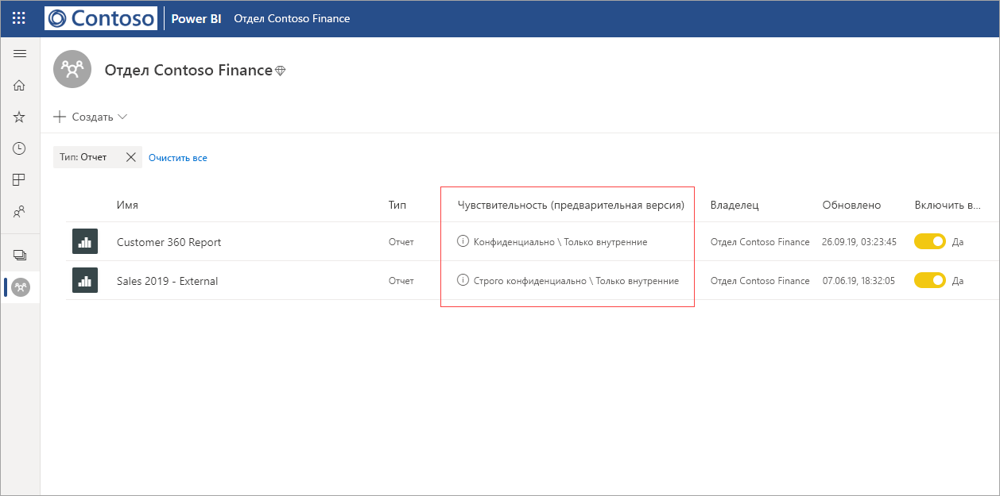
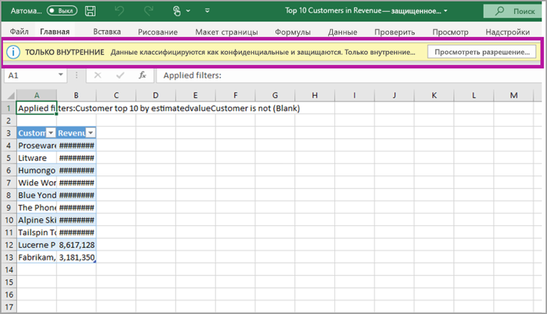

# Защита данных в Power BI (предварительная версия)

Современные предприятия работают в условиях строгих ограничений и требований, относящихся к защите конфиденциальных данных. Чтобы обеспечить максимально эффективное управление конфиденциальными данными и их прозрачность, Power BI поддерживает интеграцию с Microsoft Information Protection и Microsoft Cloud App Security. 

В Power BI реализованы следующие возможности защиты данных:

* Метки конфиденциальности Майкрософт, позволяющие классифицировать и маркировать содержимое в службе Power BI (панели мониторинга, отчеты, наборы и потоки данных) с использованием таксономии, применяемой для классификации и защиты файлов в Office 365. 

* Применение таких параметров защиты, как шифрование или водяные знаки, при экспорте данных из службы Power BI в файлы с помощью меток конфиденциальности и функции защиты содержимого (форматы Excel, PowerPoint и PDF). 

  Например, ваши пользователи могут назначить отчету в Power BI метку "Конфиденциально". Впоследствии при экспорте данных этого отчета в файл Excel служба Power BI применит соответствующую метку к полученному файлу. С помощью метки можно защитить содержимое и применить к нему водяной знак "Конфиденциально".

* Применение Microsoft Cloud App Security для отслеживания действий в Power BI, изучения проблем с безопасностью и защиты содержимого в Power BI посредством управления условным доступом к приложениям Microsoft Cloud App Security. 

## Метки конфиденциальности в Power BI

Для создания и управления меток конфиденциальности используется [центр безопасности Microsoft 365](https://security.microsoft.com/) или [центр соответствия требованиям Microsoft 365](https://compliance.microsoft.com/).

Для работы с ними в любом из этих центров следует выбрать раздел **Классификация > Метки конфиденциальности**. Метки конфиденциальности могут использоваться в самых разных службах Майкрософт, включая Azure Information Protection, приложения Office и службы Office 365.

> [!IMPORTANT]
> Чтобы использовать метки конфиденциальности в Power BI, клиентам Azure Information Protection требуется перенести метки в одну из перечисленных выше служб. Кроме того, метки конфиденциальности поддерживаются только в общедоступном облаке и недоступны для клиентов национальных и других облачных служб.
>
> Дополнительные сведения о переносе меток конфиденциальности в Microsoft Information Protection см. в [этой статье](https://docs.microsoft.com/azure/information-protection/configure-policy-migrate-labels).

## Принципы применения меток конфиденциальности

Метка, применяемая к панели мониторинга, отчету, набору или потоку данных Power BI, по своему предназначению схожа с *тегом* и дает следующие преимущества.
* **Возможность настройки** — вы можете создавать категории для разных уровней конфиденциальности содержимого организации, такие как "Личная информация", "Общедоступная информация", "Общая информация", "Конфиденциальная информация" или "Строго конфиденциальная информация".
* **Наглядное представление** — метка представляет собой обычный текст, который хорошо виден пользователям и позволяет сразу понять, каким образом обращаться с содержимым в соответствии с установленными правилами.
* **Постоянство** — примененная к содержимому метка сохраняется с ним при экспорте в файлы следующих поддерживаемых типов: Excel, PowerPoint и PDF. 

  Таким образом, метка конфиденциальности сопровождает содержимое, определяет параметры его защиты и служит в качестве основы для применения политик. 

## Пример метки конфиденциальности 

Ниже показан краткий пример применения метки конфиденциальности в Power BI.

1. К отчету в службе Power BI применена метка **Строго конфиденциально — только для внутреннего пользования**.

   

2. При экспорте данных из этого отчета в файл Excel к получаемому файлу применяются соответствующие параметры защиты и метка конфиденциальности.

   

В приложениях Microsoft Office метка конфиденциальности отображается как тег сообщения электронной почты или документа, как показано на рисунке выше.

Кроме того, вы можете назначить содержимому категорию (аналогично наклейке), которая будет храниться и передаваться вместе с ним в процессе использования и совместного доступа. На основе этой классификации можно создавать отчеты об использовании и просматривать сведения о действиях для конфиденциального содержимого. При необходимости впоследствии категории можно использовать для применения параметров защиты.

## Использование меток конфиденциальности в Power BI

Для активации меток конфиденциальности в Power BI должны соблюдаться следующие требования: 

* У вас должны быть определены метки конфиденциальности в [центре безопасности Microsoft 365](https://security.microsoft.com/) или в [центре соответствия требованиям Microsoft 365](https://compliance.microsoft.com/). 
* [Активация меток конфиденциальности](service-security-enable-data-sensitivity-labels.md) (предварительная версия) в Power BI.
* У пользователей должны быть соответствующие лицензии.
  * Для применения и просмотра меток в Power BI пользователям потребуется лицензия Azure Information Protection Premium P1 или Premium P2. Средство Microsoft Azure Information Protection можно приобрести как отдельно, так и в составе одного из наборов лицензирования Майкрософт. Дополнительные сведения см. в статье [Цены на Azure Information Protection](https://azure.microsoft.com/pricing/details/information-protection/).
  * Чтобы применять метки к ресурсам Power BI, в дополнение к указанным выше лицензиям Azure Information Protection пользователям потребуется лицензия Power BI Pro. 

## Защита содержимого с помощью Microsoft Cloud App Security

С помощью Microsoft Cloud App Security вы можете защитить содержимое в Power BI от непреднамеренных утечек или нарушений. После установки и настройки Microsoft Cloud App Security администраторы безопасности смогут отслеживать доступ пользователей и осуществляемые ими действия, выполнять анализ рисков в реальном времени, а также задавать элементы управления для меток.

Например, организации могут использовать Microsoft Cloud App Security для настройки политики, запрещающей пользователям скачивать конфиденциальные данные из Power BI на неуправляемые устройства. В такой конфигурации пользователи смогут работать с содержимым Power BI из любого места и при этом все их действия будут в реальном времени защищены с помощью Microsoft Cloud App Security. 

### Требования

Чтобы использовать Microsoft Cloud App Security для меток безопасности, необходимо обеспечить выполнение следующих условий: 

* Необходимо [включить для клиента](https://docs.microsoft.com/cloud-app-security/azip-integration) Cloud App Security и Azure Information Protection.
* Необходимо [подключить приложение к Microsoft Cloud App Security](https://docs.microsoft.com/cloud-app-security/enable-instant-visibility-protection-and-governance-actions-for-your-apps).

## Рекомендации и ограничения

Ниже описываются ограничения, связанные с применением меток конфиденциальности в Power BI:

* Для применения и просмотра меток конфиденциальности Microsoft Information Protection в Power BI пользователям требуется лицензия Azure Information Protection Premium P1 или Premium P2. Средство Microsoft Azure Information Protection можно приобрести как отдельно, так и в составе одного из наборов лицензирования Майкрософт. Дополнительные сведения см. в статье [Цены на Azure Information Protection](https://azure.microsoft.com/pricing/details/information-protection/).
* Метки конфиденциальности можно применять только к панелям мониторинга, отчетам, наборам и потокам данных.
* При экспорте метки и элементы управления защитой поддерживаются только для файлов в формате Excel, PowerPoint и PDF. Метки и элементы управления защитой не применяются при экспорте данных в CSV-файлы, оформлении подписки на электронную почту, внедрении визуальных элементов и печати.
* Пользователь, экспортирующий файл из Power BI, должен иметь разрешения на доступ к соответствующему файлу и его редактирование в соответствии с параметрами метки конфиденциальности. Пользователь, экспортирующий данные, не получает разрешения владельца файла. 
* На данный момент не поддерживаются метки конфиденциальности для [отчетов с разбивкой на страницы]( https://docs.microsoft.com/power-bi/paginated-reports-report-builder-power-bi) и рабочих книг.
* Метки конфиденциальности ресурсов Power BI отображаются только в представлениях списка рабочей области и происхождения. На данный момент метки не видны в представлениях "Избранное", "Мне предоставлен доступ", "Недавние" и "Приложения". Тем не менее, следует помнить, что примененная к ресурсу Power BI метка, даже если она не отображается, всегда сохраняется вместе с данными, экспортируемыми в файлы формата Excel, PowerPoint и PDF.
* Параметр *шифрования файла* для метки конфиденциальности, настраиваемый в [центре безопасности Microsoft 365](https://security.microsoft.com/) или в [центре соответствия требованиям Microsoft 365](https://compliance.microsoft.com/), применяется только к файлам *экспортируемым из* Power BI, и не действует *в среде* Power BI.
* Для меток, примененных в Power BI, не поддерживается защита с использованием [функции хранения собственных ключей (HYOK)](https://docs.microsoft.com/azure/information-protection/configure-adrms-restrictions).
* Для просмотра и применения меток в приложениях Office [требуются соответствующие лицензии](https://docs.microsoft.com/microsoft-365/compliance/sensitivity-labels-office-apps#subscription-and-licensing-requirements-for-sensitivity-labels).
* Метки конфиденциальности поддерживаются только для клиентов в глобальном (общедоступном) облаке. Метки конфиденциальности не поддерживаются для клиентов в облаках других видов.
* Метки конфиденциальности данных не поддерживаются для приложений-шаблонов.
* Power BI не поддерживает метки конфиденциальности для типов защиты **Не пересылать** и **Специальная**.

## Дальнейшие действия

Эта статья посвящена защите данных в Power BI. В следующих статьях вы найдете дополнительные сведения о защите данных в Power BI. 

* [Активация меток конфиденциальности данных в Power BI](service-security-enable-data-sensitivity-labels.md)
* [Применение меток конфиденциальности данных в Power BI](../designer/service-security-apply-data-sensitivity-labels.md)
* [Использование элементов управления Microsoft Cloud App Security в Power BI](service-security-using-microsoft-cloud-app-security-controls.md)
* [Отчет о метриках защиты данных](service-security-data-protection-metrics-report.md)