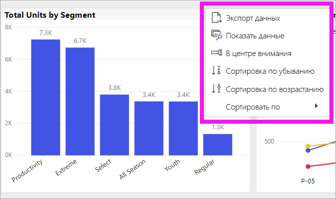

# Изменение порядка сортировки диаграммы в отчете Power BI

[!INCLUDE [power-bi-service-new-look-include](../includes/power-bi-service-new-look-include.md)]

В службе Power BI можно изменять вид визуального элемента, выполнив сортировку по разным полям данных. Изменив порядок сортировки визуального элемента, вы можете выделить информацию, которую необходимо передать, и убедиться в том, что визуальный элемент отражает тенденцию (или акцент).

Независимо от того, используете ли вы числовые (например, объемы продаж) или текстовые данные (например, названия штатов), визуализации можно сортировать в любом требуемом порядке. Power BI предоставляет гибкие возможности сортировки и меню быстрого доступа. На любом визуальном элементе выберите **Дополнительные действия** (...), а затем выберите поле, по которому нужно выполнить сортировку.

Визуальные элементы на панели мониторинга невозможно сортировать, но в отчете Power BI можно сортировать большую часть визуализаций в алфавитном порядке по названиям категорий в диаграмме или числовым значениям в каждой категории. Например, эта диаграмма отсортирована по категории **store name** в алфавитном порядке.

Вы можете легко использовать для сортировки не категорию (имя хранилища), а значение (продажи на квадратный метр).

1. Щелкните **Дополнительные действия** (…) и выберите **Сортировать по > Продажи по площадям**.
2. При необходимости снова щелкните **Дополнительные действия** и выберите команду **Сортировка по убыванию**. Поле, используемое для сортировки, выделено полужирным шрифтом и имеет желтую полосу.

   

> [!NOTE]
> Отсортировать можно не все визуальные элементы. Например, нельзя отсортировать следующие визуальные элементы: диаграмма дерева, карта, картограмма, точечная диаграмма, индикаторная диаграмма, карточка, каскадная диаграмма.

## Сохранение изменений, внесенных в порядок сортировки
В отчетах Power BI сохраняются фильтры, срезы, параметры сортировки и другие изменения, внесенные в представление данных. Поэтому если вы вернетесь к отчету позже, настройки представления сохранятся.  Чтобы восстановить параметры, настроенные создателем отчета, в верхней строке меню выберите команду **Вернуться к значениям по умолчанию**. 

Если кнопка **Вернуться к значениям по умолчанию** неактивна, значит, создатель отчета отключил возможность сохранять изменения.

## Сортировка с использованием других условий
Иногда необходимо отсортировать визуальный элемент с помощью другого поля (не входящего в элемент) или условия.  Например, можно сортировать по месяцу (а не по алфавиту) или по всем числам, а не только цифрам (например, 0, 1, 9, 20, а не 0, 1, 20, 9).  Автор отчета сможет обновить набор данных, чтобы сделать возможным такой тип сортировки. Контактные данные автора можно найти, выбрав имя отчета в строке заголовка.

## Дальнейшие действия
Подробнее о [визуализациях в отчетах Power BI](end-user-visualizations.md).

[Power BI — основные понятия](end-user-basic-concepts.md)
