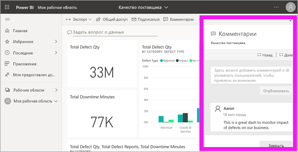
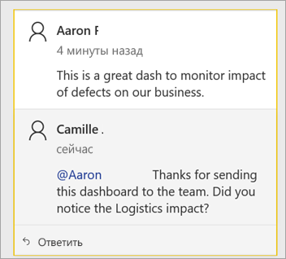
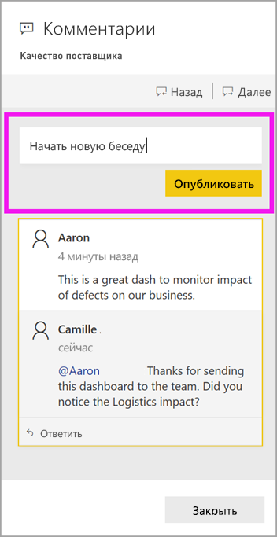
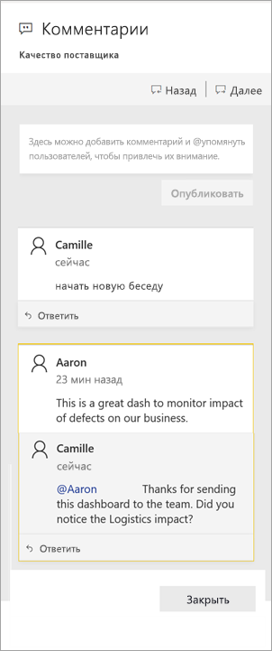
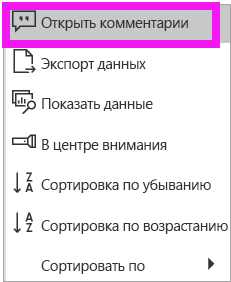
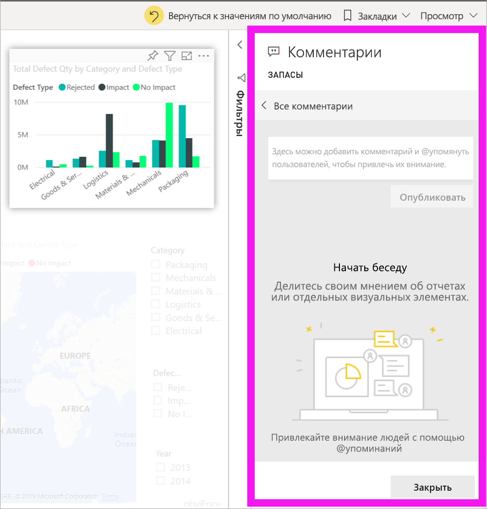
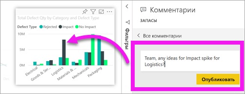
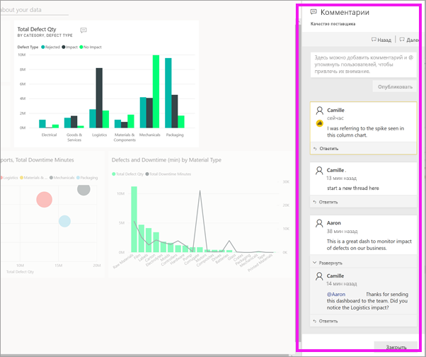

# Добавление комментариев на панель мониторинга или в отчет

[!INCLUDE [power-bi-service-new-look-include](../includes/power-bi-service-new-look-include.md)]

Добавьте личный комментарий или начните беседу о панели мониторинга со своими коллегами. Функция **комментариев** — лишь один из способов, которыми *пользователь* может взаимодействовать с другими. 

## Как использовать функцию комментариев
Комментарии можно добавлять для всей панели мониторинга и отдельных визуальных элементов на ней, а также для страницы отчета, отдельных визуальных элементов на ней и отчета с разбивкой на страницы. Добавьте общий комментарий или комментарий для конкретных коллег.  

При добавлении комментария в отчет Power BI записывает текущие значения фильтра и среза. Это означает, что при выборе комментария или ответе на него страница или визуальный элемент отчета могут измениться, чтобы отобразить выбранные фильтры и срезы, которые были активны при первоначальном добавлении комментария.  

Почему это важно? Предположим, что коллега применил фильтр и получил ценные сведения, которыми он хочет поделиться с командой. Без выбранного фильтра этот комментарий может быть бессмысленным.

При использовании отчета с разбивкой на страницы можно оставить только общий комментарий к отчету.  Поддержка комментариев для отдельных визуальных элементов отчета недоступна.

### Добавление общих комментариев на панель мониторинга или в отчет
Процедуры добавления комментариев на панель мониторинга или в отчет схожи.  В этом примере мы используем панель мониторинга. 

1. Откройте панель мониторинга или отчет Power BI и выберите значок **Комментарии**. Откроется диалоговое окно комментариев.

    

    Здесь мы видим, что создатель панели мониторинга уже добавил общий комментарий.  Все, кто имеют доступ к этой панели мониторинга, видят этот комментарий.

    

2. Для ответа нажмите **Ответить**, введите ответ и выберите **Опубликовать**.  

    

    По умолчанию Power BI направляет ваш ответ коллеге (в нашем примере это будет Aaron), который открыл ветку комментариев. 

    

 3. Если вы хотите добавить комментарий в отдельной цепочке, введите его в верхнем текстовом поле.

    

    Комментарии для этой панели мониторинга теперь выглядят следующим образом.

    

### Добавление комментария к определенному визуальному элементу на панели мониторинга или в отчете
Кроме добавления комментариев ко всей панели мониторинга или странице отчета, можно добавлять комментарии к отдельным плиткам панели мониторинга и отдельным визуальным элементам отчета. Процедуры похожи, и в этом примере мы используем отчет.

1. Наведите указатель мыши на визуальный элемент и нажмите **Дополнительные параметры** (...).    
2. В раскрывающемся списке выберите **Открыть комментарии**.

      

3.  Открывается диалоговое окно **Комментарии**, а другие визуальные элементы на странице затеняются. Этот визуальный элемент еще не содержит никаких комментариев. 

      

4. Напишите комментарий и нажмите **Опубликовать**.

      

    - Если на странице отчета выбрать комментарий, добавленный для визуального элемента, этот визуальный элемент выделяется (см. выше).

    - На панели мониторинга значок диаграммы  позволяет узнать, что комментарий привязан к определенному визуальному элементу. Комментарии, относящиеся ко всей панели мониторинга, не имеют специального значка. При выборе значка диаграммы выделяется соответствующий визуальный элемент на панели мониторинга.
    

    

5. Нажмите **Закрыть**, чтобы вернуться в панель мониторинга или отчет.

### Привлеките внимание коллеги с помощью знака @
Когда вы добавляете комментарий для панели мониторинга, отчета, плитки или визуального элемента, привлеките внимание коллег с помощью символа "\@".  Когда вы вводите символ "\@", Power BI открывает раскрывающийся список, где можно найти и выбрать отдельных пользователей из вашей организации. Проверенное имя, перед которым стоит символ \@, отображается синим. 

Это беседа, состоявшаяся с *разработчиком* визуализации. Он использовал символ @, чтобы я обязательно увидел комментарий. Я знаю, что этот комментарий для меня. Когда я открываю эту панель мониторинга приложения в Power BI, я выбираю **Комментарии** в заголовке. Появляется панель **Комментарии** с нашей беседой.

  

## Дальнейшие действия
Возврат к [визуализациям для пользователей](end-user-visualizations.md)    
<!--[Select a visualization to open a report](end-user-open-report.md)-->
