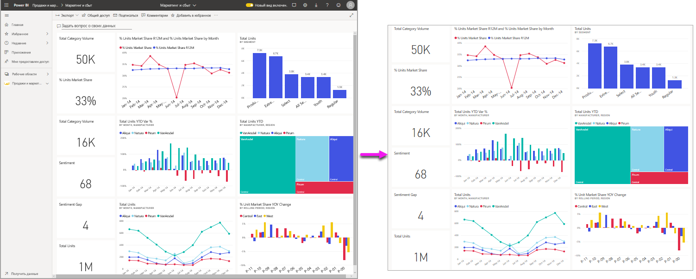
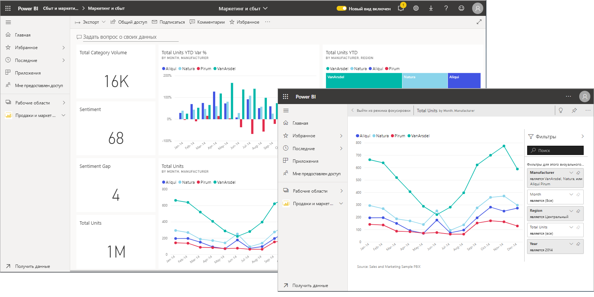
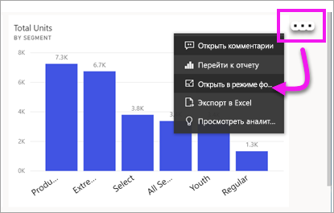
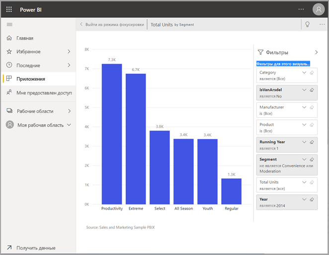
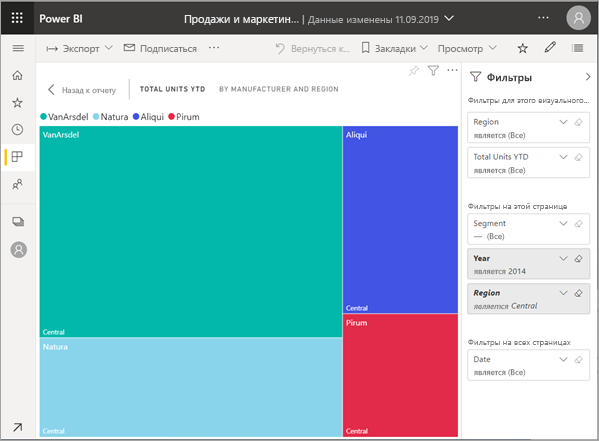

# Отображение содержимого с дополнительными подробностями: режим фокусировки и полноэкранный режим

[!INCLUDE [power-bi-service-new-look-include](../includes/power-bi-service-new-look-include.md)]    

<iframe width="560" height="315" src="https://www.youtube.com/embed/dtdLul6otYE" frameborder="0" allowfullscreen></iframe>

Режим фокусировки и полноэкранный режим — это два разных способа увидеть больше подробностей на визуальных элементах, панелях мониторинга и в отчетах.  Различие между ними заключается в том, что полноэкранный режим скрывает все панели, размещенные вокруг содержимого, а режим фокусировки сохраняет возможность взаимодействовать с визуальными элементами. Давайте более подробно рассмотрим их сходства и различия.  

|Содержимое    | Режим фокусировки  |Полноэкранный режим  |
|---------|---------|----------------------|
|Панель мониторинга     |   Невозможно     | да |
|Страница отчета   | Невозможно  | да|
|Визуальный элемент отчета | да    | да |
|Плитка панели мониторинга | да    | да |
|Windows 10 для мобильных устройств | Невозможно | Да |

## Что такое полноэкранный режим?

Отображайте содержимое службы Power BI (панели мониторинга, страницы отчетов, плитки и визуальные элементы), не отвлекаясь на меню и панели навигации.  Так вы можете быстро просматривать все содержимое сразу. Иногда это также называется режимом ТВ.   

Чтобы открыть полноэкранный режим, выберите значок **полноэкранного режима**  в строке меню службы Power BI над панелью мониторинга, отчетом, плиткой в режиме фокусировки или визуальным элементом в режиме фокусировки.  Выбранное содержимое отображается во весь экран.
Если вы используете Power BI для мобильных устройств, [в мобильных приложениях для Windows 10 доступен полноэкранный режим](./mobile/mobile-windows-10-app-presentation-mode.md). 

Некоторые варианты применения полноэкранного режима:

* презентация панели мониторинга, плитки, визуального элемента или отчета на собрании или конференции;
* отображение в офисе на выделенном большом экране или проекторе;
* просмотр на небольшом экране;
* просмотр в режиме блокировки — вы можете коснуться экрана или наводить указатель мыши на плитки без открытия базового отчета или панели мониторинга.

## Что такое режим фокусировки?

***Режим фокусировки*** позволяет развернуть визуальный элемент или плитку, чтобы увидеть больше подробностей.  Представьте, что панель мониторинга или отчет перегружены визуальными элементами и вы хотите сосредоточиться только на одном из них.  Это идеальная ситуация для режима фокусировки.  

В режиме фокусировки *потребитель* Power BI может взаимодействовать с фильтрами, которые были применены при создании этого визуального элемента.  В службе Power BI вы можете применить режим фокусировки к плитке панели мониторинга или к визуальному элементу отчета.

## Работа в полноэкранном режиме

Чтобы открыть панель мониторинга или страницу отчета в полноэкранном режиме, выберите значок полноэкранного режима  на панели навигации вверху. В полноэкранном режиме перемещение мыши или курсора отображает контекстные меню. Полноэкранный режим используется для содержимого очень разных типов, и в контекстных меню для них есть некоторые различия, но все доступные варианты не требуют дополнительных пояснений.  Просто наведите курсор на нужный значок, чтобы увидеть определение.

Меню для панелей мониторинга    
    

Меню для страниц отчета    
    

  *     
  Для возврата на предыдущую страницу браузера используйте кнопку **Назад**. Если предыдущей является страница Power BI, она также отобразится в полноэкранном режиме.  Полноэкранный режим будет использоваться, пока вы не выйдете из него.

  *     
  Используйте эту кнопку, чтобы распечатать панель мониторинга или страницу отчета в полноэкранном режиме.

  *     
    Используйте кнопку **По размеру экрана**, чтобы панель мониторинга отобразилась в максимальном размере без полос прокрутки.  

    

  *        
    Иногда полосы прокрутки не мешают, но нужно, чтобы панель мониторинга занимала всю ширину доступного пространства. Для этого нажмите кнопку **По ширине**.    

    

  *        
    В отчетах, развернутых на весь экран, используйте эти стрелки для перемещения между страницами.    
  *      
  Чтобы выйти из полноэкранного режима, выберите значок **Выйти из полноэкранного режима**.

      

## Работа в режиме фокусировки

У вас есть два способа открыть режим фокусировки: один для плиток панели мониторинга и другой для визуальных элементов отчета.

### Режим фокусировки для панелей мониторинга

1. Откройте панель мониторинга в службе Power BI.

2. Наведите указатель мыши на плитку панели мониторинга или визуальный элемент отчета, щелкните **Дополнительные параметры** (…) и выберите пункт **Открыть в режиме фокусировки**.

    .

2. Плитка откроется и заполнит весь холст. Обратите внимание, что у вас по-прежнему есть область **Фильтры**, которую можно использовать для взаимодействия с визуальным элементом. Область **Фильтры** можно свернуть.

   

4. Попробуйте [изменить фильтры](end-user-report-filter.md) и найти интересные факты в данных.  

5. Выйдите из режима фокусировки и вернитесь на панель мониторинга, выбрав значок **Выйти из режима фокусировки** (в левом верхнем углу визуального элемента).

        

## Режим фокусировки для визуализаций отчета

1. Откройте отчет в службе Power BI.  Для демонстрации возможностей мы используем пример продаж и маркетинга.

1. После открытия отчета выберите вкладку **Категория с начала года**.

2. Наведите указатель мыши на область диаграммы дерева в левом нижнем углу и выберите значок **режима фокусировки** .  

   
2. Визуальный элемент откроется и заполнит весь холст.

   

3. Также можно развернуть область **Фильтры**, чтобы изменить настройки фильтров, примененных к данному визуальному элементу. Подробно изучите данные в поисках новых идей и ответов на вопросы. Как *потребитель*, вы не можете добавлять новые фильтры, изменять поля в визуальных элементах или создавать новые визуальные элементы.  Но все изменения, которые вы вносите в существующие фильтры, сохраняются при выходе из Power BI. Если вы не хотите сохранять в Power BI внесенные изменения, щелкните **Вернуться к значениям по умолчанию**.   

5. Выйдите из режима фокусировки и вернитесь в отчет, щелкнув значок **Назад к отчету** (в левом верхнем углу визуального элемента).

      

## Рекомендации и устранение неполадок

* Используя режим фокусировки для визуального элемента отчета, вы сможете просматривать и настраивать фильтры любого уровня: "Визуальные элементы", "Страницы", "Детализации" и "Отчеты".    
* Используя режим фокусировки для визуализации на панели мониторинга, вы сможете просматривать и настраивать только фильтр уровня визуальных элементов.

## Дальнейшие действия

[Просмотр параметров отчетов](end-user-report-view.md)