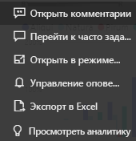
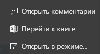
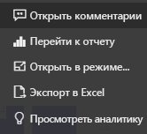

# Плитки панели мониторинга в Power BI

[!INCLUDE [power-bi-service-new-look-include](../includes/power-bi-service-new-look-include.md)]

Плитка представляет собой моментальный снимок данных, закрепленный на панели мониторинга при помощи *конструктора*. *Разработчики* могут создавать плитки на основе отчета, набора данных, информационной панели, поля вопросов и ответов, Excel, а также служб SQL Server Reporting Services (SSRS) и многого другого.  На предыдущем снимке экрана показано множество различных плиток, закрепленных на информационной панели.

Кроме плиток, закрепленных из отчетов, *конструкторы* позволяют добавить автономные плитки непосредственно на панели мониторинга с помощью команды **Добавить плитку**. Автономные плитки содержат следующие данные: текстовые поля, изображения, видео, потоковую передачу данных и веб-содержимое.

Нужна помощь со стандартными блоками Power BI?  См. раздел [Power BI — основные понятия](end-user-basic-concepts.md).

## Взаимодействие с плитками на информационной панели

1. Наведите указатель на плитку , чтобы отобразить многоточие.
   
    
2. Выберите многоточие, чтобы открыть меню действий плитки. Доступные варианты зависят от типа визуального элемента и метода, используемого для создания плитки. Ниже приведено несколько примеров того, что можно увидеть.

    - Плитка, созданная с помощью раздела "Вопросы и ответы"
   
        

    - Плитка, созданная из книги
   
        

    - Плитка, созданная из отчета
   
        
   
    Здесь можно выполнять следующие действия:
   
   * [открыть отчет, который использовался для создания этой плитки ](end-user-reports.md) ;  
   
   * [открыть вопрос, который использовался для создания плитки ](end-user-reports.md) ;  
   

   * [открыть книгу, которая использовалась для создания плитки ](end-user-reports.md) ;  
   * [просмотреть плитку в режиме фокусировки ](end-user-focus.md) ;  
   * [просмотреть аналитические сведения ](end-user-insights.md) ;
   * [добавить комментарий и начать обсуждение](end-user-comment.md) .
   * [управлять оповещениями, настроенными на плитке панели мониторинга](end-user-alerts.md) ;
   * [открыть данные в Excel](end-user-export.md) .

3. Чтобы закрыть меню действий, выберите пустую область на холсте.

### Выбор плитки
То, что происходит при выборе плитки, зависит от того, как плитка была создана и имеет ли она [пользовательскую ссылку](../service-dashboard-edit-tile.md). Если пользовательская ссылка присутствует, при выборе плитки осуществляется переход по этой ссылке. Иначе при выборе плитки открываются отчет, книга Excel Online, локальный отчет SQL Server Reporting Services или вопрос функции "Вопросы и ответы", которые использовались для создания плитки.

> [!NOTE]
> Исключением из этого являются плитки видео, созданные непосредственно на панели мониторинга с помощью команды **Добавить плитку**. При выборе такой плитки видео воспроизводится прямо на панели мониторинга.   
> 
> 

## Рекомендации и устранение неполадок
* Если отчет, который использовался для создания визуализации, не был сохранен, при выборе плитки никакие действия не выполняются.
* Если плитка была создана из книги в Excel Online и у вас нет по крайней мере разрешения на чтение этой книги, выбор плитки не приводит к открытию этой книги в Excel Online.
* Если для плиток, созданных непосредственно на панели мониторинга с помощью команды **Добавить плитку**, задана пользовательская гиперссылка, при выборе заголовка или подзаголовка в плитке откроется этот URL-адрес.  В противном случае по умолчанию при выборе одной из плиток, созданных непосредственно на панели мониторинга для изображения, веб-кода или текстового поля, не выполняются никакие действия.
* Если у вас нет разрешения на доступ к отчету в SQL Server Reporting Services и вы выберете плитку, созданную в SQL Server Reporting Services, появится страница с сообщением, что у вас нет доступа (rsAccessDenied).
* Если у вас нет доступа к сети, в которой расположена среда SQL Server Reporting Services и вы выберете плитку, созданную в SQL Server Reporting Services, появится страница с сообщением, что не удалось найти сервер (HTTP 404). Для просмотра отчета ваше устройство должно иметь сетевой доступ к серверу отчетов.
* Если исходная визуализация, использованная для создания плитки, изменяется, сама плитка не изменяется.  Например, если *конструктор* закрепил график из отчета, а затем изменил график на гистограмму, график будет по-прежнему отображаться на плитке информационной панели. Данные обновляются, а тип визуализации — нет.

## Дальнейшие действия
[Обновление данных](../refresh-data.md)

[Power BI — основные понятия](end-user-basic-concepts.md)
