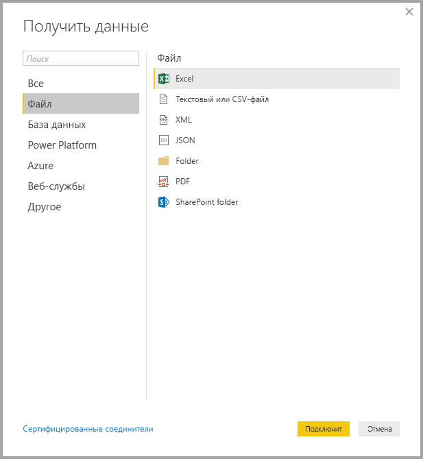
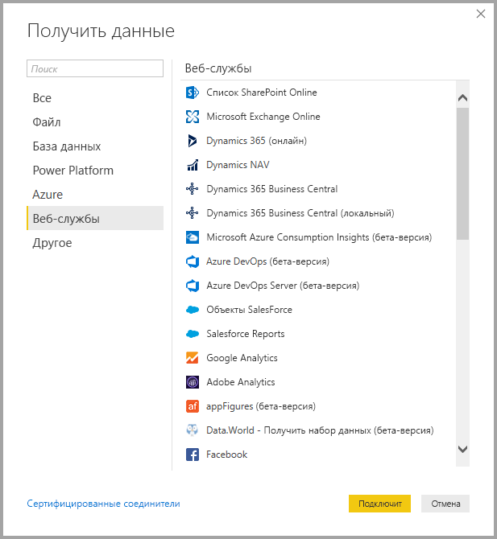
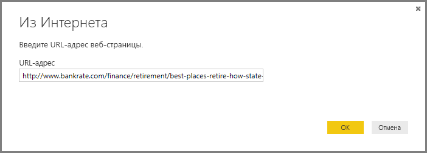

# <a name="data-sources-in-power-bi-desktop"></a>Источники данных в Power BI Desktop

Power BI Desktop позволяет подключаться к данным из многих разных источников. Полный список доступных источников данных см. в статье [Источники данных Power BI](power-bi-data-sources.md).

Подключение к данным осуществляется с помощью ленты **Главная**. Чтобы отобразить меню типов данных **Самые распространенные**, нажмите кнопку **Получить данные** или стрелку вниз.


Чтобы перейти к диалоговому окну **Получение данных**, откройте меню типов данных **Самые распространенные** и выберите **Дополнительно**. Вы также можете открыть диалоговое окно **Получение данных** (и обойти меню **Самые распространенные**), напрямую нажав на значок **Получить данные**.


> [!NOTE]
> Команда разработчиков Power BI постоянно расширяет список источников данных, доступных для приложения Power BI Desktop и службы Power BI. Поэтому вы часто будете видеть ранние версии источников данных в процессе разработки с пометкой **Бета-версия** или **Предварительная версия**. Все источники данных с пометкой **Бета-версия** или **Предварительная версия** имеют ограниченную поддержку и функциональные возможности и не должны использоваться в рабочих средах. Кроме того, любой источник данных, помеченный как **Бета-версия** или **Предварительная версия** для Power BI Desktop, может быть недоступен для использования в службе Power BI или других службах Майкрософт, пока не станет общедоступным (GA).

> [!NOTE]
> Существует много соединителей данных для Power BI Desktop, для проверки подлинности которых требуется Internet Explorer 10 (или более поздняя версия). 


## <a name="data-sources"></a>Источники данных

Диалоговое окно **Получение данных** организует типы данных в следующих категориях:

* Все
* Файл
* База данных
* Power Platform
* Azure
* Веб-службы
* Другие

Категория **Все** включает все типы подключений данных из всех категорий.

### <a name="file-data-sources"></a>Файловые источники данных

Категория **Файл** предоставляет следующие подключения к данным:

* Excel
* Text/CSV.
* XML
* JSON
* Папка
* PDF
* Папка SharePoint

На следующем рисунке показано окно **Получить данные** для категории **Файл**.



### <a name="database-data-sources"></a>Источники данных базы данных

Категория **База данных** предоставляет следующие подключения к данным:

* База данных SQL Server
* База данных Access
* База данных SQL Server Analysis Services
* База данных Oracle
* База данных IBM DB2
* База данных IBM Informix (бета-версия)
* IBM Netezza
* База данных MySQL
* База данных PostgreSQL
* База данных Sybase
* База данных Teradata
* База данных SAP HANA
* Сервер приложений SAP Business Warehouse
* Сервер сообщений SAP Business Warehouse
* Amazon Redshift
* Impala
* Google BigQuery
* Vertica
* Снежинка
* Essbase
* Кубы AtScale (бета-версия)
* Соединитель BI
* Denodo
* Dremio
* Exasol
* Indexima (бета-версия)
* InterSystems IRIS (бета-версия)
* Jethro (бета-версия)
* Kyligence
* MarkLogic

> [!NOTE]
> Некоторые соединители базы данных необходимо включить: выберите **Файл > Параметры и настройки > Параметры**, затем щелкните **Предварительная версия функций** и включите соединитель. Если некоторые из указанных выше соединителей не отображаются, а вы хотите их использовать, проверьте настройки параметра **Предварительная версия функций**. Также обратите внимание, что все источники данных с пометкой *Бета-версия* или *Предварительная версия* имеют ограниченную поддержку и функциональные возможности и не должны использоваться в рабочих средах.

На следующем рисунке показано окно **Получить данные** для категории **База данных**.


### <a name="power-platform-data-sources"></a>Источники данных Power Platform

Категория **Power Platform** предоставляет следующие подключения к данным:

* Наборы данных Power BI
* Потоки данных Power BI
* Common Data Service
* Потоки данных Power Platform

На следующем рисунке показано окно **Получение данных** для **Power Platform**.


### <a name="azure-data-sources"></a>Источники данных Azure

Категория **Azure** предоставляет следующие подключения к данным:

* База данных SQL Azure
* Хранилище данных SQL Azure
* База данных Azure Analysis Services
* Хранилище BLOB-объектов Azure
* Хранилище таблиц Azure
* Azure Cosmos DB
* Azure Data Lake Storage 2-го поколения
* Azure Data Lake Storage 1-го поколения
* Azure HDInsight (HDFS)
* Azure HDInsight Spark
* HDInsight Interactive Query
* Azure Data Explorer (Kusto)
* Управление затратами Azure
* Аналитика временных рядов Azure (бета-версия)

На следующем рисунке показано окно **Получить данные** для категории **Azure**.


### <a name="online-services-data-sources"></a>Источники данных Интернет-служб

Категория **Интернет-службы** предоставляет следующие подключения к данным:

* Список SharePoint Online
* Microsoft Exchange Online
* Dynamics 365 (в сети)
* Dynamics NAV
* Dynamics 365 Business Central
* Dynamics 365 Business Central (локальный)
* Microsoft Azure Consumption Insights (бета-версия)
* Azure DevOps (бета-версия)
* Azure DevOps Server (бета-версия)
* Объекты SalesForce
* Отчеты SalesForce
* Google Analytics
* Adobe Analytics
* appFigures (бета-версия)
* Data.World — получение набора данных (бета-версия)
* Facebook
* GitHub (бета-версия)
* LinkedIn Sales Navigator (бета-версия)
* MailChimp (бета-версия)
* Merketo (бета-версия)
* Mixpanel (бета-версия)
* Planview Enterprise One — PRM (бета-версия)
* Planview Projectplace (бета-версия)
* QuickBooks Online (бета-версия)
* Smartsheet (бета-версия)
* SparkPost (бета-версия)
* SweetIQ (бета-версия)
* Planview Enterprise One — CTM (бета-версия)
* Twilio (бета-версия)
* tyGraph (бета-версия)
* Webtrends (бета-версия)
* ZenDesk (бета-версия)
* Dynamics 365 Customer Insights (бета-версия)
* Источник данных Emigo
* Entersoft Business Suite (бета-версия)
* Industrial App Store
* Хранилище данных Intune (бета-версия)
* Microsoft Graph Security (бета-версия)
* Product Insights (бета-версия)
* Quick Base
* TeamDesk (бета-версия)
* Рабочая Аналитика (бета-версия)

На следующем рисунке показано окно **Получение данных** для категории **Интернет-службы**.



### <a name="other-data-sources"></a>Другие источники данных

Категория **Другие** предоставляет следующие подключения к данным:

* Интернет
* Список SharePoint
* Веб-канал OData
* Active Directory
* Microsoft Exchange
* Файл Hadoop (HDFS)
* Spark
* Скрипт R
* Скрипт Python
* ODBC
* OLE DB
* BI360 — отчеты по бюджетам и финансам (бета-версия)
* Information Grid (бета-версия)
* Paxata
* QubolePresto (бета-версия)
* Roamler (бета-версия)
* Siteimprove (бета-версия)
* SurveyMonkey (бета-версия)
* Tenforce (Smart)List (бета-версия)
* Vena (бета-версия)
* Workforce Dimensions (бета-версия)
* Пустой запрос

На следующем рисунке показано окно **Получение данных** для категории **Другие**.


> [!NOTE]
> Подключение к пользовательским источникам данных, полученным с помощью Azure Active Directory, сейчас не работает.

## <a name="connecting-to-a-data-source"></a>Подключение к источнику данных

Чтобы подключиться к источнику данных, выберите его в окне **Получение данных** и нажмите кнопку **Подключить**. На следующем рисунке выбран источник **Интернет** из категории подключения к данным **Другие** .


Отображается окно подключения, зависящее от типа подключения к данным. Если необходимы учетные данные, вам будет предложено ввести их. На следующем рисунке показан ввод URL-адреса для подключения к интернет-источнику данных.



Введите URL-адрес или сведения о подключении к ресурсу, а затем выберите **ОК**. Power BI Desktop устанавливает подключение к источнику данных и представляет доступные источники данных в области **Навигатор**.


Чтобы загрузить данные, внизу области **Навигатор** нажмите кнопку **Загрузить**. Чтобы преобразовать или изменить запрос в редакторе Power Query перед загрузкой данных, нажмите кнопку **Преобразовать данные**.

Это вся информация о подключении к источникам данных в Power BI Desktop. Попробуйте подключиться к данным из нашего растущего списка источников данных и следите за новостями — список постоянно пополняется.

## <a name="using-pbids-files-to-get-data"></a>Использование файлов PBIDS для получения данных

Файлы PBIDS — это файлы Power BI Desktop с определенной структурой и расширением PBIDS, позволяющим определить их как файлы источника данных Power BI.

Вы можете создать PBIDS-файл, чтобы упростить **получение данных** для создателей отчетов в вашей организации. Чтобы упростить использование файлов PBIDS для нового автора отчета, рекомендуется, чтобы администратор создал эти файлы для часто используемых подключений.

Когда автор открывает PBIDS-файл, Power BI Desktop открывает и запрашивает у пользователя учетные данные для проверки подлинности и подключения к источнику данных, указанному в файле. После этого откроется диалоговое окно **Навигация**, где пользователь должен выбрать таблицы из этого источника данных для загрузки в модель. Пользователям также может потребоваться выбрать базы данных, если они не были указаны в PBIDS-файле.

С этого момента пользователь может начать создавать визуализации или выбирать **Недавние источники**, чтобы загрузить новый набор таблиц в модель.

В настоящее время PBIDS-файлы поддерживают только один источник данных в одном файле. При указании нескольких источников данных возникает ошибка.

Чтобы создать файл PBIDS, администратор должен указать необходимые входные данные для одного соединения. Они также могут указывать для режима подключения как DirectQuery, так и Импорт. Если в файле отсутствует **режим** или он имеет значение null, то пользователю, открывающему файл в Power BI Desktop, предлагается выбрать **DirectQuery** или **Импорт**.

### <a name="pbids-file-examples"></a>Примеры PBIDS-файлов

В этом разделе приводится несколько примеров из часто используемых источников данных. Тип PBIDS-файла поддерживает только подключения к данным, которые также поддерживаются в Power BI Desktop, с двумя исключениями: Live Connect и пустой запрос.

PBIDS-файл *не* содержит информацию об аутентификации, таблицах и схемах.  

В следующих фрагментах кода показаны несколько распространенных примеров для файлов PBIDS, но они не являются полными или исчерпывающими. Информацию о протоколе и адресе для других источников данных см. в [разделе о формате ссылки на источник данных (DSR)](https://docs.microsoft.com/azure/data-catalog/data-catalog-dsr#data-source-reference-specification).

Эти примеры предназначены только для удобства. Они не являются исчерпывающими и не включают все поддерживаемые соединители в формате DSR. Используя эти примеры в качестве руководств, администраторы или организации могут создавать собственные источники данных, из которых они могут создавать и поддерживать собственные файлы источников данных.

#### <a name="azure-as"></a>Azure AS

```json
{ 
    "version": "0.1", 
    "connections": [ 
    { 
        "details": { 
        "protocol": "analysis-services", 
        "address": { 
            "server": "server-here" 
        }, 
        } 
    } 
    ] 
}
```

#### <a name="folder"></a>Папка

```json
{ 
  "version": "0.1", 
  "connections": [ 
    { 
      "details": { 
        "protocol": "folder", 
        "address": { 
            "path": "folder-path-here" 
        } 
      } 
    } 
  ] 
} 
```

#### <a name="odata"></a>OData

```json
{ 
  "version": "0.1", 
  "connections": [ 
    { 
      "details": { 
        "protocol": "odata", 
        "address": { 
            "url": "URL-here" 
        } 
      } 
    } 
  ] 
} 
```

#### <a name="sap-bw"></a>SAP BW

```json
{ 
  "version": "0.1", 
  "connections": [ 
    { 
      "details": { 
        "protocol": "sap-bw-olap", 
        "address": { 
          "server": "server-name-here", 
          "systemNumber": "system-number-here", 
          "clientId": "client-id-here" 
        }, 
      } 
    } 
  ] 
} 
```

#### <a name="sap-hana"></a>SAP Hana

```json
{ 
  "version": "0.1", 
  "connections": [ 
    { 
      "details": { 
        "protocol": "sap-hana-sql", 
        "address": { 
          "server": "server-name-here:port-here" 
        }, 
      } 
    } 
  ] 
} 
```

#### <a name="sharepoint-list"></a>Список SharePoint

URL-адрес должен указывать на сам сайт SharePoint, а не на список на сайте. Пользователи получают навигатор, позволяющий выбрать с этого сайта один или несколько списков, каждый из которых станет таблицей в модели.

```json
{ 
  "version": "0.1", 
  "connections": [ 
    { 
      "details": { 
        "protocol": "sharepoint-list", 
        "address": { 
          "url": "URL-here" 
        }, 
       } 
    } 
  ] 
} 
```

#### <a name="sql-server"></a>SQL Server

```json
{ 
  "version": "0.1", 
  "connections": [ 
    { 
      "details": { 
        "protocol": "tds", 
        "address": { 
          "server": "server-name-here", 
          "database": "db-name-here (optional) "
        } 
      }, 
      "options": {}, 
      "mode": "DirectQuery" 
    } 
  ] 
} 
```

#### <a name="text-file"></a>текстовый файл

```json
{ 
  "version": "0.1", 
  "connections": [ 
    { 
      "details": { 
        "protocol": "file", 
        "address": { 
            "path": "path-here" 
        } 
      } 
    } 
  ] 
} 
```

#### <a name="web"></a>Интернет

```json
{ 
  "version": "0.1", 
  "connections": [ 
    { 
      "details": { 
        "protocol": "http", 
        "address": { 
            "url": "URL-here" 
        } 
      } 
    } 
  ] 
} 
```

#### <a name="dataflow"></a>Поток данных

```json
{
  "version": "0.1",
  "connections": [
    {
      "details": {
        "protocol": "powerbi-dataflows",
        "address": {
          "workspace":"workspace id (Guid)",
          "dataflow":"optional dataflow id (Guid)",
          "entity":"optional entity name"
        }
       }
    }
  ]
}
```

## <a name="next-steps"></a>Дальнейшие действия

Power BI Desktop предоставляет широкие возможности. Дополнительные сведения об этих возможностях см. в следующих ресурсах.

* [Что такое Power BI Desktop?](desktop-what-is-desktop.md)
* [Об использовании Редактора запросов в Power BI Desktop](desktop-query-overview.md)
* [Типы данных в Power BI Desktop](desktop-data-types.md)
* [Формирование и объединение данных в Power BI Desktop](desktop-shape-and-combine-data.md)
* [Общие задачи с запросами в Power BI Desktop](desktop-common-query-tasks.md)
