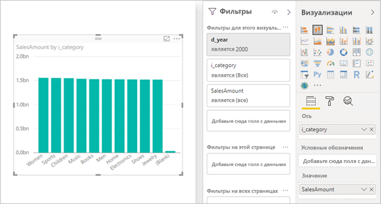

# <a name="troubleshoot-developing-directquery-models-in-power-bi-desktop"></a>Устранение неполадок с разработкой моделей DirectQuery в Power BI Desktop

Эта статья ориентирована на разработчиков моделей данных DirectQuery для Power BI, использующих Power BI Desktop или службу Power BI. Здесь описывается диагностика проблем с производительностью, а также получение более подробных сведений для оптимизации отчетов.

## <a name="performance-analyzer"></a>Анализатор производительности

Мы настоятельно рекомендуем выполнять любую диагностику проблем производительности в Power BI Desktop, а не в Power BI (служба сервера отчетов Power BI). Очень часто проблемы с производительностью возникают на основе уровня производительности базового источника данных, и их проще всего обнаружить и проанализировать в более изолированной среде, как, например, в Power BI Desktop, что также позволяет на начальном этапе исключить возможность столкновения с определенными компонентами (например, Power BI Gateway). Только в том случае, если проблемы производительности невозможно диагностировать в Power BI Desktop, необходимо рассмотреть отдельные аспекты отчета в Power BI. [Анализатор производительности](desktop-performance-analyzer.md) — это полезный инструмент для выявления проблем в рамках этого процесса.

Аналогичным образом рекомендуется в первую очередь обеспечить надежную защиту для отдельного визуального элемента, а не нескольких на странице.

Давайте предположим, что эти действия (рассмотренные в предыдущих абзацах этого раздела) выполнены. Теперь у нас есть один визуальный элемент на странице в Power BI Desktop, производительность которого по-прежнему достаточно низкая. Чтобы определить запросы, отправляемые Power BI Desktop в базовый источник, можно использовать анализатор производительности. Кроме того, можно просмотреть сведения о трассировке (диагностике), предоставляемые этим источником. Такие трассировки могут также содержать полезную информацию и дополнительные сведения о выполнении запроса и возможностях его оптимизации.

Кроме того, даже если мы не получим сведений о трассировке из источника, у нас все равно есть возможность просмотреть запросы, отправленные Power BI, а также время их выполнения, что будет рассматриваться далее.

## <a name="review-trace-files"></a>Проверка файлов трассировки

По умолчанию Power BI Desktop записывает события во время определенного сеанса в файл трассировки, который называется **FlightRecorderCurrent.trc**.

Для некоторых источников DirectQuery этот журнал включает все запросы, отправленные в базовый источник данных (поддержка остальных источников DirectQuery может быть реализована позже). Ниже перечислены источники, которые записывают запросы в журнал:

- SQL Server
- База данных SQL Azure
- Хранилище данных SQL Azure
- Oracle
- Teradata
- SAP HANA

Файл трассировки можно найти в папке **AppData** для текущего пользователя: _\\\<Пользователь>\AppData\Local\Microsoft\Power BI Desktop\AnalysisServicesWorkspaces_

Ниже описан простой способ получить эту папку: В Power BI Desktop выберите _Файл > Параметры и настройки > Параметры_, а затем перейдите на страницу **Диагностика**. Появится следующее диалоговое окно:


Если щелкнуть ссылку **Открыть папку аварийных дампов и трассировок** в разделе "Сбор аварийных дампов", откроется следующая папка: _\\\<Пользователь>\AppData\Local\Microsoft\Power BI Desktop\Traces_

Когда вы перейдете к родительской папке, отобразится папка, содержащая _AnalysisServicesWorkspaces_, которая будет содержать одну вложенную папку рабочей области для каждого открытого экземпляра Power BI Desktop. Эти вложенные папки содержат в имени суффикс целого числа, например _AnalysisServicesWorkspace2058279583_.

В этой папке находится вложенная папка _\Data_, содержащая файл трассировки FlightRecorderCurrent.trc для текущего сеанса Power BI. Соответствующая папка рабочей области удаляется по завершении связанного сеанса Power BI Desktop.

Файлы трассировки можно открыть с помощью средства SQL Server Profiler, которое доступно для скачивания бесплатно в составе SQL Server Management Studio. Получить SQL Server Management Studio вы можете из [этого расположения](/sql/ssms/download-sql-server-management-studio-ssms?view=sql-server-2017).

После скачивания и установки SQL Server Management Studio запустите SQL Server Profiler.


Чтобы открыть файл трассировки, сделайте следующее:

1. В SQL Server Profiler выберите _Файл > Открыть > Файл трассировки_.
2. Введите путь к файлу трассировки для текущего открытого сеанса Power BI, например: _\\\<Пользователь>\AppData\Local\Microsoft\Power BI Desktop\AnalysisServicesWorkspaces\AnalysisServicesWorkspace2058279583\Data_
3. Откройте файл _FlightRecorderCurrent.trc_.

Отобразятся все события текущего сеанса. Ниже приведен пример, в котором выделены группы событий. Каждая группа включает следующее:

- события _Начало запроса_ и _Окончание запроса_, которые представляют отправку и завершение запроса DAX, созданного интерфейсом пользователя (например, визуальным элементом, заполнением списка значений в пользовательском интерфейсе фильтра);
- одну или несколько пар событий _Начало DirectQuery_ и _Окончание DirectQuery_, которые представляют запрос, отправленный в базовый источник данных, как часть оценки запроса DAX.

Обратите внимание, что несколько запросов DAX могут выполняться параллельно, поэтому события из разных групп могут чередоваться. Значение ActivityID может использоваться для определения событий, принадлежащих одной группе.


Другие столбцы, которые следует рассмотреть:

- **TextData:** текстовые сведения о событии. Для событий _"Начало запроса" и "Окончание запроса"_ будет использоваться запрос DAX. Для событий _"Начало DirectQuery" и "Окончание DirectQuery"_ будет использоваться SQL-запрос, отправленный в базовый источник. Значение _TextData_ для текущего выбранного события также отображается в нижней области.
- **EndTime:** время завершения события.
- **Duration:** время, затраченное на выполнение запроса SQL или DAX, в мс.
- **Error:** событие, сообщающее об ошибке (в этом случае событие также отображается красным цветом).

На приведенном выше рисунке область со столбцами, которые мы не рассматриваем, сужена, что дает возможность сосредоточиться только на основных столбцах.

Чтобы диагностировать потенциальные проблемы производительности с помощью трассировки, мы рекомендуем сделать следующее:

- Откройте отдельный сеанс Power BI Desktop (чтобы избежать путаницы с несколькими папками рабочей области).
- Выполните необходимые действия в Power BI Desktop. Выполните несколько дополнительных действий, чтобы убедиться, что нужные события записываются в файл трассировки.
- Откройте SQL Server Profiler и найдите файл трассировки, как описано выше. Помните, что файл трассировки после закрытия Power BI Desktop будет удален. Кроме того, дополнительные действия в Power BI Desktop будут отображены не сразу: файл трассировки следует закрыть, а затем повторно открыть, чтобы просмотреть новые события.
- Используйте небольшие отдельные сеансы (десятки секунд на действие, не сотни) для быстрого анализа файла трассировки. (Из-за ограничения размера файла трассировки есть вероятность, что события длинных сеансов завершатся сбоем.)

## <a name="understand-queries-sent-to-the-source"></a>Общие сведения о запросах, отправляемых в источник

Общий формат запросов, создаваемых и отправляемых Power BI Desktop, использует подзапросы для каждой связанной таблицы модели, в которой подзапрос определяется запросом Power Query. Предположим, в реляционной базе данных SQL Server есть следующие таблицы TPC-DS:


Обратите внимание на следующий визуальный элемент и его конфигурацию, а также на то, что мера **SalesAmount** определяется следующим выражением:

```dax

SalesAmount = SUMX(Web_Sales, [ws_sales_price] * [ws_quantity])

```



Обновление этого визуального элемента приведет к запросу T-SQL, показанному ниже. Как видно, используется три подзапроса для таблиц модели **Web_Sales**, **Item** и **Date_dim**. Каждая из этих таблиц возвращает все столбцы таблицы модели, несмотря на то, что визуальный элемент фактически ссылается только на четыре столбца. Именно эти подзапросы (затенены) определяют запросы Power Query. Использование подзапросов таким образом не влияет на производительность для источников данных, поддерживаемых для DirectQuery на сегодняшний день. Такие источники данных, как SQL Server, оптимизируют ссылки на неиспользуемые столбцы.

Такая схема используется в Power BI, поскольку вы имеете возможность определить запрос Power Query, используемый в качестве конкретного выражения запроса. Таким образом, он используется в исходном виде без попыток перезаписать его. Обратите внимание, что в таких схемах применяются выражения запросов, использующие обобщенные табличные выражения и хранимые процедуры. Такие выражения нельзя использовать в подзапросах.


## <a name="gateway-performance"></a>Производительность шлюза

Дополнительные сведения об устранении неполадок с производительностью шлюза см. в статье [Устранение неполадок с шлюзами — Power BI](service-gateway-onprem-tshoot.md).

## <a name="next-steps"></a>Дальнейшие действия

Дополнительные сведения о DirectQuery см. в следующих статьях:

- [Использование DirectQuery в Power BI Desktop](desktop-use-directquery.md)
- [Модели DirectQuery в Power BI Desktop](desktop-directquery-about.md)
- [Руководство по использованию модели DirectQuery в Power BI Desktop](guidance/directquery-model-guidance.md)
- У вас появились вопросы? [Попробуйте задать вопрос в сообществе Power BI.](https://community.powerbi.com/)
