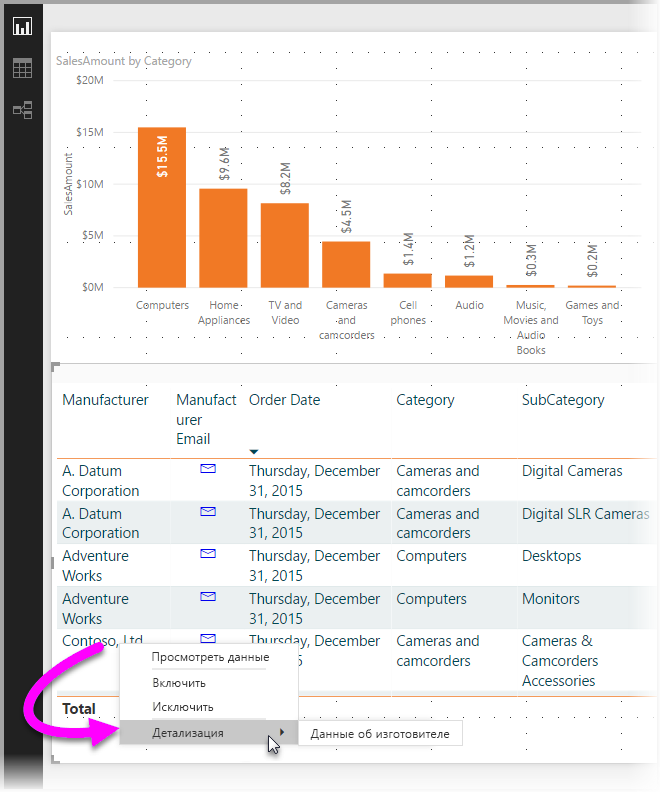
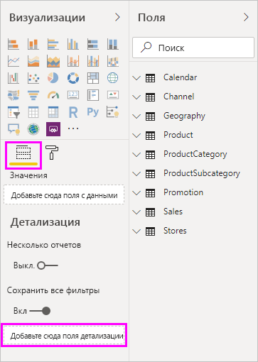
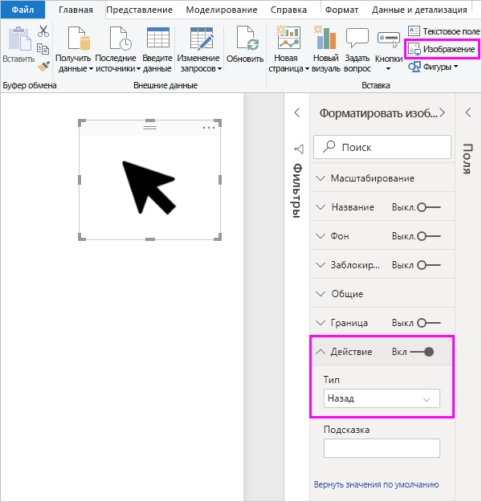
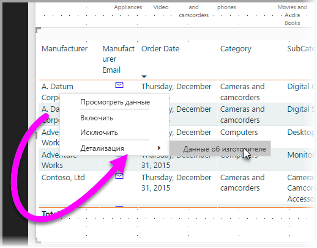
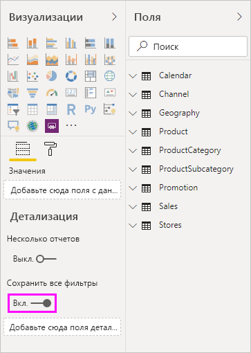
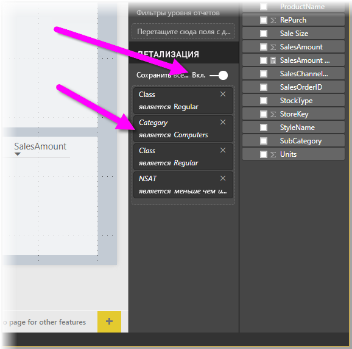
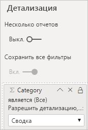

# Использование детализации в Power BI Desktop
С помощью функции *детализации* в Power BI Desktop вы можете создать страницу отчета, посвященную определенной сущности, такой как поставщик, клиент или производитель. Чтобы использовать детализацию, можно щелкнуть правой кнопкой мыши точку данных на других страницах отчета и перейти для детализации на страницу определенной сущности, чтобы получить подробные сведения, отфильтрованные с учетом контекста.

## Использование детализации
1. Чтобы использовать детализацию, создайте страницу отчета с необходимыми визуальными элементами для типа сущности, для которой будет выполняться детализация. 

    Предположим, вы хотите детализировать данные по производителям. Для этого можно создать страницу детализации с визуальными элементами, которые показывают общий объем продаж, общее количество отгруженных единиц товара, продажи по категориям, продажи по регионам и т. д. Таким образом, когда вы перейдете на эту страницу, отобразятся визуальные элементы, относящиеся к выбранному производителю.

2. Затем на странице детализации в разделе **Поля** панели **Визуализации** перетащите поле, для которого требуется выполнить детализацию, в область **Фильтры детализации**.

    

    Когда вы добавляете поле в область **Фильтры детализации**, Power BI Desktop автоматически создает визуальный элемент для *возврата*. В опубликованных отчетах этот визуальный элемент представляет собой кнопку. С ее помощью пользователи, работающие с вашим отчетом в службе Power BI, смогут вернуться на страницу отчета, с которой они перешли.

    

> [!IMPORTANT]
> Можно настроить и выполнить детализацию до страницы в том же отчете, но невозможно выполнить детализацию до страницы в другом отчете.  

## Использование собственного изображения для кнопки возврата    
 Так как кнопка "Назад" — это изображение, вы можете заменить его на любое другое изображение. Это не повлияет на работу кнопки, с помощью которой пользователи отчетов возвращаются к исходной странице. 

Чтобы использовать собственное изображение для кнопки "Назад", сделайте следующее.

1. На вкладке **Главная** выберите **Изображение**. Затем найдите требуемое изображение и поместите его на странице детализации.

2. Выберите новое изображение на странице детализации. В области **Формат изображения** установите ползунок для параметра **Действие** в положение **Включить** и задайте для параметра **Тип** значение **Назад**. Теперь изображение выполняет функцию кнопки возврата.

    

    
     Теперь пользователи могут щелкнуть правой кнопкой мыши точку данных в отчете и открыть контекстное меню, чтобы перейти на страницу детализации. 

    

    Когда пользователь отчета переходит на страницу детализации, данные на странице фильтруются, чтобы отобразить сведения о точке данных, которую он щелкнул правой кнопкой мыши. Предположим, пользователь щелкнул правой кнопкой мыши точку данных о компании Contoso (производитель) и перешел на страницу детализации. На открывшейся странице детализации данные будут отфильтрованы по компании Contoso.

## Передача всех фильтров в детализации

К окну детализации можно применить все заданные фильтры. Например, можно выбрать определенную товарную категорию и отфильтровать визуальные элементы по этой категории, а затем выбрать детализацию. Вам может быть интересно узнать, как будет выглядеть детализация со всеми примененными фильтрами.

Чтобы сохранить все примененные фильтры, в разделе **Детализация** области **Визуализации** установите переключатель **Сохранить все фильтры** в положение **Включить**. 

Выполнив теперь детализацию визуального элемента, можно увидеть, какие фильтры действуют после применения временных фильтров к исходному визуальному элементу. В разделе **Детализация** области **Визуализация** такие временные фильтры выделены курсивом. 

Хотя так же можно было бы поступить и со страницами подсказок, они будут работать неправильно. Поэтому выполнять эти действия с подсказками не рекомендуется.

## Добавление меры в детализацию

Помимо передачи всех фильтров в окно детализации, вы можете добавить в область детализации меру или итоговый числовой столбец. Перетащите поле детализации в карточку **Детализация**, чтобы применить его. 

После добавления меры или итогового числового столбца вы сможете перейти к странице детализации, когда это поле используется в области *Значение* визуального элемента.

Это все, что нужно знать о детализации в отчетах. Детализация — отличный способ получить развернутое представление данных о сущности, выбранных с помощью фильтра детализации.

## Дальнейшие действия

Рекомендуем также ознакомиться со следующими материалами:

* [Использование детализации между отчетами в Power BI Desktop](desktop-cross-report-drill-through.md)
* [Использование срезов в Power BI Desktop](visuals/power-bi-visualization-slicers.md)

