# Общие сведения о запросах в Power BI Desktop
С помощью Power BI Desktop вы можете подключаться к миру данных, создавать привлекательные и фундаментальные отчеты и совместно использовать свою работу с другими пользователями, которые затем могут использовать ее для расширения своих возможностей по бизнес-аналитике.

Power BI Desktop имеет три представления:

* Представление **отчетов** — здесь можно использовать запросы для создания впечатляющих визуализаций, их упорядочивания и добавления на них нескольких страниц, которые можно использовать совместно с другими пользователями.
* Представление **данных** — здесь можно просматривать данные отчета в формате модели данных, добавлять меры, создавать новые столбцы и управлять связями.
* Представление **связей** — здесь можно получить графическое представление связей, установленных в вашей модели данных, а также при необходимости изменять их или управлять ими.

Доступ к этим представлениям осуществляется путем выбора одного из трех значков, расположенных вдоль левой стороны Power BI Desktop. На следующем рисунке выбрано представление **Отчеты**, на что указывает желтая полоска рядом со значком.  

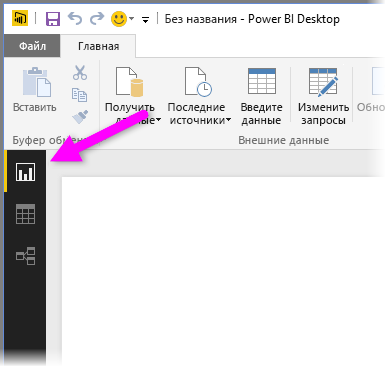

Power BI Desktop также поставляется с редактором Power Query. Используйте редактор Power Query, чтобы подключаться к одному или нескольким источникам данных, преобразовывать данные в соответствии с потребностями, а также загружать модель в Power BI Desktop.

Этот документ содержит общие сведения о работе с данными в редакторе Power Query, но это еще не все. В конце этого документа вы найдете ссылки на подробные указания по поддерживаемым типам данных. Вы также найдете руководство по подключению к данным, формированию данных, созданию связей и началу работы.

Но сначала давайте ознакомимся с редактором Power Query.

## Редактор Power Query
Чтобы открыть редактор Power Query, в Power BI Desktop на вкладке **Главная** нажмите кнопку **Изменить запросы**.  

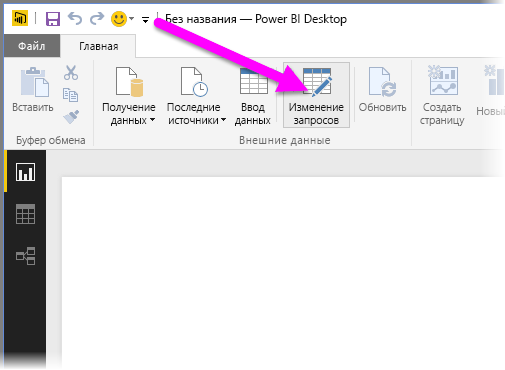

Без подключения к данным в Power Query отображается пустая область.  

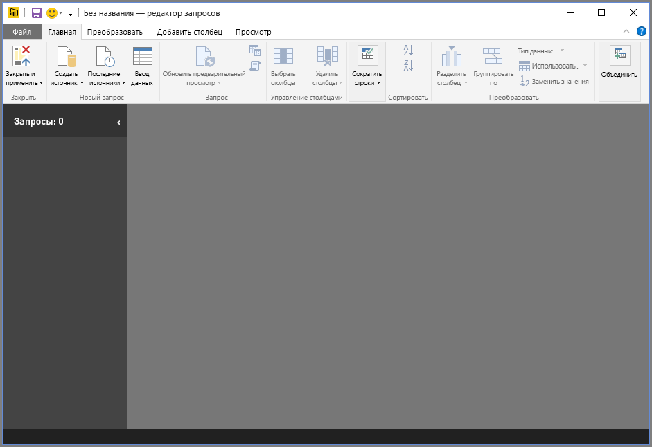

После загрузки запроса представление редактора Power Query становится гораздо более интересным. Если мы подключимся к указанному ниже веб-источнику данных, редактор Power Query загрузит сведения о данных и мы сможем начинать их формировать.

[*https://www.bankrate.com/retirement/best-and-worst-states-for-retirement/*](https://www.bankrate.com/retirement/best-and-worst-states-for-retirement/)

Вот так выглядит редактор Power Query после подключения к данным.

1. На ленте многие кнопки теперь можно использовать для взаимодействия с данными в запросе.
2. В левой области перечислены запросы, которые можно выбирать, просматривать и формировать.
3. В центральной области отображаются данные из выбранного запроса, и их можно формировать.
4. Появляется область **Параметры запроса**, в которой перечислены свойства запроса и примененные действия.  
   
   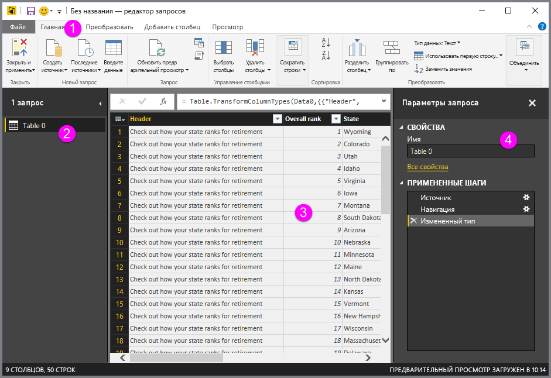

Мы рассмотрим каждую из этих четырех областей — ленту, область запросов, представление данных и область параметров запроса.

## Лента запроса
Лента в редакторе Power Query состоит из четырех вкладок: **Главная**, **Преобразовать**, **Добавить столбец** и **Представление**.

На вкладке **Главная** содержатся общие задачи запросов.

Чтобы подключиться к данным и начать процесс построения запросов, выберите **Создать источник**. Появится меню с наиболее распространенными источниками данных.  

Дополнительные сведения о доступных источниках данных см. в разделе **Источники данных**. Сведения о подключении к данным, включая примеры и инструкции, см. в разделе **Подключение к данным**.

Вкладка **Преобразовать** предоставляет доступ к общим задачам преобразования данных, например:

* добавление или удаление столбцов;
* изменение типов данных; 
* разделение столбцов; 
* другие задачи с данными.

Дополнительные сведения о преобразовании данных, включая примеры, см. в разделе [Учебник. Формирование и объединение данных в Power BI Desktop](https://docs.microsoft.com/power-bi/desktop-shape-and-combine-data).

На вкладке **Добавить столбец** предоставляются дополнительные задачи, связанные с добавлением столбца, форматированием данных столбца и добавлением настраиваемых столбцов. На следующем рисунке показана вкладка **Добавить столбец** ленты.  

Вкладка **Вид** на ленте используется для переключения между разными областями или окнами. Она также используется для отображения расширенного редактора. На следующем рисунке показана вкладка **Вид** ленты.  

Полезно знать, что многие задачи, доступные на ленте, также доступны по щелчку правой кнопкой мыши столбца или других данных в центральной области.

## Левая область (запросы)
В левой области (**Запросы**) отображается число активных запросов, а также имя запроса. При выборе запроса в левой области его данные отображаются в центральной области, где их можно формировать и преобразовывать в соответствии со своими потребностями. На следующем рисунке показана левая область с запросом.  

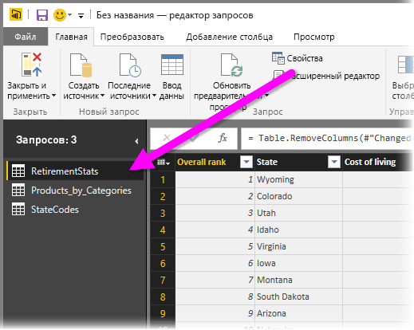

## Центральная область (область данных)
В центральной области, или области **Данные**, отображаются данные из выбранного запроса. Здесь выполняется большая часть работы с представлением **Запросы**.

На следующем рисунке показано подключение к веб-данным, установленное ранее. Выбран столбец **Продукт**, его заголовок показывает доступные пункты меню по правому щелчку мыши. Обратите внимание, что многие из этих пунктов контекстного меню совпадают с кнопками на вкладках ленты.  

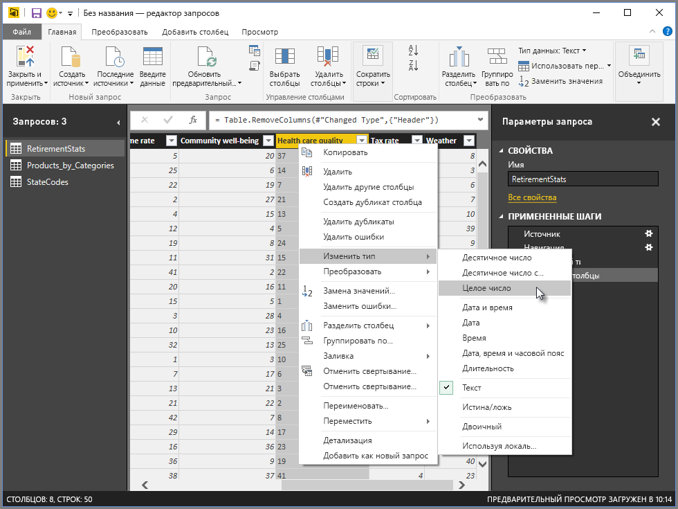

При выборе пункта контекстного меню (или нажатии кнопки на ленте) запрос применяет это действие к данным. Он также сохраняет шаг как часть самого запроса. Действия записываются в области **Параметры запроса** в последовательном порядке, как описано в следующем разделе.  

## Правая область (параметры запроса)
В области **Параметры запроса** справа отображаются все действия, связанные с запросом. Например, на следующем рисунке в разделе **Примененные действия** области **Параметры запроса** отражен тот факт, что мы только что изменили тип столбца **Overall score** (Общий рейтинг).

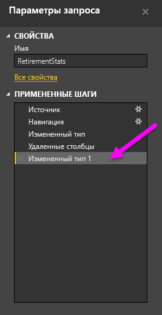

По мере применения к запросу дополнительных действий по формированию они регистрируются в разделе **Примененные действия**.

Важно помнить, что базовые данные *не* меняются. Вместо этого редактор Power Query настраивает и формирует представление данных. Он также формирует и корректирует представление любого взаимодействия с базовыми данными, которое происходит на основе сформированного и измененного представления данных в редакторе Power Query.

В области **Параметры запроса** можно переименовывать действия, удалять действия или упорядочивать их по своему усмотрению. Для этого щелкните правой кнопкой мыши действие в разделе **Примененные действия** и в появившемся меню выберите соответствующую команду. Все действия запроса выполняются в порядке их отображения в области **Примененные действия**.

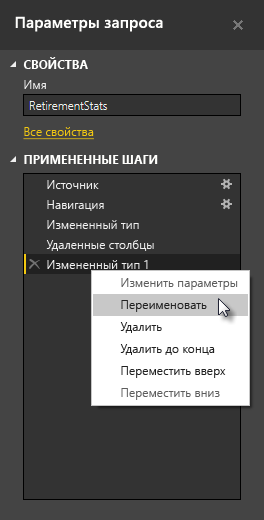

## Расширенный редактор
**Расширенный редактор** позволяет увидеть код, создаваемый редактором Power Query на каждом шаге. Он также позволяет создать собственный код формирования. Чтобы запустить расширенный редактор, выберите на ленте вкладку **Вид** , а затем нажмите **Расширенный редактор**. Появится окно с существующим кодом запроса.  
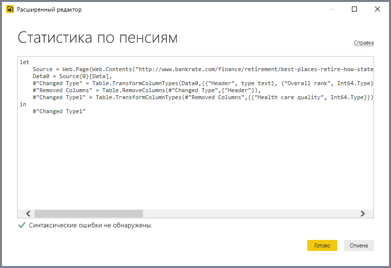

Можно непосредственно редактировать код в окне **Расширенный редактор** . Чтобы закрыть окно, нажмите кнопку **Готово** или **Отмена** .  

## Сохранение работы
Если запрос находится в нужном месте, выберите **Закрыть и применить** в меню **Файл** в редакторе Power Query. Это действие применяет изменения и закрывает редактор.  

По мере хода выполнения Power BI Desktop выводит диалоговое окно для отображения состояния.  
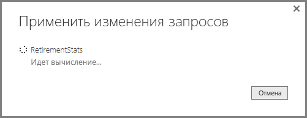

Когда будете готовы, Power BI Desktop можете сохранить вашу работу в виде файла *PBIX*.

Чтобы сохранить результаты работы, выберите **Файл** \> **Сохранить** (или **Файл** \> **Сохранить как**), как показано на следующем рисунке.  
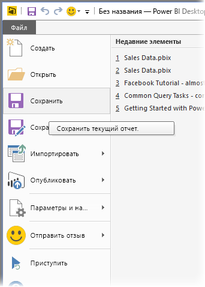

## Дальнейшие действия
Power BI Desktop предоставляет широкие возможности. Дополнительные сведения об этих возможностях см. в следующих ресурсах.

* [Что такое Power BI Desktop?](desktop-what-is-desktop.md)
* [Источники данных в Power BI Desktop](desktop-data-sources.md)
* [Подключение к данным в Power BI Desktop](desktop-connect-to-data.md)
* [Руководство. Формирование и объединение данных в Power BI Desktop](desktop-shape-and-combine-data.md)
* [Выполнение общих задач с запросами в Power BI Desktop](desktop-common-query-tasks.md)   

