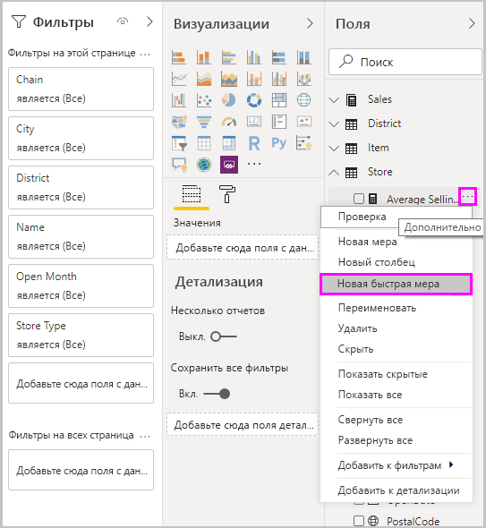
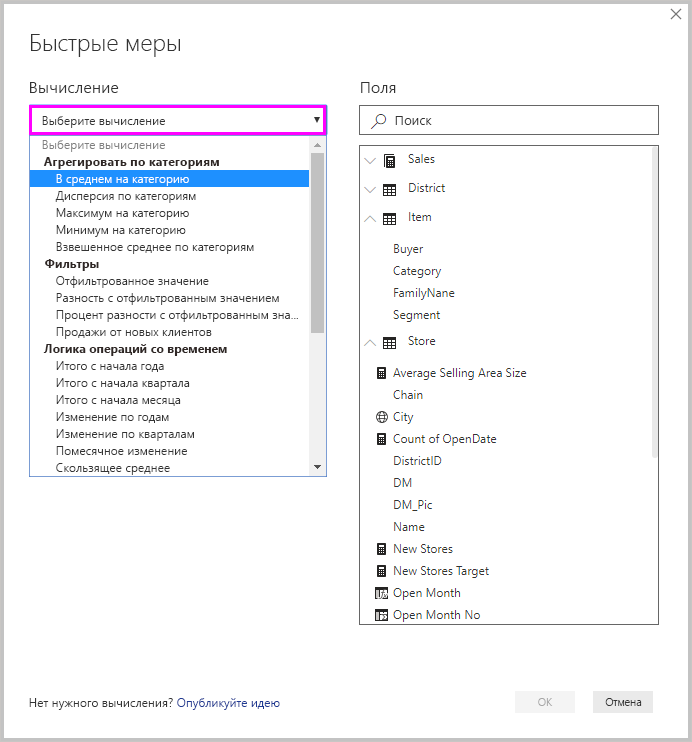
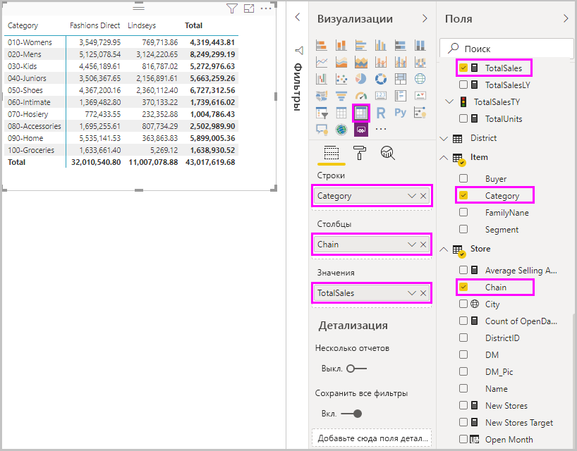
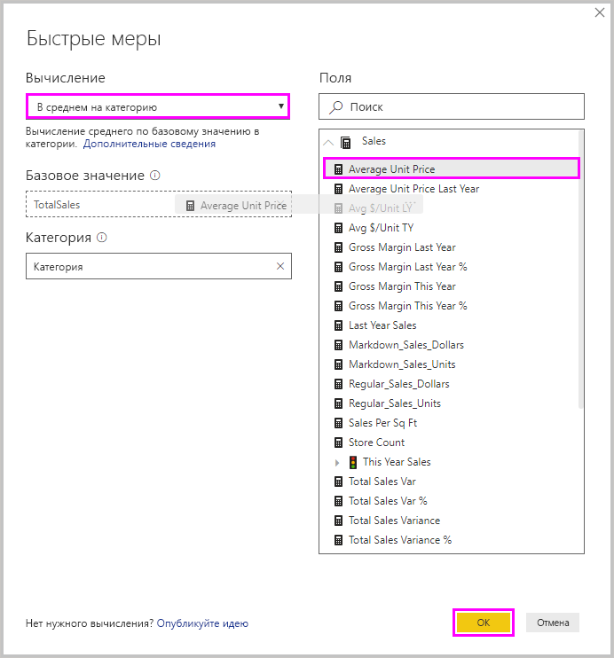
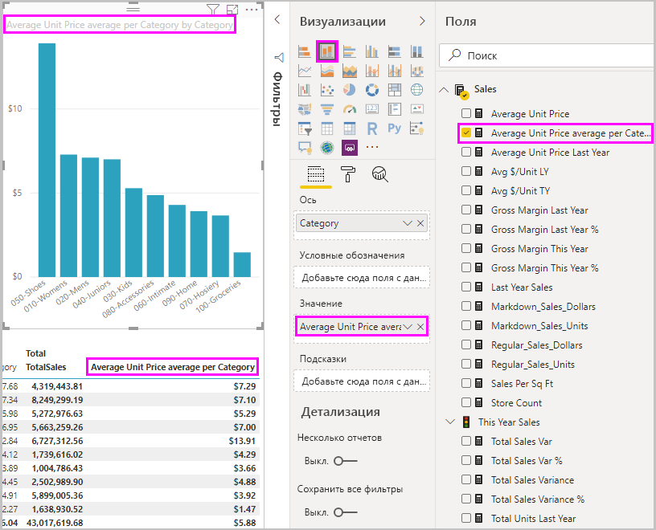
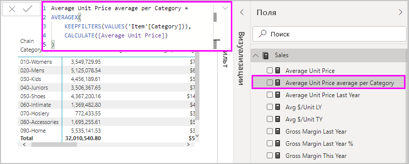
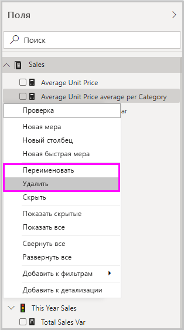

# Использование быстрых мер для выполнения стандартных вычислений
Чтобы оперативно и без труда выполнять стандартные и ресурсоемкие вычисления, используйте *быстрые меры*. Быстрая мера выполняет набор команд DAX в фоновом режиме, а затем представляет результаты для использования в отчете. Вам не нужно писать DAX-код — все выполняется автоматически на основе входных данных, которые вы вводите в диалоговом окне. Существует много доступных категорий вычислений и способов изменять каждое вычисление в соответствии с вашими потребностями. Самое главное, вы можете просмотреть, как быстрые меры выполняют DAX-команды, а также ознакомиться с библиотекой DAX или расширить свои знания о ней.

## Создание быстрой меры

Чтобы создать быструю меру в Power BI Desktop, щелкните правой кнопкой мыши или выберите многоточие **...** рядом с любым элементом в области **Поля**, а затем выберите **Новая быстрая мера** в появившемся меню. 

Можно также щелкнуть правой кнопкой мыши или выбрать стрелку раскрывающегося списка рядом с любым значением в области **Значения** для существующего визуального элемента, а затем выбрать в меню пункт **Новая быстрая мера**. 

При выборе элемента **Новая быстрая мера** появляется окно **Быстрые меры**, позволяющее выбрать нужное вычисление и поля для него. 

Выберите поле **Выберите вычисление**, чтобы просмотреть длинный список доступных быстрых мер. 

Ниже приведены пять типов вычислений быстрых мер с соответствующими вычислениями.

* **Агрегировать по категориям:**
  * В среднем на категорию
  * Дисперсия по категориям
  * Максимум на категорию
  * Минимум на категорию
  * Средневзвешенное значение по категориям
* **Фильтры:**
  * Отфильтрованное значение
  * Разность с отфильтрованным значением
  * Процент разности с отфильтрованным значением
  * Продажи от новых клиентов
* **Логика операций со временем**
  * Итого с начала года
  * Итого с начала квартала
  * Итого с начала месяца
  * изменение по годам;
  * поквартальное изменение;
  * Помесячное изменение
  * Скользящее среднее
* **Итоги**
  * Итоговая сумма
  * Итоги для категории (с фильтрами)
  * Итоги для категории (без фильтров)
* **Математические операции**
  * Добавление
  * Вычитание
  * Умножение
  * Деление
  * Разница в процентах
  * коэффициент корреляции.
* **Текстовые**
  * Оценка
  * Объединенный список значений

Чтобы поделиться своими идеями о новых быстрых мерах, которые вы хотели бы получить, базовых формулах DAX или другими важными мыслями о быстрых мерах, перейдите в конец статьи.

> [!NOTE]
> При использовании динамических подключений служб SQL Server Analysis Services (SSAS) доступны некоторые быстрые меры. В Power BI Desktop отображаются только быстрые меры, поддерживаемые версией служб SSAS, к которой вы подключаетесь. Если вы подключились к источнику динамических данных SSAS и не видите в списке определенные быстрые меры, это означает, что версия служб SSAS, к которой вы подключились, не поддерживает команды DAX, используемые для реализации этих быстрых мер.

Выбрав нужные вычисления и поля для быстрой меры, нажмите кнопку **ОК**. Новая быстрая мера появляется в области **Поля**, а базовая формула DAX появляется в строке формул. 

## Пример быстрой меры
Рассмотрим быструю меру в действии.

Следующий визуальный элемент матрицы отображает таблицу с продажами различных продуктов. Это основная таблица, содержащая итоги продаж по каждой категории.

Выбрав визуальный элемент матрицы, щелкните стрелку раскрывающегося списка рядом с полем **TotalSales** в области **Значения** и выберите **Новая быстрая мера**. 

В окне **Быстрые меры** в разделе **Вычисление** выберите **В среднем на категорию**. 

Перетащите **Средняя цена за единицу** из области **Поля** в поле **Базовое значение**. Оставьте элемент **Категория** в поле **Категория** и нажмите кнопку **ОК**. 

После нажатия кнопки **ОК** происходит ряд действий.

1. Визуальный элемент матрицы содержит новый столбец, показывающий вычисленное значение **Средняя цена за единицу в среднем на категорию**.
   
2. Формула DAX для быстрой меры отображается в строке формул. Дополнительные сведения о формуле DAX см. в [следующем разделе](#learn-dax-by-using-quick-measures).
   
3. Новая быстрая мера отображается выбранной и выделенной в области **Поля**. 

Она доступна в любом визуальном элементе в отчете, а не только в элементе, для которого была создана. На следующем рисунке показан визуальный элемент быстрой гистограммы, созданный с помощью поля "Новая быстрая мера".

## Изучение DAX с помощью быстрых мер
Значительное преимущество быстрых мер заключается в том, что они отображают формулу DAX, реализующую меру. Когда вы выбираете быструю меру в области **Поля**, появляется **строка формул**, где отображается формула DAX, которую приложение Power BI создало для реализации меры.

Строка формул не только показывает формулу для меры, но, что может оказаться даже важнее, позволяет увидеть, как создавать формулы, лежащие в основе быстрых мер.

Предположим, вам нужно выполнить вычисление по годам, но вы не уверены, как структурировать формулу DAX. Или вы вообще не знаете, с чего начать. Для начала вы можете создать быструю меру с помощью вычисления **Изменение по годам** и наблюдать, что отображается на визуальном элементе и как работает формула DAX. Затем можно внести изменения непосредственно в формулу DAX либо создать аналогичную меру, соответствующую вашим потребностям и ожиданиям. Это как консультант, который оперативно отвечает на все ваши вопросы. 

Вы всегда можете удалить быстрые меры из модели, если они вам не нравятся. Просто щелкните правой кнопкой мыши меру или выберите **...** рядом с ней, а затем выберите команду **Удалить** Можно также переименовать быструю меру по своему усмотрению, выбрав пункт **Переименовать** в меню. 

## Рекомендации и ограничения
Обратите внимание на ряд ограничений и рекомендаций.

- Быструю меру, добавленную в область **Поля**, можно использовать с любым визуальным элементом в отчете.
- Вы всегда можете просмотреть формулу DAX, связанную с быстрой мерой, выбрав меру в списке **Поля** и просмотрев формулу в строке формул.
- Быстрые меры доступны только в том случае, если вы можете изменить модель. Такая возможность отсутствует при работе с некоторыми активными подключениями. Активные подключения табличных служб SSAS поддерживаются, как описано выше.
- В режиме DirectQuery нельзя создавать быстрые меры для логики операций со временем. Функции DAX, используемые в этих быстрых мерах, влияют на производительность при преобразовании в инструкции T-SQL, отправляемые в источник данных.

> [!IMPORTANT]
> Инструкции DAX для быстрых мер используют только запятые в качестве разделителей аргументов. Если в вашей версии Power BI Desktop используется язык, где в качестве десятичных разделителей используются запятые, быстрые меры будут работать неправильно.

### Логика операций со временем и быстрые меры
Вы можете использовать настраиваемые таблицы дат с быстрыми мерами логики операций со временем. При использовании внешней табличной модели убедитесь в том, что при создании модели первичный столбец дат в этой таблице помечен как таблица дат, как описано в статье [Указание таблицы дат для использования с логикой операций со временем](https://docs.microsoft.com/sql/analysis-services/tabular-models/specify-mark-as-date-table-for-use-with-time-intelligence-ssas-tabular). Если вы импортируете собственную таблицу дат, пометьте ее соответствующим образом, как описано в статье [Настройка и использование таблиц дат в Power BI Desktop](desktop-date-tables.md).

### Дополнительные сведения и примеры
У вас есть идеи, которые не реализованы для быстрых мер? Отлично! Перейдите на страницу [идей для Power BI](https://go.microsoft.com/fwlink/?linkid=842906) и отправьте свои идеи и формулы DAX для быстрых мер, которые вы бы хотели увидеть реализованными в Power BI Desktop. Мы рассмотрим возможность добавления их в список быстрых мер в будущем выпуске.

