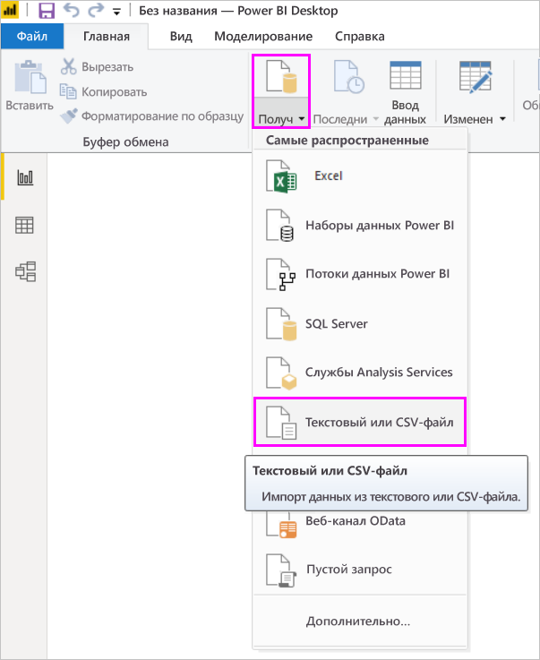

# <a name="use-r-in-query-editor"></a>Использование языка R в редакторе запросов

[**R**](https://mran.microsoft.com/documents/what-is-r) — это многофункциональный язык программирования, который широко применяют специалисты по статистике, аналитики и специалисты по обработке данных. **R** можно использовать в **редакторе запросов** Power BI Desktop для выполнения следующих задач:

* Подготовка моделей данных

* Создавать отчеты

* Очистка данных, расширенное формирование данных и аналитика набора данных, включая завершение отсутствующих данных, прогнозирование, кластеризацию и многое другое.  

## <a name="install-r"></a>Установка скрипта R

Вы можете бесплатно скачать **R** на [странице скачивания Revolution Open](https://mran.revolutionanalytics.com/download/) и в [репозитории CRAN](https://cran.r-project.org/bin/windows/base/).

### <a name="install-mice"></a>Установка mice

В вашей среде R должна быть установлена [библиотека **mice**](https://www.rdocumentation.org/packages/mice/versions/3.5.0/topics/mice). Без **mice** этот код примера сценария работает неправильно. Пакет **mice** реализует метод для обработки отсутствующих данных.

Порядок установки **mice**:

1. Запустите программу R.exe (например, C:\Program Files\Microsoft\R Open\R-3.5.3\bin\R.exe)  

2. Выполните команду установки:

   ``` 
   >  install.packages('mice') 
   ```

## <a name="use-r-in-query-editor"></a>Использование языка R в редакторе запросов

Чтобы продемонстрировать использование **R** в **редакторе запросов**, мы воспользуемся примером набора данных фондовой биржи из CSV-файла и выполним следующие действия:

1. [Скачайте файл **EuStockMarkets_NA.csv**](https://download.microsoft.com/download/F/8/A/F8AA9DC9-8545-4AAE-9305-27AD1D01DC03/EuStockMarkets_NA.csv). Запомните, куда вы его сохраняете.

1. Загрузите файл в **Power BI Desktop**: на вкладке **Главная** ленты выберите **Получить данные > Текстовый или CSV-файл**.

   

1. Выберите файл и нажмите кнопку **Открыть**. CSV-данные отображаются в диалоговом окне **Текстовый или CSV-файл**.

   

1. После загрузки данных вы увидите в области **Поля**.

   

1. Чтобы открыть **редактор запросов**, на вкладке **Главная** ленты выберите **Изменить запросы**.

   

1. На вкладке **Преобразование** ленты нажмите кнопку **Запустить сценарий R**. Открывается редактор **Запустить сценарий R**.  

   В строках 15 и 20 отсутствуют данные, как и в других строках, которых не видно на изображении. В инструкциях ниже показано, как язык R заполняет эти строки.

   

1. Например, введите приведенный ниже код сценария. Замените "&lt;Your File Path&gt;" (Ваш путь к файлу) на путь к файлу **EuStockMarkets_NA.csv** в локальной файловой системе, например C:/Users/John Doe/Documents/Microsoft/EuStockMarkets_NA.csv

    ```r
       dataset <- read.csv(file="<Your File Path>/EuStockMarkets_NA.csv", header=TRUE, sep=",")
       library(mice)
       tempData <- mice(dataset,m=1,maxit=50,meth='pmm',seed=100)
       completedData <- complete(tempData,1)
       output <- dataset
       output$completedValues <- completedData$"SMI missing values"
    ```

    > [!NOTE]
    > Может потребоваться перезаписать переменную с именем *output*, чтобы правильно создать набор данных с примененными фильтрами.

7. После нажатия кнопки **ОК** в **редакторе запросов** отображается предупреждение о конфиденциальности данных.

   
8. Чтобы сценарии R правильно работали в службе Power BI, нужно сделать все источники данных **общедоступными**. Дополнительные сведения о параметрах конфиденциальности и результатах их использования см. в статье об [уровнях конфиденциальности](desktop-privacy-levels.md).

   

   После выбора элемента **Сохранить** запускается сценарий. Обратите внимание на новый столбец **completedValues** в области **Поля**. Обратите внимание на несколько отсутствующих элементов данных, например в строках 15 и 18. Следующий раздел описывает, как язык R обрабатывает эти строки.

   Используя только пять строк сценария R, **редактор запросов** заполнит отсутствующие значения с помощью прогнозной модели.

## <a name="create-visuals-from-r-script-data"></a>Создание визуальных элементов с использованием данных сценария R

Создадим визуальный элемент, чтобы увидеть, как код сценария R заполнил отсутствующие значения с помощью библиотеки **Mice** (см. рисунок ниже):


Можно сохранить все готовые визуальные элементы в одном PBIX-файле **Power BI Desktop** и использовать модель данных и ее сценарии R в службе Power BI.

> [!NOTE]
> Вы можете [скачать PBIX-файл](https://download.microsoft.com/download/F/8/A/F8AA9DC9-8545-4AAE-9305-27AD1D01DC03/Complete%20Values%20with%20R%20in%20PQ.pbix), где все эти действия уже выполнены.

После отправки PBIX-файла в службу Power BI нужно выполнить дополнительные действия для включения обновления данных службы и обновленных визуальных элементов:  

* **Включите запланированное обновление для набора данных**. Чтобы включить запланированное обновление для книги, содержащей набор данных со сценариями R, см. инструкции в статье [Настройка запланированного обновления](refresh-scheduled-refresh.md), которая также включает информацию о шлюзе **Personal Gateway**.

* **Установите шлюз Personal Gateway**. Установите **Personal Gateway** на компьютере, где находятся файл и **R**. Служба Power BI обращается к этой книге и повторно отрисовывает все обновленные визуальные элементы. Дополнительные сведения см. в инструкциях по [установке и настройке шлюза Personal Gateway](service-gateway-personal-mode.md).

## <a name="limitations"></a>Ограничения

Существуют ограничения на запросы, включающие сценарии R, которые созданы в **редакторе запросов**.

* Все параметры источника данных R должны быть **общедоступными**. Все остальные действия в запросе **редактора запросов** также должны быть общедоступными. Чтобы получить параметры источника данных, в **Power BI Desktop** выберите элементы **Файл > Параметры и настройки > Параметры источника данных**.

  

  В диалоговом окне **Параметры источника данных** выберите источники данных, а затем щелкните **Изменить разрешения...** .  Задайте для параметра **Уровень конфиденциальности** значение **Общедоступный**.

      
* Чтобы включить запланированное обновление визуальных объектов R или набора данных, включите **запланированное обновление** и установите шлюз **Personal Gateway** на компьютере с книгой и **R**. Дополнительные сведения о запланированном обновлении и шлюзе Personal Gateway см. в статьях по ссылкам, приведенным в предыдущем разделе.

С помощью R и пользовательских запросов можно выполнять разные операции. Просматривайте и формируйте свои данные, придавая им нужный вид.

## <a name="next-steps"></a>Дальнейшие действия

* [Введение в R](https://mran.microsoft.com/documents/what-is-r) 

* [Выполнение скриптов R в Power BI Desktop](desktop-r-scripts.md) 

* [Использование внешней среды R IDE с Power BI](desktop-r-ide.md) 

* [Пакеты R в службе Power BI](service-r-packages-support.md)
