# <a name="tutorial-shape-and-combine-data-in-power-bi-desktop"></a>Руководство. Формирование и объединение данных в Power BI Desktop

С помощью Power BI Desktop можно подключаться к разным типам источников данных, а затем формировать данные в соответствии с потребностями, создавая визуальные отчеты, которые можно использовать совместно с другими пользователями. *Формирование* данных означает преобразование данных, например переименование столбцов или таблиц, замену текста числами, удаление строк, установку первой строки в качестве заголовков и т. д. *Объединение* данных означает подключение к нескольким источникам данных, формирование их данных в соответствии с потребностями и их последующее объединение в один удобный запрос.

Из этого руководства вы узнаете, как выполнять следующие задачи:

* Формирование данных в редакторе запросов.
* Подключение к различным источникам данных.
* Объединение этих источников данных и создание модели данных для использования в отчетах

В этом документе описано, как сформировать запрос с помощью Power BI Desktop, и показаны распространенные задачи. Используемый здесь запрос и процесс его создания с нуля подробно описываются в разделе [Начало работы с Power BI Desktop](desktop-getting-started.md).

В редакторе запросов в Power BI Desktop можно в полной мере использовать контекстные меню в дополнение к задачам, доступным на ленте **Преобразование**. Почти все действия, которые можно выбрать на ленте, также доступны, если щелкнуть правой кнопкой мыши элемент (например, столбец) и выбрать соответствующий пункт в появившемся меню.

## <a name="shape-data"></a>Формирование данных
При формировании данных в редакторе запросов вы создаете пошаговые инструкции (которые автоматически выполняются в этом редакторе запросов) для настройки данных по мере их загрузки и отображения в редакторе. Это не влияет на исходный источник данных; корректируется или *формируется* только это конкретное представление данных.

Указанные действия (например, переименование таблицы, преобразование типа данных или удаление столбца) записываются редактором запросов. Каждый раз, когда этот запрос подключается к источнику данных, редактор запросов выполняет эти действия, чтобы данные всегда были заданы указанным вами способом. Это происходит всякий раз, когда вы используете редактор запросов или когда кто-либо другой использует ваш предоставленный в общий доступ запрос, например в службе Power BI. Эти действия последовательно записываются в области **Параметры запроса** в разделе **Примененные действия**. Мы обсудим каждый из этих шагов в следующих нескольких абзацах.

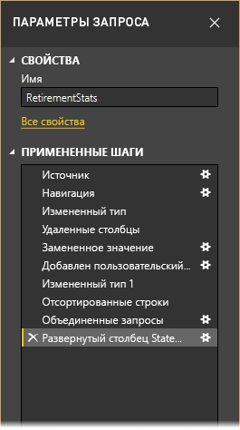

Сформируем нужным нам образом данные об увольнениях из раздела [Начало работы с Power BI Desktop](desktop-getting-started.md), которые мы нашли, подключившись к источнику данных в Интернете. Добавим настраиваемый столбец для вычисления ранга на основе всех данных с одинаковыми факторами, а затем сравним этот ранг с существующим столбцом **Ранг**.  

1. На ленте **Добавить столбец** выберите пункт **Настраиваемый столбец**, который позволяет добавить пользовательский столбец.

    

1. В окне **Настраиваемый столбец** в поле **Имя нового столбца**введите _Новый ранг_. В поле **Настраиваемая формула столбца** введите следующие данные:

    ```
    ([Cost of living] + [Weather] + [Health care quality] + [Crime] + [Tax] + [Culture] + [Senior] + [#"Well-being"]) / 8
    ```
 
1. Убедитесь, что сообщение о состоянии содержит такой текст: *No syntax errors have been detected* (Синтаксические ошибки не обнаружены), и нажмите **ОК**.

    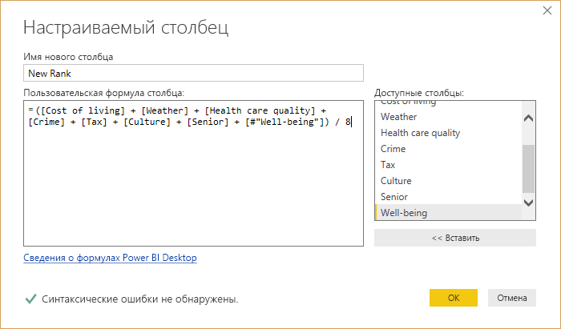

1. Чтобы данные столбца были согласованными, преобразуйте значения нового столбца в целые числа. Для этого щелкните правой кнопкой мыши заголовок столбца и выберите **Изменить тип \> Целое число**. 

    Чтобы выбрать несколько столбцов, сначала выделите столбец, нажмите и удерживайте клавишу **SHIFT**, одновременно выделите смежные столбцы, а затем щелкните правой кнопкой мыши заголовок столбца. Можно также использовать клавишу **CTRL** , чтобы выбрать несмежные столбцы.

    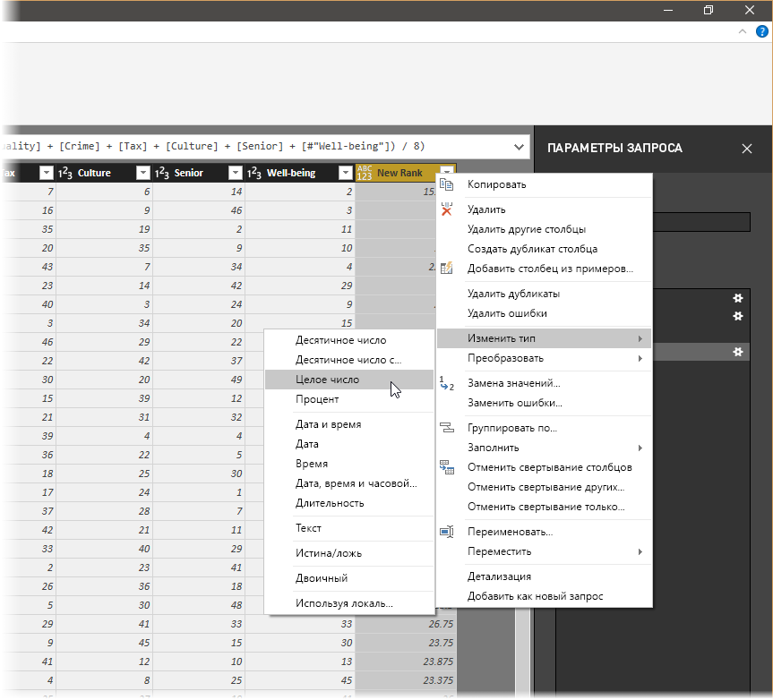

1. Чтобы *преобразовать типы данных* столбцов (при этом текущий тип данных преобразуется в другой), выберите **Тип данных — текст** на ленте **Преобразование**. 

   

1. В области **Параметры запроса** в разделе **Примененные действия** отражаются все примененные действия по формированию данных. Чтобы удалить какой-либо шаг из процесса формирования, щелкните значок **X** слева от него. 

    На следующем рисунке список **Примененные шаги** отражает добавленные действия на данный момент: 
     - **Источник**: подключение к веб-сайту.
     - **Навигация**: выбор таблицы. 
     - **Измененный тип**: изменение типа текстовых числовых столбцов с *текста* на *целое число*. 
     - **Добавлен пользовательский объект**: добавление настраиваемого столбца.
     - **Измененный тип 1**: последнее примененное действие.

       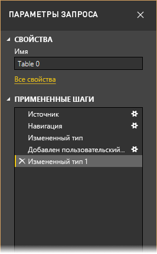

## <a name="adjust-data"></a>Корректировка данных

Прежде чем можно будет работать с этим запросом, необходимо внести некоторые изменения, чтобы скорректировать данные в нем.

   - Скорректируйте рейтинги, удалив столбец.

       Мы решили, что **Стоимость жизни** в наших результатах не является значимым фактором. После удаления этого столбца данные останутся без изменений. 

   - Устраните несколько ошибок.

       Так как мы удалили столбец, необходимо изменить вычисления в столбце **Новый ранг**, что требует изменить формулу.

   - Отсортируйте данные.

       Следует отсортировать данные — на основе столбцов **Новый ранг** и **Ранг**.
 
   - Замените данные.

       Мы покажем, как заменить конкретное значение, и объясним необходимость вставки **примененного действия**.

   - Измените имя таблицы. 

       Поскольку **Таблица 0** вряд ли является полезным дескриптором для таблицы, мы изменим ее имя.

1. Чтобы удалить столбец **Стоимость жизни**, выберите этот столбец, перейдите на вкладку **Главная** на ленте, а затем выберите **Удалить столбцы**.

    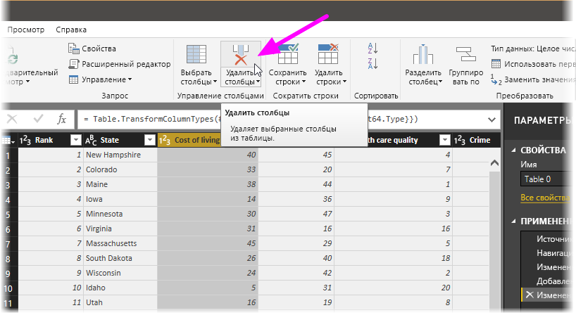

   Обратите внимание, что значения столбца **Новый ранг** не изменились благодаря порядку выполнения шагов. Поскольку редактор запросов записывает действия последовательно, но независимо друг от друга, можно перемещать каждое **Примененное действие** вверх или вниз в последовательности. 

1. Щелкните действие правой кнопкой мыши. Редактор запросов предоставит меню, которое позволяет сделать следующее: 
   - **Переименовать**: переименовать действие.
   - **Удалить**: удалить действие.
   - **Удалить** **до конца**: удалить текущее действие и все последующие.
   - **Переместить вверх**: переместить действие вверх в списке.
   - **Переместить вниз**: переместить действие вниз в списке.

1. Сдвиньте вверх последнее действие, **Удаленные столбцы**, которое предшествует действию **Добавлен пользовательский объект**.

   

1. Выберите действие **Добавлен пользовательский объект**. 

   Обратите внимание, что данные отображают _ошибку_, которую нужно устранить.

   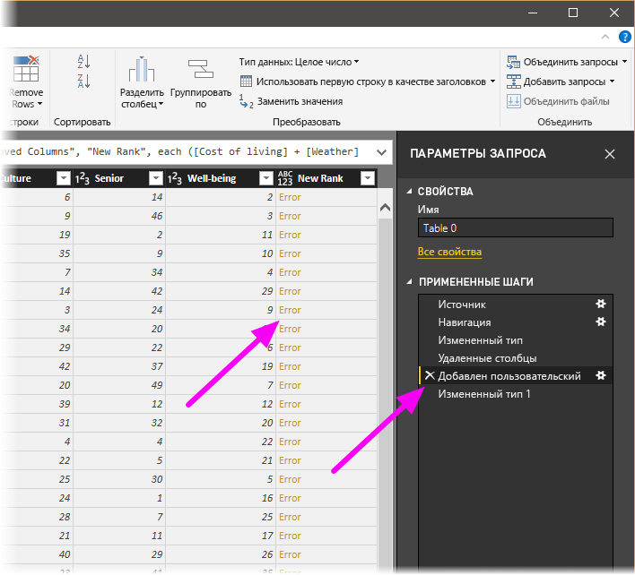

   Существует несколько способов получить дополнительные сведения о каждой ошибке. Если выбрать ячейку, не щелкая слово *Ошибка*, то редактор запросов отобразит сведения об ошибке в нижней части окна.

   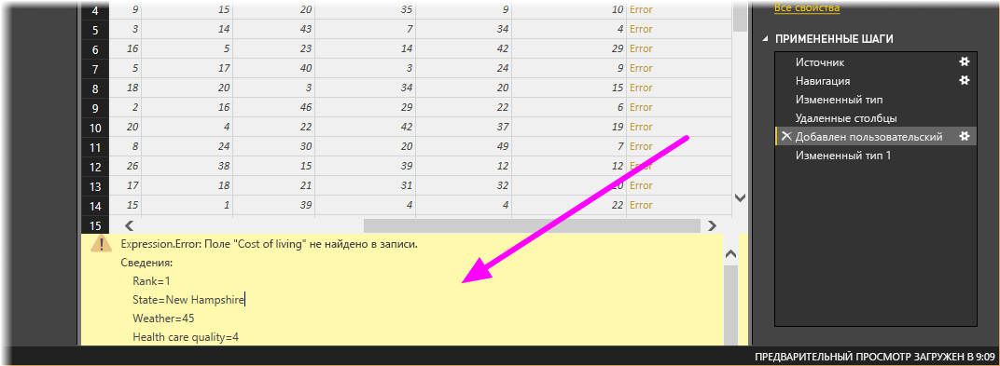

   Если щелкнуть непосредственно слово *Ошибка*, редактор запросов создает **Примененное действие** в области **Параметры запроса** и отображает сведения об ошибке. 

1. Поскольку нам не нужно отображать сведения об ошибках, выберите **Отмена**.

1. Чтобы исправить ошибки, выберите столбец **New Rank**, затем отобразите формулу данных столбца: установите флажок **Строка формул** на вкладке **Вид**. 

   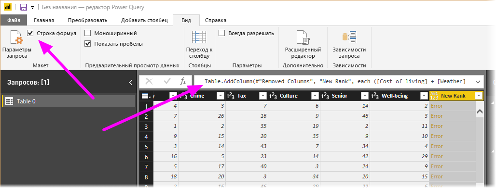

1. Теперь можно удалить параметр_Стоимость жизни_ и уменьшить делитель, изменив формулу: 
   ```
    Table.AddColumn(#"Removed Columns", "New Rank", each ([Weather] + [Health care quality] + [Crime] + [Tax] + [Culture] + [Senior] + [#"Well-being"]) / 7)
   ```

1. Установите зеленую галочку слева от поля формулы или нажмите клавишу **ВВОД**.

  Редактор запросов заменяет данные измененными значениями, а действие **Добавлен пользовательский объект** завершается без ошибок.

   > [!NOTE]
   > Вы также можете использовать команду **Удалить ошибки** на ленте или в контекстном меню, которая удаляет все строки, содержащие ошибки. Однако не стоит делать так в этом учебнике, так как нам нужно сохранить данные в таблице.

1. Отсортируйте данные на основе столбца **Новый ранг**. Сначала выберите последний примененный шаг **Измененный тип1** для получения последних данных. После этого выберите раскрывающийся список рядом с заголовком столбца **Новый ранг** и выберите команду **Сортировать по возрастанию**.

   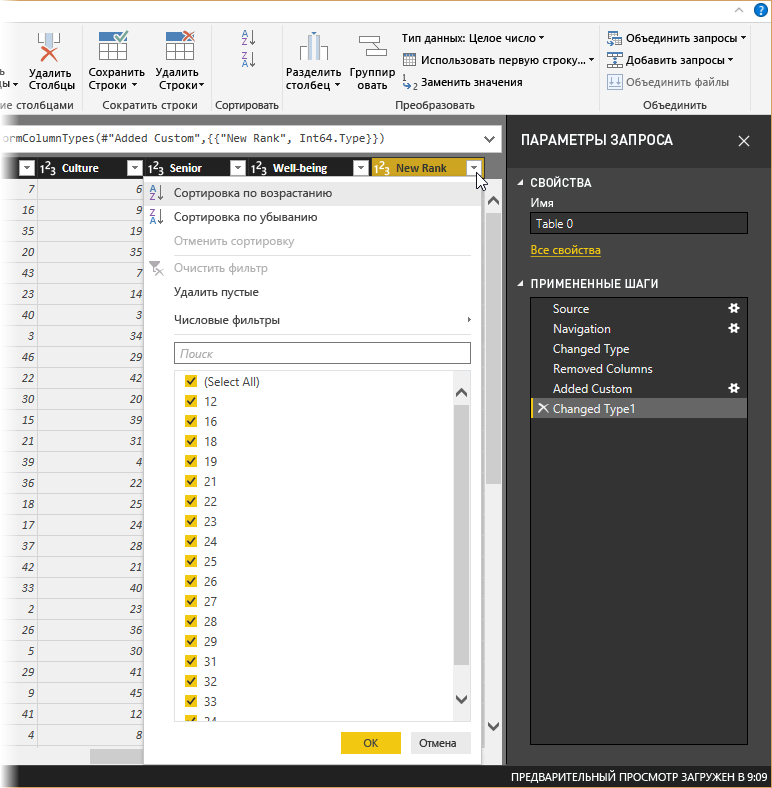

   Данные теперь отсортированы по столбцу **Новый ранг**. Но если взглянуть на столбец **Ранг**, вы заметите, что данные не сортируются правильно, если есть привязка к значению столбца **Новый ранг**. Мы исправим эту проблему на следующем шаге.

1. Чтобы устранить проблему с сортировкой данных, выберите столбец **Новый ранг** и измените формулу в **строке формул** на следующую:

   ```
    = Table.Sort(#"Changed Type1",{{"New Rank", Order.Ascending},{"Rank", Order.Ascending}})
   ```

1. Установите зеленую галочку слева от поля формулы или нажмите клавишу **ВВОД**. 

   Теперь строки упорядочены в соответствии с **Новым рангом** и **Рангом**. Кроме того, можно выбрать любое **Примененное действие** в списке и продолжить формирование данных с этой точки. Редактор запросов автоматически вставит новое действие непосредственно после выбранного в данный момент **примененного действия**. 

1. В разделе **Примененное действие** выберите действие, предшествующее настраиваемому столбцу, то есть действие **Удаленные столбцы**. Здесь мы заменим значение ранжирования значения **Погода** в Аризоне. Щелкните правой кнопкой мыши соответствующую ячейку, содержащую ранжирование **Погода** и выберите команду **Заменить значения**. Обратите внимание на то, какое **примененное действие** выбрано в данный момент.

   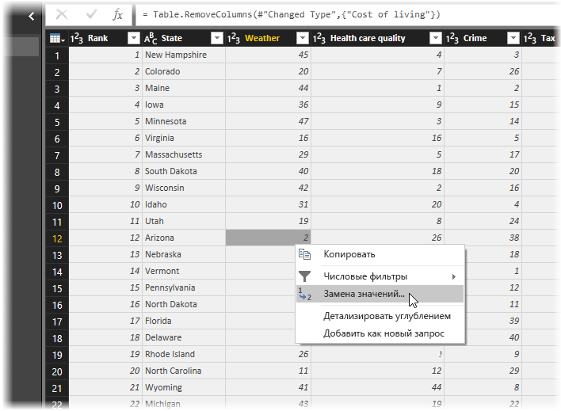

1. Выберите команду **Вставить**.

    Поскольку мы вставляем действие, редактор запросов предупреждает об опасности этого — последующие действия могут привести к прерыванию запроса. 

    

1. Измените значение данных на _51_. 

   Редактор запросов заменяет данные для штата Аризона. При создании нового **примененного действия** редактор запросов присваивает ему новое имя с учетом действия — в данном случае **Заменено значение**. Если в запросе появляется еще одно действие с тем же именем, редактор запросов добавляет к нему последовательный номер, чтобы различать **Примененные действия**.

1. Выберите последнее **Примененное действие**: **Отсортированные строки**. 

   Обратите внимание, что данные в отношении нового ранжирования по Аризоне изменились. Это связано с тем, что шаг **Замененное значение** вставлен в нужное место, то есть до шага **Добавлен пользовательский объект**.

1. Наконец, мы хотим изменить имя этой таблицы на что-нибудь более осмысленное. В области **Параметры запроса** в разделе **Свойства** введите новое имя таблицы, а затем нажмите **ВВОД**. Давайте назовем эту таблицу *RetirementStats*.

   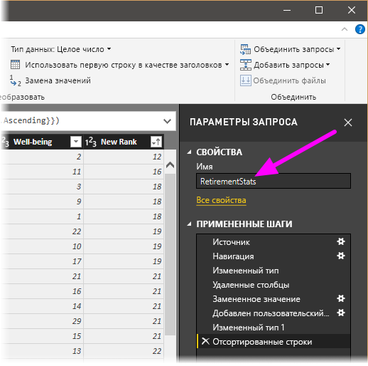

   Когда мы приступим к созданию отчетов, будет особенно удобно иметь описательные имена таблиц, особенно в том случае, если мы подключаемся к нескольким источникам данных, которые перечисляются в области **Поля** представления **Отчет**.

   Наконец мы сформировали данные в нужной степени. Теперь давайте подключимся к другому источнику данных и объединим данные.

## <a name="combine-data"></a>Объединение данных
Эти данные о различных штатах представляют интерес и будут использоваться для создания дополнительных аналитических исследований и запросов. Однако есть одна проблема: в большей части данных здесь используется не полное название штата, а его двухбуквенный код. Нам нужно каким-либо способом связать названия штатов с их кодами.

Нам повезло: имеется другой общедоступный источник данных, который делает именно это, но требуется его изрядное формирование, прежде чем можно будет подключить его к нашей таблице. Чтобы сформировать данные, выполните следующие действия.

1. На ленте **Главная** в редакторе запросов выберите **Новый источник \> Интернет**. 

2. Введите адрес веб-сайта, сокращающего названия штатов, *http://en.wikipedia.org/wiki/List_of_U.S._state_abbreviations* , а затем выберите **Подключить**.

   Навигатор отображает содержимое веб-сайта.

    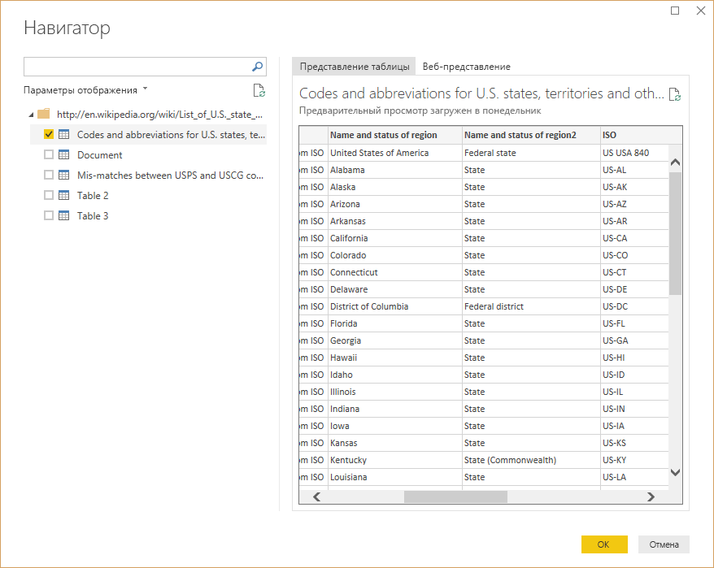

1. Выберите **Коды и сокращения**. 

   > [!TIP]
   > Чтобы немного очистить данные этой таблицы и привести их к желаемому виду, нужно приложить усилия. Можно ли выполнить описанные ниже действия легче или быстрее? Да, можно создать *связь* между двумя таблицами и сформировать данные на ее основе. С помощью описанных ниже действий вы все равно сможете познакомиться с таблицами: просто помните о том, что связи позволяют ускорить работу с данными из нескольких таблиц.
> 
> 

Чтобы сформировать данные, выполните следующие действия.

1. Удалите верхнюю строку. Она появилась в результате создания таблицы на веб-странице, но она не нужна. На ленте **Главная** выберите **Сократить строки \> Удалить строки \> Удалить верхние строки**.

    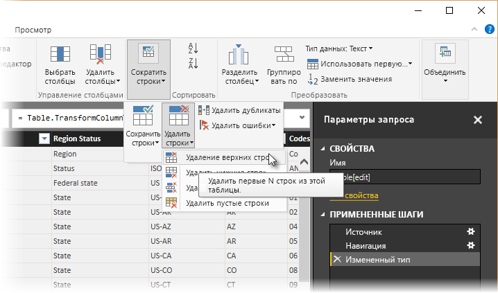

    Откроется окно **Удалить верхние строки** , в котором можно указать, сколько строк требуется удалить.

    > [!NOTE]
    > Если служба Power BI случайно импортирует заголовки таблицы в виде строки в таблицу данных, выберите **Использовать первую строку в качестве заголовков** на вкладке **Главная** или на вкладке **Преобразование** ленты, чтобы исправить таблицу.

1. Удалите последние 26 строк. Эти строки относятся ко внешним малым территориям США, которые не нужно включать. На ленте **Главная** выберите **Сократить строки \> Удалить строки \> Удалить нижние строки**.

    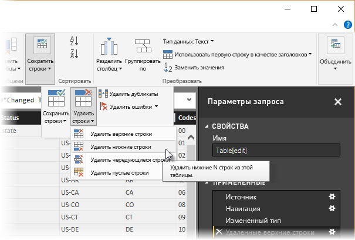

1. Поскольку таблица RetirementStats не содержит сведения для Washington DC (Вашингтон, округ Колумбия), нам необходимо отфильтровать их из нашего списка. Выберите раскрывающийся список **Состояние региона**, а затем снимите флажок рядом с элементом **Федеральный округ**.

    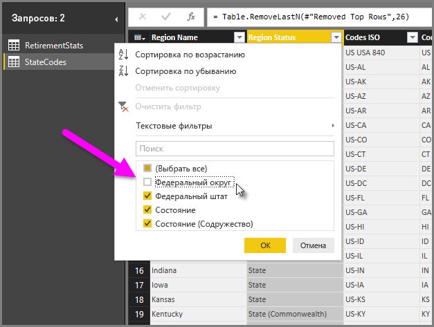

1. Удалите несколько ненужных столбцов. Нам требуется только сопоставление штата с его официальным двухбуквенным кодом, поэтому можно удалить следующие столбцы: **Column1**, **Column3**, **Column4**, а затем с **Column6** по **Column11**. Сначала выберите **Column1**, затем нажмите и удерживайте клавишу **CTRL** и выберите остальные столбцы для удаления. На вкладке **Главная** на ленте выберите **Удалить столбцы \>Удалить столбцы**.

   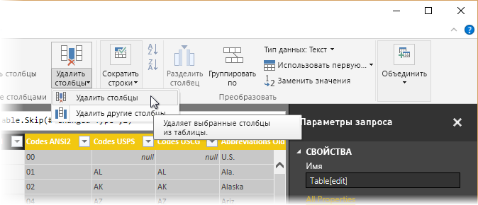

   > [!NOTE]
   > Это подходящий момент, чтобы показать, как важна *последовательность* примененных шагов в редакторе запросов, так как она может влиять на способ формирования данных. Также важно рассмотреть, как один шаг может повлиять на последующий шаг; если удалить шаг из примененных действий, то последующие шаги могут работать не так, как предполагалось, из-за влияния последовательности шагов запроса.

   > [!NOTE]
   > При изменении размера (сужении) окна редактора запросов некоторые элементы ленты уплотняются, что обеспечивает оптимальное использование видимого пространства. При увеличении ширины окна редактора запросов элементы ленты расширяются, чтобы оптимально использовать увеличенную площадь ленты.

1. Переименуйте столбцы и таблицу. Это можно сделать несколькими способами: Сначала выберите столбец, а затем либо выберите **Переименовать** на вкладке **Преобразование** на ленте, либо щелкните его правой кнопкой мыши и выберите **Переименовать**. На следующем рисунке оба варианта показаны стрелками; просто выберите один из них.

   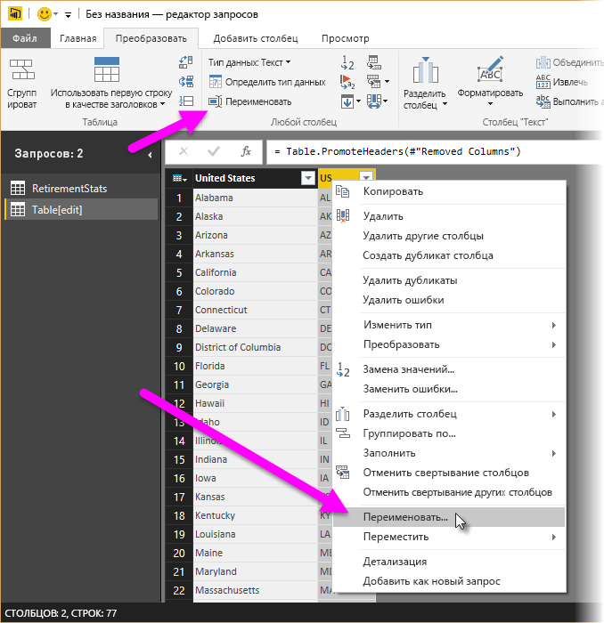

1. Переименуйте столбцы в *Название штата* и *Код штата*. Чтобы переименовать таблицу, введите **Имя** в области **Параметры запроса**. Давайте назовем эту таблицу *StateCodes*.

## <a name="combine-queries"></a>Объединение запросов

Теперь, когда мы сформировали таблицу StateCodes так, как нам нужно, объедините эти две таблицы (то есть запроса). Поскольку таблицы, которые мы таким образом получили, являются результатом выполнения запросов к данным, они часто называются *запросами*.

Существует два основных способа объединения запросов: *слияние* и *дополнение*.

- Если имеется один или несколько столбцов, которые требуется добавить в другой запрос, нужно выполнить *слияние* запросов. 
- При наличии дополнительных строк данных, которые нужно добавить в существующий запрос, выполняется *дополнение* запроса.

В данном случае нужно объединить запросы. Для этого выполните указанные ниже действия.
 
1. В левой области редактора запросов выберите запрос, *с которым* требуется объединить другой запрос. В данном случае это **RetirementStats**. 

1. Затем на вкладке **Главная** на ленте выберите **Объединить \> Объединить запросы**.

   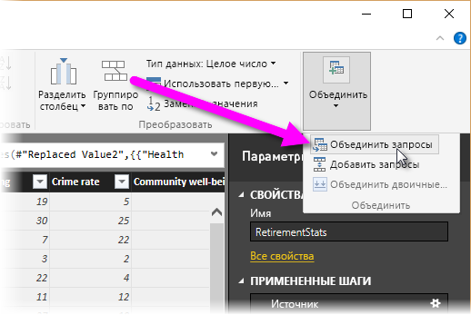

   Вам может быть предложено задать уровни конфиденциальности, чтобы убедиться, что данные объединяются без включения или переноса данных, которые переносить не нужно.

   Откроется окно **Слияние**. В нем предлагается выбрать таблицу для слияния с выбранной и соответствующие столбцы для слияния. 

1. Выберите **Штат** из таблицы RetirementStats, а затем выберите запрос **StateCodes**. 

   При выборе правильных совпадающих столбцов кнопка **ОК** будет включена.

   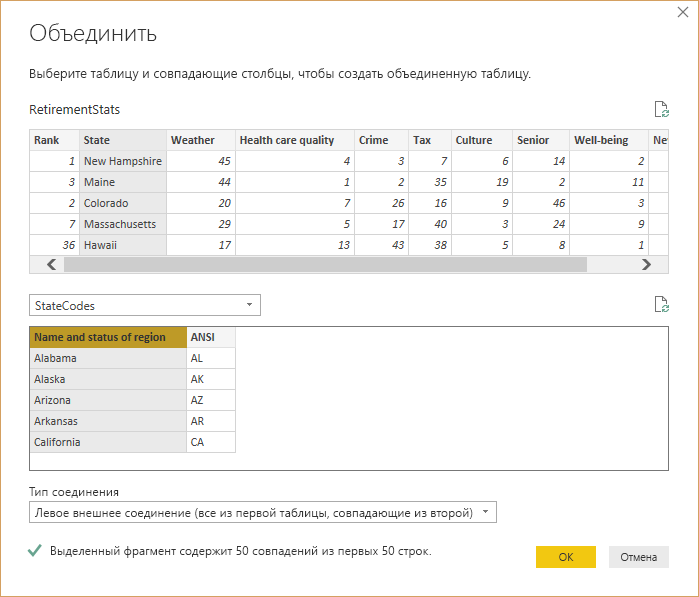

1. Нажмите кнопку **ОК**.

   Редактор запросов создаст в конце запроса столбец **NewColumn**, содержащий данные из таблицы (запроса), которая была объединена с существующим запросом. Все столбцы из объединенного запроса собраны в столбец **NewColumn**, но можно **Развернуть** таблицу и включить нужные столбцы.

   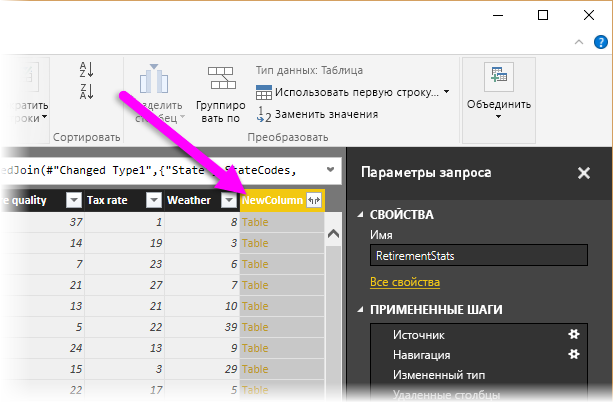

1. Чтобы развернуть объединенную таблицу и выбрать столбцы для включения, щелкните значок развертывания (). 

   Появится окно **Развернуть** .

   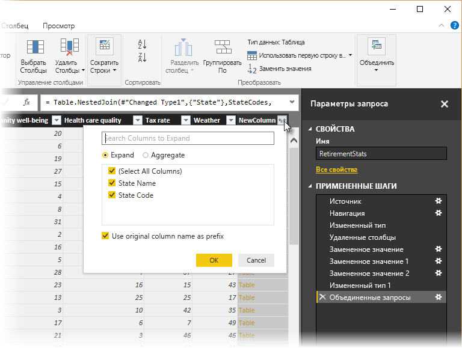

1. В этом случае нам нужен только столбец **Код штата**. Выберите этот столбец, снимите флажок **Использовать исходное имя столбца как префикс**, а затем нажмите кнопку **ОК**.

   Если оставить флажок **Использовать исходное имя столбца как префикс** установленным, то объединенный столбец будет называться **NewColumn.State Code**.

   > [!NOTE]
   > Хотите узнать, как добавить таблицу NewColumn? Вы можете немного поэкспериментировать, и если вас не устроит результат, просто удалите этот шаг из списка **примененных действий** в области **параметров запроса** ; ваш запрос вернется в состояние до применения шага **Развернуть** . Вы можете повторять это сколько угодно, пока процесс развертывания не будет происходить так, как нужно.

   Теперь у нас есть один запрос (таблица), объединяющий два источника данных, каждый из которых сформирован так, как нам нужно. Этот запрос может служить основой для большого количества дополнительных подключений к представляющим интерес данным, таким как стоимость содержания, демографические данные или вакансии в любом штате.

1. Чтобы применить изменения и закрыть редактор запросов, выберите **Закрыть и применить** на вкладке **Главная** ленты. 

   Преобразованный набор данных отображается в Power BI Desktop, готовый к использованию для создания отчетов.

   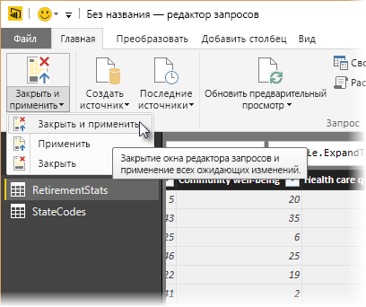

## <a name="next-steps"></a>Дальнейшие действия
Дополнительные сведения о среде Power BI Desktop и ее возможностях см. в указанных ниже ресурсах.

* [Что такое Power BI Desktop?](desktop-what-is-desktop.md)
* [Общие сведения о запросах в Power BI Desktop](desktop-query-overview.md)
* [Источники данных в Power BI Desktop](desktop-data-sources.md)
* [Подключение к данным в Power BI Desktop](desktop-connect-to-data.md)
* [Общие задачи с запросами в Power BI Desktop](desktop-common-query-tasks.md)   

