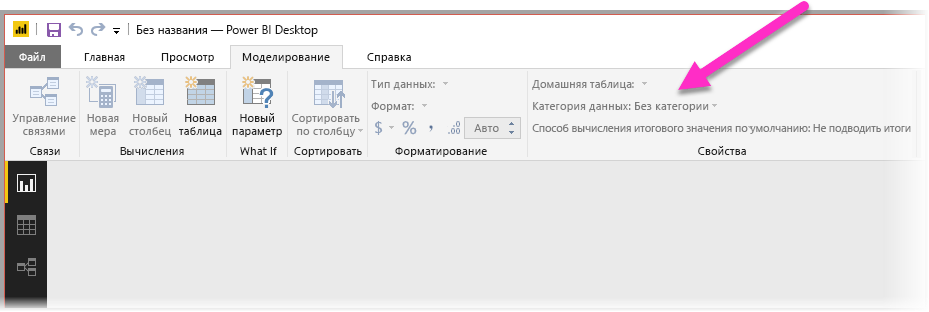
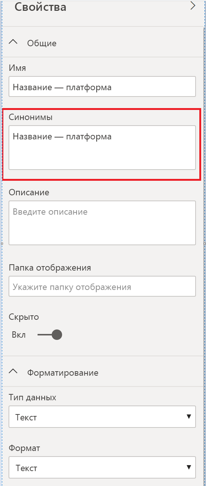

# Рекомендации по оптимизации функции "Вопросы и ответы" в Power BI
Эффективный обработчик позволяет задавать вопросы о данных с помощью обычных фраз и естественного языка. Еще больше впечатляет, когда от данных поступает ответ. Именно эту возможность предоставляет функция "Вопросы и ответы" в Power BI.

Чтобы обработчик успешно интерпретировал большое количество вопросов, на которые он способен отвечать, он должен строить допущения относительно модели. Если структура модели не соответствует одному или нескольким допущениям, необходимо настроить модель. В настройках для обработчика "Вопросы и ответы" следует применять те же методы оптимизации, которые используются для любой другой модели в Power BI, независимо от того, используете ли вы обработчик "Вопросы и ответы".

В следующих разделах объясняется, как настроить модель, чтобы она правильно работала с обработчиком "Вопросы и ответы".

## Автоматические настройки, выполняемые функцией "Вопросы и ответы"

### Таблицы мер

В предыдущих версиях функции "Вопросы и ответы" из-за таблиц мер могла возникать путаница с вопросами и ответами в случае отключения базовой таблицы. Теперь эта проблема устранена.

### Конфликты имен таблиц с именами столбцов

В предыдущих версиях функции "Вопросы и ответы" в случае совпадения имен таблицы и столбца приоритет отдавался имени таблицы. Сейчас эта проблема решена, и исправлять ее в моделях больше не требуется.

## Оптимизация функции "Вопросы и ответы" вручную

### Использование нового средства "Вопросы и ответы" для исправления вопросов

Средство "Вопросы и ответы" можно использовать для обучения модели основным бизнес-терминам и исправления вопросов, которые могут задавать ваши пользователи. В некоторых случаях сложно дать ответ на вопрос из-за несоответствующей формулировки данных или их отсутствия. Рекомендации по оптимизации в таких ситуациях приведены в следующих разделах. Дополнительные сведения см. в статье, посвященной [средству "Вопросы и ответы"](q-and-a-tooling-intro.md).

## Добавление отсутствующих связей

Если в модели нет связей между таблицами, их невозможно будет соединить ни с помощью отчетов Power BI, ни с помощью компонента "Вопросы и ответы". Связи являются основой хорошей модели. Например, нельзя использовать запрос "общий объем продаж клиентам в Сиэтле", если между таблицами *заказов* и *клиентов* отсутствует связь. На следующих изображениях показана модель, которую нужно настроить, а также модель, которая готова для работы с функцией "Вопросы и ответы". 

**Нужно настроить**

На первом рисунке между таблицами клиентов, продаж и продуктов отсутствуют связи.

**Готова для работы с обработчиком "Вопросы и ответы"**

На первом рисунке определены связи между таблицами.

## Переименование таблиц и столбцов

Выбор таблиц и столбцов имеет большое значение для обработчика "Вопросы и ответы". Например, предположим, у вас есть таблица с именем *Сводка клиентов*, содержащая список клиентов. Необходимо использовать запросы вроде "Отобразить сводку клиентов в Чикаго" вместо "Отобразить клиентов в Чикаго". 

Хотя функция "Вопросы и ответы" может разбивать запрос на слова и обнаруживать множественное число, она предполагает, что имена таблиц и столбцов точно отражают их содержимое.

Рассмотрим другой пример. Представьте, что у вас есть таблица с именем *Учет сотрудников*, содержащая имена, фамилии и количество сотрудников. У вас есть другая таблица с именем *Сотрудники*, содержащая количество сотрудников, должностей и даты поступления на работу. Люди, знакомые с моделью, могут понять такую структуру. Другой пользователь, который отправит запрос "Пересчитать сотрудников" получит количество строк из таблицы "Сотрудники". Такой результат, скорее всего, представляет не то, что пользователь имел в виду, так как он отражает количество должностей, которые каждый сотрудник занимал в течение своего трудового стажа. Лучше переименовать эти таблицы, чтобы имена отражали их содержимое.

**Нужно настроить**

Имена таблиц *Сведения о магазине* и *Список продуктов* следует настроить.

**Готова для работы с обработчиком "Вопросы и ответы"**

Имена *Магазин* и *Продукты* для этих таблиц подойдут лучше.

## Исправление неправильных типов данных

Импортированные данные могут содержать неправильные типы данных. Например, столбцы *даты* и *количества*, которые импортируются как *строки*, обработчик "Вопросы и ответы" не интерпретирует как значения даты и количества. Необходимо выбрать правильный тип данных в модели Power BI.

## Значение "Не суммировать" для столбцов года и идентификатора

По умолчанию Power BI агрессивно вычисляет числовые столбцы, поэтому, например, на запрос "общий объем продаж за год" может поступить ответ в виде огромного количества продаж за большое количество лет. Если некоторые столбцы не нужно так вычислять, установите для свойства **Способ вычисления итогового значения по умолчанию** значение **Не суммировать**. Обратите внимание, что со столбцами **год**, **месяц**, **день** и **идентификатор** проблемы возникают чаще всего. Другие столбцы, значения которых не нужно суммировать, например *возраст*, также могут выиграть, если для свойства **Способ вычисления итогового значения по умолчанию** указать значение **Не суммировать** или **Среднее**. Этот параметр находится на вкладке **Моделирование**.

## Выбор категории данных для каждого столбца "дата" и "географический регион"

Параметр **Категория данных** предоставляет дополнительные сведения о семантике содержимого за пределами своего типа данных. Например, столбец с целым числом может быть помечен как "почтовый индекс", столбец со строкой может быть помечен как "город", "страна", "регион" и т. д. Функция "Вопросы и ответы" использует эту информацию для выполнения двух важных задач: выбора визуализации и смещения языка.

Во-первых, обработчик "Вопросы и ответы" использует сведения **категории данных**, чтобы выбрать вариант визуального представления. Например, он определяет, что столбцы с **категорией данных** "дата" или "время" обычно лучше отображать на горизонтальной оси графика или на оси воспроизведения в пузырьковой диаграмме. Он также предполагает, что результаты, содержащие столбцы с географическими **категориями данных**, целесообразно показать на карте.

Кроме того, обработчик "Вопросы и ответы" делает обоснованные предположения о том, как пользователи могут называть столбцы "дата" и "географический регион", что помогает ему интерпретировать определенные типы вопросов. Например, слово "когда" в запросе "Когда Ивана Кузнецова приняли на работу?" почти наверняка касается столбца даты, а в запросе "Количество клиентов в Иванове", скорее всего, подразумевается город Иваново, а не фамилия Иванов.

## Выбор свойства "Сортировать по столбцу" для соответствующих столбцов

Свойство **Сортировать по столбцу** позволяет при сортировке по одному столбцу выполнять автоматическую сортировку по другому столбцу. Например, при запросе "Сортировать клиентов по размеру рубашки" может понадобиться сортировать столбец "Размер рубашки" по возрастанию (XS, S, M, L, XL), а не в алфавитном порядке (L, M, S, XL, XS).

## Нормализация модели

Не беспокойтесь, мы не предлагаем вам полностью переделывать модель. Однако некоторые структуры являются настолько сложными, что обработчик "Вопросы и ответы" не может обработать их правильно. Если выполнить основную нормализацию структуры модели, использовать отчеты Power BI станет значительно удобнее. Кроме того, функция "Вопросы и ответы" будет давать более точные ответы.

Следуйте этому общему правилу: Каждая уникальная "вещь", о которой говорит пользователь, должна быть представлена только одним объектом в модели (таблицей или столбцом). Поэтому, если пользователь говорит о клиентах, должен быть один объект *клиент*. Если пользователь говорит о продажах, должен быть один объект *продажи*. Все просто, правда? Возможно, но это зависит от формы данных, с которой вы начинаете работать. В **редакторе запросов** доступны возможности изменения формы, если они вам нужны. Но многие более простые преобразования можно выполнять с помощью вычислений в модели Power BI.

В следующих разделах содержатся некоторые распространенные преобразования, которые могут вам понадобиться.

### Создание новых таблиц для сущностей с несколькими столбцами

Если несколько столбцов функционируют как единый отдельный блок в большой таблице, эти столбцы следует разделить на подтаблицы. Например, предположим, у вас есть столбец "Имя контакта", "Должность контакта" и "Телефон контакта" в таблице *Компании*. Лучше создать отдельную таблицу *Контакты*, которая будет содержать имя, должность и телефон, а также ссылку на таблицу *Компании* Этот подход упрощает отправку вопросов о контактах независимо от вопросов о компании, контактами которой они являются, а также позволяет более гибко отображать результаты.

**Нужно настроить**

**Готова для работы с обработчиком "Вопросы и ответы"**

### Сведение для исключения контейнеров свойств

Если в модели есть *контейнеры свойств*, их нужно реструктуризировать, чтобы для одного свойства существовал один столбец. Контейнеры свойств удобны для управления большим количеством свойств, но для них характерны некоторые естественные ограничения, которые ни отчеты Power BI, ни обработчик "Вопросы и ответы" не могут обойти.

Например, рассмотрим таблицу *Демографические данные клиентов* со столбцами "Идентификатор клиента", "Свойство" и "Значение", где каждая строка представляет отдельное свойство клиента (например, возраст, семейное положение, город и т. д). Если перегрузить значение столбца "Значение" на основе столбца "Свойство", обработчик "Вопросы и ответы" не сможет интерпретировать большинство запросов, которые ссылаются на него. Простой запрос, например "показать возраст каждого клиента" может сработать, так как он может быть интерпретирован как "показать клиентов и демографические данные клиентов со свойством «возраст»". Но структура модели просто не поддерживает более сложные запросы, например "средний возраст клиентов в Чикаго". Пользователи, которые непосредственно создают отчеты Power BI, иногда изобретают способы получения нужных данных. Но компонент "Вопросы и ответы" работает, только когда каждый столбец имеет только одно значение.

**Нужно настроить**

**Готова для работы с обработчиком "Вопросы и ответы"**

### Объединение в избежание секционирования

Если вы разделили данные на несколько таблиц или свели значения нескольких столбцов, вашим пользователям будет трудно выполнить многие стандартные операции или они вообще не смогут их выполнить. Сначала рассмотрим типичный пример секционирования таблиц: таблица *Продажи 2000–2010* и таблица *Продажи 2011–2020*. Если все важные отчеты доступны только для определенного десятилетия, это можно так и оставить для отчетов Power BI. Но благодаря гибкости функции "Вопросы и ответы" пользователи могут ожидать ответа на такой запрос, как, например, "общие продажи по годам". Чтобы этот запрос сработал, необходимо объединить данные в одну таблицу модели Power BI.

Также рассмотрим типичный столбец со сведенными значениями: таблица *Заказы экскурсий* содержит столбцы "Автор", "Заказ", "Город1", Город2" и "Город3". Такая структура не позволяет правильно обрабатывать даже такие простые запросы, как "количество заказов по городам". Чтобы запрос сработал, создайте отдельную таблицу *Города заказов экскурсий*, которая объединяет значения городов в один столбец.

**Нужно настроить**

**Готова для работы с обработчиком "Вопросы и ответы"**

### Разделение форматированных столбцов

Если источник, из которого импортируются данные, содержит форматированные столбцы, отчеты Power BI и функция "Вопросы и ответы" не смогут получить доступ к столбцу, чтобы проанализировать его содержимое. Поэтому, если у вас есть, например, столбец **Полный адрес**, в котором указаны адрес, город и страна, следует разбить его на столбцы "Адрес", "Город" и "Страна", чтобы пользователи выполняли запросы к этим столбцам по отдельности.

**Нужно настроить**

**Готова для работы с обработчиком "Вопросы и ответы"**

Точно так же, если есть столбец "ФИО" для пользователя, может потребоваться добавить столбцы **Имя** и **Фамилия** на случай, если кто-то захочет отправить запрос с использованием имени или фамилии. 

### Создание новых таблиц для столбцов с несколькими значениями

Похожая ситуация: если источник, из которого импортируются данные, содержит столбцы с несколькими значениями, отчеты Power BI и функция "Вопросы и ответы" не смогут получить доступ к столбцу, чтобы проанализировать его содержимое. Поэтому, если столбец "Композитор" содержит несколько имен авторов песни, его следует разбить на несколько строк в отдельной таблице *Композиторы*.

**Нужно настроить**

**Готова для работы с обработчиком "Вопросы и ответы"**

### Денормализация во избежание неактивных связей

Единственное исключение из правила "нормализация лучше" возникает при наличии нескольких путей из одной таблицы в другую. Например, предположим, есть таблица *Рейсы* со столбцами "Идентификатор города вылета" и "Идентификатор города назначения", каждый из которых связан с таблицей *Города*. Одну из этих связей придется пометить как неактивную. Так как обработчик "Вопросы и ответы" может использовать только активные связи, вы не можете отправлять запросы о городе вылета или городе назначения в зависимости от того, что вы выбрали. Если вместо этого выполнить денормализацию столбцов с названиями городов в таблицу *Рейсы*, вы можете отправлять такие запросы: "Отобразить рейсы на завтра из Сиэтла в Сан-Франциско".

**Нужно настроить**

**Готова для работы с обработчиком "Вопросы и ответы"**

### Добавление синонимов в таблицы и столбцы

Этот шаг применяется только для обработчика "Вопросы и ответы", а не для отчетов Power BI в целом. Пользователи часто используют разные термины для названия одного того же понятия, например: общий объем продаж, чистая выручка от продаж, общая чистая выручка от продаж. Эти синонимы можно добавить в таблицы и столбцы в модели Power BI. 

Этот шаг может быть важен. Даже при наличии простых имен таблиц и столбцов пользователи функции "Вопросы и ответы" задают вопросы, используя свой привычный лексикон, а не выбирают слова из списка предопределенных столбцов. Чем больше правильно подобранных синонимов вы добавите, тем удобнее будет пользователям работать с вашим отчетом. Чтобы добавить синонимы, перейдите в представление модели Power BI, откройте вкладку "Моделирование" и выберите поле или таблицу. Для добавления синонимов используйте поле **Синонимы**, представленное в области "Свойства".

 При добавлении синонимов будьте предельно внимательны. Если добавить один и тот же синоним в несколько столбцов или таблиц, возникнет неоднозначная ситуация. Функция "Вопросы и ответы" использует контекст там, где можно выбирать между неоднозначными синонимами. Но не все запросы содержат достаточно контекста. Например, пользователь просит посчитать количество клиентов. Если в вашей модели слово "клиент" обозначает три вещи, пользователь может не получить ответ на свой запрос. В таких случаях основной синоним должен быть уникальным, так как в формулировке используется именно он. Обработчик может сообщить пользователю о неоднозначности. Например, в ответе на запрос "показать количество архивных записей клиентов" он может попросить сформулировать запрос иначе.
