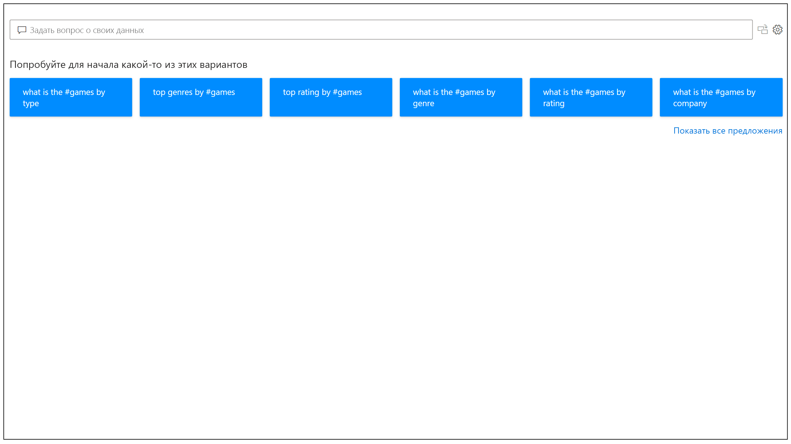
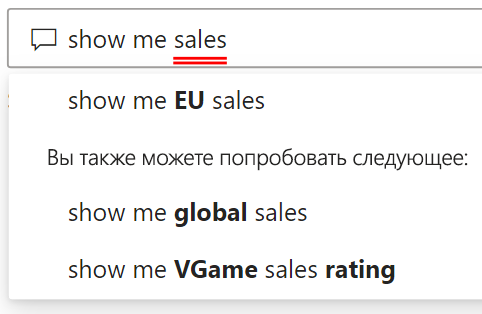
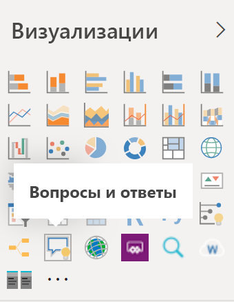

# Общие сведения о модуле "Вопросы и ответы" в Power BI

Иногда быстрее всего получить ответ из данных, выполнив поиск с использованием естественного языка. Функция "Вопросы и ответы" в Power BI позволяет изучать данные, формулируя запросы своими словами на естественном языке. Функция "Вопросы и ответы" интерактивна и даже интересна. Часто один вопрос приводит к многим другим, так как визуализации раскрывают новые пути для поиска. Задать вопрос — это только начало. Исследуйте данные, уточняя или расширяя вопросы, обнаруживая новую информацию, сосредотачиваясь на деталях или увеличивая поле зрения, чтобы получить более широкое представление. Взаимодействие происходит интерактивно и быстро благодаря тому, что функция основана на хранилище в памяти. 

Модуль "Вопросы и ответы" в Power BI является бесплатным и доступен всем пользователям. В Power BI Desktop разработчики отчетов могут использовать модуль "Вопросы и ответы" для изучения данных и создания визуализаций. В службе Power BI любой пользователь может исследовать эти данные с помощью модуля "Вопросы и ответы". Если у вас есть разрешение на изменение панели мониторинга или отчета, можно также закрепить результаты модуля "Вопросы и ответы".

## Работа с модулем "Вопросы и ответы"

Еще до начала ввода компонент вопросов и ответов открывает новое окно с полезными предложениями. Начните с одного из предлагаемых вопросов или введите собственный. Модуль "Вопросы и ответы" поддерживает широкий спектр вопросов, включая, помимо прочего, следующие:

- **Вопросы на естественном языке**. Какие продажи принесли максимальный доход?
- **Фильтрация относительных дат**. Показать продажи за последний год.
- **Возврат первых N элементов**. Первые 10 продуктов по объему продаж.
- **Фильтр**. Показать продажи в России.
- **Сложные условия**. Показать продажи продуктов, относящихся к категории 1 или категории 2.
- **Возврат определенного визуального элемента**. Показать продажи по продуктам в виде круговой диаграммы.
- **Сложные агрегаты**. Показать медианные продажи по продуктам.
- **Сортировка результатов**. Показать первые 10 стран по объему продаж, упорядоченные по коду страны.
- **Сравнение данных**. Показать даты по объему продаж в сравнении с общей стоимостью.
- **Просмотр тенденций**. Показать продажи с течением времени.

### Автозавершение

В процессе ввода вопроса модуль "Вопросы и ответы" Power BI выводит актуальные и контекстные предложения, что позволяет ускорить работу. По мере ввода вы получаете мгновенные отзывы и результаты. Это похоже на ввод запроса в поисковой системе.

### Подчеркивание красным и синим

В модуле "Вопросы и ответы" слова, распознанные и не распознанные системой, подчеркиваются. Сплошное синее подчеркивание означает, что система успешно соотнесла слово с полем или значением в модели данных. В приведенном ниже примере модуль "Вопросы и ответы" распознал словосочетание *Продажи в ЕС*.

Слова, введенные в модуле "Вопросы и ответы", часто подчеркиваются красным. Красная подчеркивание может указывать на одну из двух возможных проблем. Первый тип проблем — это *низкая степень достоверности*. При вводе неконкретного или неоднозначного слова поле подчеркивается красным. Примером может служить слово "Продажи". Оно может содержаться в нескольких полях, поэтому система использует красное подчеркивание, чтобы предложить выбрать нужное поле. Еще одним примером низкой степени достоверности может служить слово "область", которому соответствует столбец "регион". Модуль "Вопросы и ответы" в Power BI распознает слова, которые означают одно и то же, благодаря интеграции с Bing и Office. Однако слово подчеркивается красным, чтобы дать вам понять, что это не прямое соответствие.

Проблемы второго типа возникают тогда, когда модуль "Вопросы и ответы" не распознает слово вообще. Например, это может произойти при использовании термина, относящегося к определенной предметной области, который не упоминается нигде в данных, или при неправильном указании имен для полей данных. Примером может служить использование слова "Затраты", которое не встречается в данных. Это слово имеется в русском словаре, но модуль "Вопросы и ответы" подчеркивает его красным.

> [!NOTE]
> Цвета подчеркивания можно настроить в разделе **Форматирование визуального элемента** модуля "Вопросы и ответы". Кроме того, в статье [Средства модуля "Вопросы и ответы"](q-and-a-tooling-teach-q-and-a.md) описывается раздел *Вопросы и ответы: обучение*, в котором можно определить термины, не распознаваемые модулем "Вопросы и ответы".

### Результаты визуализации

По мере ввода вопроса модуль "Вопросы и ответы" пытается мгновенно интерпретировать его и визуализировать ответ. После последних обновлений модуль "Вопросы и ответы" теперь пытается интерпретировать вопрос и автоматически отобразить поля на правильной оси. Например, если ввести "Продажи по годам", модуль "Вопросы и ответы" определит, что год является полем даты, и будет стараться разместить это поле в первую очередь на оси X. Чтобы изменить тип визуализации, введите фразу "в виде *тип диаграммы*" после вопроса. В настоящее время модуль "Вопросы и ответы" поддерживает следующие типы визуализаций:

- График
- Линейчатая диаграмма
- Матрица
- Таблица
- Карточка
- С областями
- круговая диаграмма;
- точечная или пузырьковая диаграмма.
 

## Добавление функции "Вопросы и ответы" в отчет

Функцию "Вопросы и ответы" можно добавить в отчет в Power BI Desktop или службе Power BI одним из двух способов:

- добавление визуального элемента модуля "Вопросы и ответы";
- добавление кнопки модуля "Вопросы и ответы".

Чтобы добавить визуальный элемент модуля "Вопросы и ответы" в отчет, щелкните новый значок **Вопросы и ответы**, а затем выберите новый визуальный элемент "Вопросы и ответы" в области "Визуализация". Чтобы вставить визуальный элемент модуля "Вопросы и ответы", можно также дважды щелкнуть в любом месте холста отчета.

Чтобы добавить кнопку, на ленте **Главная** выберите **Кнопки** > **Вопросы и ответы**. Изображение кнопки "Вопросы и ответы" можно настроить как угодно.

> [!NOTE]
> При запуске модуля "Вопросы и ответы" с помощью кнопки по-прежнему используется его старая версия. Эта проблема будет исправлена в одном из следующих выпусков Power BI.

## Использование модуля "Вопросы и ответы" для панелей мониторинга

По умолчанию функция "Вопросы и ответы" находится в верхней части панелей мониторинга. Чтобы использовать "Вопросы и ответы", введите вопрос в поле **Задайте вопрос о своих данных**.

## Дальнейшие действия

Поддержку естественного языка можно интегрировать в отчеты различными способами. Дополнительные сведения см. в следующих статьях:

* ["Вопросы и ответы": визуализация](../visuals/power-bi-visualization-q-and-a.md)
* ["Вопросы и ответы": рекомендации](q-and-a-best-practices.md)
