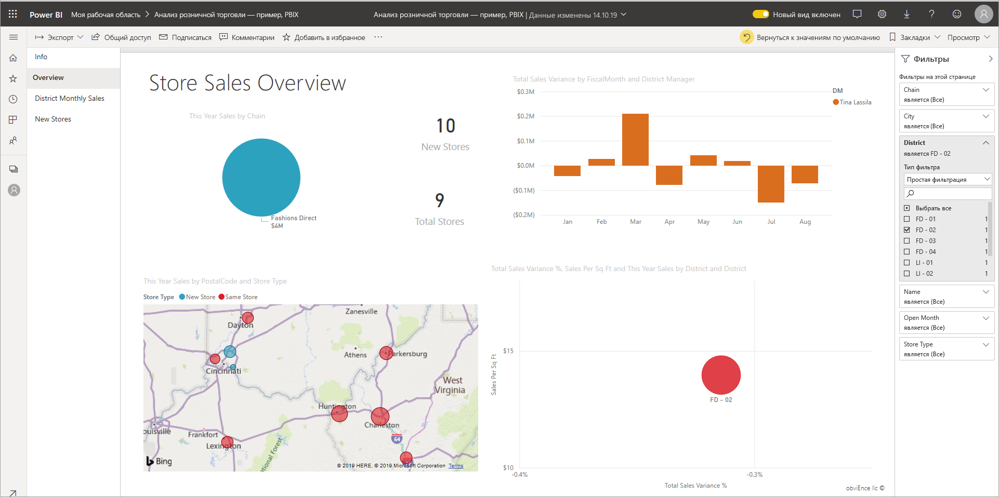
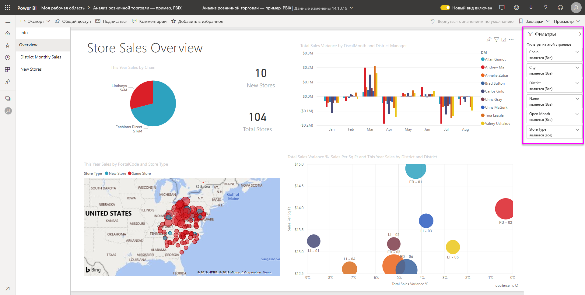
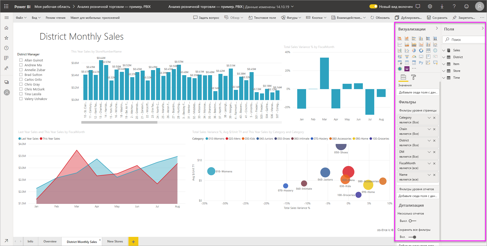
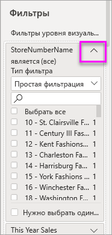
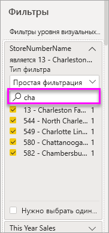
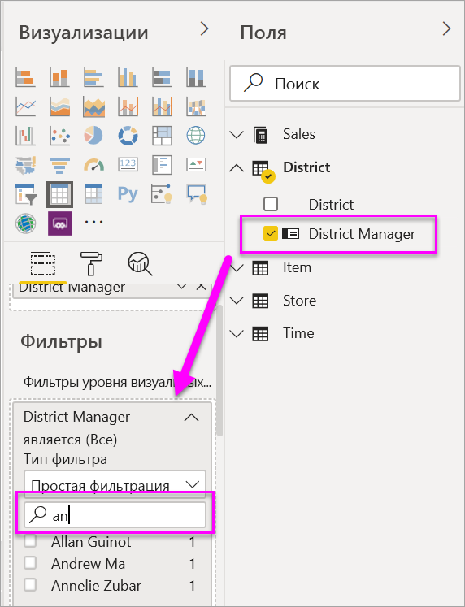
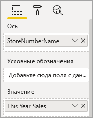
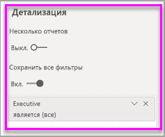
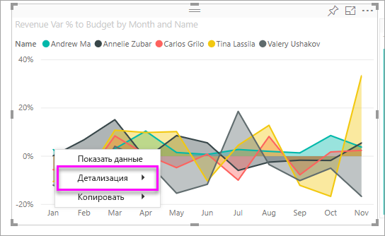
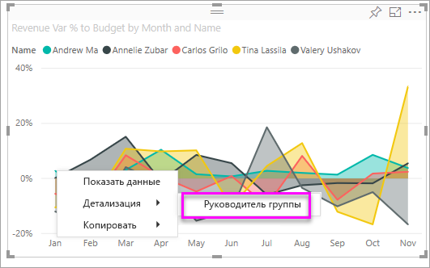

# Добавление фильтра в отчет в Power BI

[!INCLUDE [power-bi-service-new-look-include](includes/power-bi-service-new-look-include.md)]

В этой статье описано, как добавить фильтр на уровне страницы, визуализации, отчета или детализации в отчет Power BI. Примеры в этой статье даны для службы Power BI, но действия в Power BI Desktop практически идентичны.

**Знаете ли вы?** В Power BI доступны новые функции фильтров. См. дополнительные сведения о [новых функциях фильтров в отчетах Power BI](power-bi-report-filter.md).

Power BI содержит множество разных видов фильтров, от ручных и автоматических до фильтров детализации и сквозных фильтров. Читать о [различных видах фильтров](power-bi-report-filter-types.md).

## Фильтры в представлении правки или чтения
С отчетами можно взаимодействовать в двух представлениях: чтения и правки. Доступные возможности фильтрации зависят от используемого представления. Сведения см. в [статье о фильтрации и выделении в отчетах Power BI](power-bi-reports-filters-and-highlighting.md).

В этой статье описано, как создать фильтры для отчета в **представлении правки**.  См. дополнительные сведения о [взаимодействии с фильтрами отчета в представлении чтения](consumer/end-user-report-filter.md).

Так как фильтры *сохраняются* при выходе из отчета, в Power BI сохраняются изменения, внесенные в фильтры, срезы, и другие изменения, касающиеся представления данных. Это позволяет при повторном открытии отчета продолжить начатую работу. Чтобы изменения фильтров не сохранялись, в верхней строке меню нажмите **Вернуться к значениям по умолчанию**.

## Уровни фильтров на панели "Фильтры"
При использовании классической версии или службы Power BI панель "Фильтры" отображается на холсте отчетов справа. Если панель "Фильтры" отсутствует, разверните ее, щелкнув значок ">" в правом верхнем углу.

Вы можете установить фильтры на трех различных уровнях отчета: на визуальном уровне, на уровне страницы и на уровне отчета. Также вы можете установить фильтры детализации. В этой статье рассматриваются все эти уровни.

## Добавление фильтра к визуальному элементу
Вы можете добавить визуальный фильтр к визуальному элементу двумя различными способами. 

* отфильтровав поле, которое уже используется в визуализации;
* указав поле, которое не используется в визуализации, и добавив его непосредственно в контейнер **Фильтры уровня визуальных элементов**.

Обратите внимание, что в этой процедуре используется пример "Анализ розничной торговли". Вы можете скачать этот пример и ознакомиться с ним. Скачайте пример пакета содержимого [Анализ розничной торговли](sample-retail-analysis.md#get-the-content-pack-for-this-sample).

### Фильтрация полей в визуальном элементе

1. Выберите **Дополнительные параметры (...)**  > **Изменить отчет**, чтобы открыть свой отчет в режиме редактирования.
   
   

2. Откройте панели "Визуализации" и "Фильтры" и панель "Поля" (если они еще не открыты).
   
   
3. Выберите визуальный элемент, чтобы сделать его активным. Все поля, используемые визуальным элементом, определены на панели **Поля** и перечислены на панели **Фильтры** в разделе **Фильтры уровня визуальных элементов**.
   
   
4. На этом этапе мы добавим фильтр к полю, которое уже используется в визуализации. 
   
    Прокрутите вниз до области **Фильтры уровня визуальных элементов** и щелкните стрелку, чтобы развернуть поле, которое нужно отфильтровать. В этом примере будет выполнена фильтрация поля **StoreNumberName**.
     
     
    
    Выберите элемент управления фильтрации — **Базовый**, **Расширенный** или **Top N** (Первые N). В этом примере мы используем базовый режим фильтрации и выполним поиск строки **cha**, чтобы выбрать пять магазинов, соответствующих критерию.
     
     
   
    Визуальный элемент изменится в соответствии с новым фильтром. Если сохранить отчет с фильтром, в начале работы читатели отчета увидят отфильтрованный визуальный элемент. Затем они могут взаимодействовать с фильтром в представлении чтения, выбирая значения или отменяя их выбор.
     
    
    
    При использовании фильтра для поля, используемого в визуальном элементе, в котором статистически вычисляется поле (например, сумма, среднее значение или счетчик), выполняется фильтрация по *агрегатному* значению в каждой точке данных. Поэтому при запросе фильтрации приведенного выше визуального элемента, где **This Year Sales > 500000** (Продажи за этот год > 500000), в результате вы увидите только точку данных **13 — Charleston Fashion Direct**. Фильтры по [мерам модели](desktop-measures.md) всегда применяются к агрегированному значению точки данных.

### Фильтрация поля, которое не принадлежит визуальному элементу

Теперь добавим в визуализацию новое поле в качестве фильтра на уровне визуальных элементов.
   
1. На панели "Поля" выберите поле, которое нужно добавить в качестве нового фильтра на уровне визуальных элементов, и перетащите его в область **Фильтры уровня визуальных элементов**.  В этом примере мы перетащим поле **District Manager** в контейнер **Фильтры уровня визуальных элементов**, выполним поиск строки **an** и выберем трех менеджеров, которые соответствуют критерию.
     
    

    Обратите внимание, что поле **District Manager** (Региональный менеджер) *не* добавляется к самой визуализации. В визуализации по-прежнему есть параметр **StoreNumberName** (заданный в качестве оси) и **This Year Sales** (Продажи за этот год) (заданный в качестве значения).  
     
    

    Теперь визуализация отфильтрована и отображает только данные по продажам для этих менеджеров за указанный год в указанных магазинах.
     
    

    Если сохранить отчет с этим фильтром, читатели отчета смогут взаимодействовать с фильтром **District Manager** (Региональный менеджер), выбирая значения и отменяя их выбор.
    
    Если перетащить *числовой столбец* на панель фильтра для создания фильтра на уровне визуальных элементов, фильтр применяется к *базовым строкам данных*. Например, если добавить фильтр по полю **UnitCost** (Стоимость единицы) и задать **UnitCost** > 20, отображаются только данные для тех строк "Product" (Продукт), где стоимость единицы была больше 20, независимо от общего значения стоимости единицы для точек данных, отображаемых в визуальном элементе.

## Добавление фильтра ко всей странице

Вы также можете добавить фильтр уровня страницы, чтобы отфильтровать всю страницу.

1. В службе Power BI откройте отчет "Анализ розничной торговли", а затем перейдите на страницу **District Monthly Sales** (Продажи в регионах по месяцам). 

2. Выберите **...**  > **Изменить отчет**, чтобы открыть свой отчет в режиме редактирования.
   
   
2. Откройте панели "Визуализации" и "Фильтры" и панель "Поля" (если они еще не открыты).
3. На панели "Поля" выберите поле, которое нужно добавить в качестве нового фильтра уровня страницы, и перетащите его в область **Фильтры уровня страницы**.  
4. Выберите значения, которые нужно отфильтровать, и установите элемент управления фильтрацией — **Базовый** или **Расширенный**.
   
   Все визуальные элементы на странице перерисовываются для отражения изменений.
   
   

    Если отчет сохранен с фильтром, читатели отчета могут взаимодействовать с фильтром в представлении чтения, выбирая значения или отменяя их выбор.

## Добавление фильтра детализации
Используя функцию детализации в службе Power BI и Power BI Desktop, вы можете создать *целевую* страницу отчета, посвященную определенной сущности: поставщику, клиенту или производителю. Теперь пользователи могут щелкнуть правой кнопкой мыши точку данных на других страницах отчета и перейти для детализации на страницу определенной сущности.

### Создание фильтра детализации
Чтобы продолжить, скачайте пример [Рентабельность клиента](sample-customer-profitability.md#get-the-content-pack-for-this-sample). Допустим, вам нужно перейти на страницу, на которой представлены направления деятельности руководителя.

1. В службе Power BI откройте отчет "Анализ розничной торговли", а затем перейдите на страницу **District Monthly Sales** (Продажи в регионах по месяцам).

2. Выберите **Дополнительные параметры (...)**  > **Изменить отчет**, чтобы открыть свой отчет в режиме редактирования.
   
   

1. Добавьте новую страницу в отчет и назовите ее **Руководитель группы**. Это будет *целевая* страница детализации.
2. Добавьте визуализации, отслеживающие ключевые показатели для направлений деятельности руководителей групп.    
3. Из таблицы **Executives** (Руководители) перетащите элемент **Executive** (Руководитель) в область фильтров детализации.    
   
    
   
    Обратите внимание, что Power BI добавляет стрелку "Назад" на страницу отчета.  Если пользователь щелкнет эту стрелку, он вернется к *исходной* странице отчета, на которой он выбрал детализацию. В режиме редактирования удерживайте нажатой клавишу CTRL, чтобы выбрать стрелку "Назад".
   
     

### Использование фильтра детализации
Давайте посмотрим, как работает фильтр детализации.

1. Начните со страницы **Командная система показателей** отчета.    
2. Предположим, что вас зовут Сергей Зайцев и вы хотите просмотреть страницу отчета "Руководитель группы", отфильтрованную для отображения только ваших данных.  На диаграмме вверху слева щелкните правой кнопкой мыши любую зеленую точку данных, чтобы открыть пункт меню "Детализация".
   
    
3. Выберите **Детализация > Руководитель группы**, чтобы перейти на страницу детализации отчета **Руководитель группы**. Страница отфильтруется, отображая сведения о точке данных, которую вы щелкнули правой кнопкой мыши. В нашем случае — это Сергей Зайцев. Все фильтры на исходной странице применяются к странице детализации отчета.  
   
    

## Добавление фильтра уровня отчета, чтобы отфильтровать весь отчет

1. Выберите пункт **Изменить отчет**, чтобы открыть отчет в режиме правки.
   
   

2. Откройте панели "Визуализации", "Фильтры" и "Поля", если они еще не открыты.
3. На панели "Поля" выберите поле, которое нужно добавить в качестве нового фильтра на уровне отчета, и перетащите его в область **Фильтры уровня отчетов**.  
4. Выберите значения, которые нужно отфильтровать.

    Визуальные элементы на активной странице, а также на всех страницах отчета изменятся в соответствии с новым фильтром. Если отчет сохранен с фильтром, читатели отчета могут взаимодействовать с фильтром в представлении чтения, выбирая значения или отменяя их выбор.

1. Щелкните стрелку "Назад", чтобы вернуться на предыдущую страницу отчета.

## Рекомендации и устранение неполадок

- Если область полей не отображается, убедитесь, что вы выбрали [режим редактирования](service-interact-with-a-report-in-editing-view.md) отчета.    
- Если вы внесли множество изменений в фильтры и хотите восстановить параметры отчета по умолчанию, заданные автором, в верхней строке меню выберите команду **Вернуться к значениям по умолчанию**.

## Дальнейшие действия
[Ознакомление с панелью "Фильтры" отчета](consumer/end-user-report-filter.md)

[Фильтры и выделение в отчетах](power-bi-reports-filters-and-highlighting.md)

[Различные виды фильтров Power BI](power-bi-report-filter-types.md)

Появились дополнительные вопросы? [Ответы на них см. в сообществе Power BI.](http://community.powerbi.com/)

