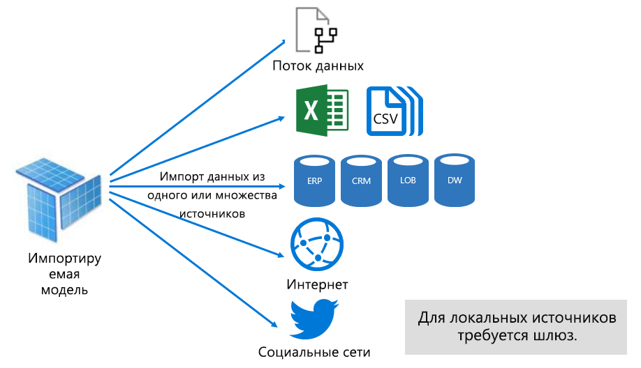
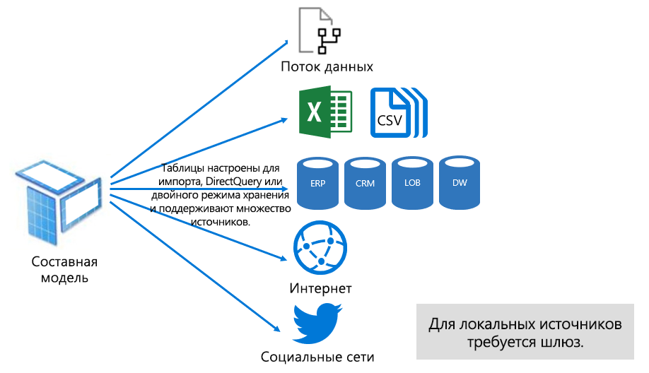

# Режимы наборов данных в службе Power BI

В этой статье содержится техническое описание режимов набора данных Power BI. Эти режимы применяются к наборам данных, которые представляют активное подключение к модели Analysis Services внешнего размещения, а также к моделям, разработанным в Power BI Desktop. В этой статье рассматривается каждый режим и возможное влияние на ресурсы емкости Power BI.

Существуют три режима набора данных:

- [импорт](#import-mode);
- [DirectQuery](#directquery-mode)
- [составной](#composite-mode).

## Режим импорта

Режим _Импорт_ является наиболее распространенным режимом, используемым для разработки моделей. Этот режим обеспечивает очень высокую производительность благодаря использованию запросов в памяти. Он также предлагает гибкость проектирования для разработчиков и поддержку конкретных функций службы Power BI (Вопросы и ответы, Краткая аналитика и т. д.). Из-за этих преимуществ этот режим используется по умолчанию при создании нового решения Power BI Desktop.

Важно понимать, что импортированные данные всегда хранятся на диске. При запросе или обновлении данные должны быть полностью загружены в память емкости Power BI. После загрузки в память модели импорта достигают невероятно быстрых результатов запросов. Кроме того, важно понимать, что модель импорта невозможно частично загрузить в память.

После обновления данные сжимаются и оптимизируются, а затем сохраняются на диск с помощью подсистемы хранилища VertiPaq. При загрузке с диска в память может наблюдаться сжатие в 10 раз. Таким образом, разумно рассчитывать, что данные размером 10 ГБ источника данных можно сжать до 1 ГБ. Размер хранилища на диске может уменьшиться на 20 % благодаря сжатию. (Разницу в размере можно определить, сравнив размер файла Power BI Desktop с объемом памяти диспетчера задач, используемым для файла.)

Достигнуть гибкости проектирования можно тремя способами. Для этого разработчики данных могут сделать следующее:

- Интегрировать данные путем кэширования данных из потоков данных и внешних источников данных, независимо от типа или формата источника данных.
- Использовать весь набор функций языка [Power Query Formula Language](/powerquery-m/) (также называемый M) при создании запросов на подготовку данных.
- Использовать весь набор функций [выражений анализа данных (DAX)](/dax/) при расширении модели с помощью бизнес-логики. Существует поддержка вычисляемых столбцов, вычисляемых таблиц и мер.

Как показано на следующем рисунке, модель импорта может интегрировать данные из ряда поддерживаемых типов источников данных.

Однако, хотя с использованием моделей импорта связаны неоспоримые преимущества, существуют также и недостатки:

- В память должна быть загружена вся модель, чтобы служба Power BI могла выполнить запрос к модели. Это может оказать нежелательное влияние на доступные ресурсы, особенно по мере роста количества и размера моделей импорта.
- Данные модели обновляются по мере обновления самой модели, поэтому обновлять модели импорта предпочтительней по расписанию.
- В случае полного обновления все данные из всех таблиц будут удалены и заново перезагружены из источника данных. Этот процесс может дорого обходиться с точки зрения времени и ресурсов для службы Power BI и источников данных.

    > [!NOTE]
    > Power BI может выполнить добавочное обновление, чтобы избежать усечения и перезагрузки целых таблиц. Однако эта функция поддерживается только в том случае, если набор данных размещен в рабочих областях на емкости Premium. Дополнительные сведения см. в статье о [добавочном обновлении в Power BI Premium](service-premium-incremental-refresh.md).

С позиций ресурсов службы Power BI для модели импорта требуются:

- Достаточный объем памяти для загрузки модели при выполнении запроса или обновлении.
- Ресурсы для обработки и дополнительные ресурсы памяти для обновления данных.

## Режим DirectQuery

Режим _DirectQuery_ является альтернативой режиму импорта. Модели, разработанные в режиме DirectQuery, не импортируют данные. Вместо этого они состоят только из метаданных, определяющих структуру модели. При запросе к модели для получения данных из базового источника данных используются машинные запросы.

Существует две основные причины для разработки модели DirectQuery:

- объемы данных слишком велики (даже при применении [методов сокращения данных](guidance/import-modeling-data-reduction.md)) для загрузки в модель или обновления;
- отчеты и панели мониторинга должны содержать данные в режиме, близком к реальному времени, а этого можно достигнуть в рамках запланированных обновлений (запланированные ограничения обновления: восемь раз в день для общей емкости и 48 раз в день для емкости Premium).

С использованием моделей DirectQuery связан ряд преимуществ:

- Не применяются ограничения размера модели импорта.
- Модели не требуют обновления.
- Пользователи отчетов увидят последние данные при взаимодействии с фильтрами отчетов и срезами. Кроме того, пользователи отчетов могут обновлять весь отчет для получения текущих данных.
- Отчеты в режиме реального времени можно разрабатывать с помощью функции [автоматического обновления страниц](desktop-automatic-page-refresh.md).
- Плитки панели мониторинга, созданные на основе моделей DirectQuery, могут автоматически обновляться каждые 15 минут.

Несмотря на все это, с моделями DirectQuery связано множество недостатков и ограничений:

- Модель должна основываться на одном поддерживаемом источнике данных. Именно поэтому интеграция данных уже должна быть выполнена в источнике данных. Поддерживаемые источники данных представляют собой реляционные и аналитические системы с поддержкой многих популярных хранилищ данных.

    > [!TIP]
    > Поддерживаются многие источники данных Майкрософт. Источники данных Майкрософт включают в себя SQL Server, Azure Data Bricks, Azure HDInsight Spark (бета-версия), Базу данных SQL Microsoft Azure и Хранилище данных SQL Azure. Дополнительные сведения об источниках данных, поддерживаемых DirectQuery в Power BI, см. в [этой статье](desktop-directquery-data-sources.md).

- Производительность может быть низкой, что может негативно влиять на работу службы Power BI. Эта проблема может возникнуть из-за того, что некоторые запросы требуют интенсивного использования ЦП для службы Power BI. Это также может быть вызвано тем, что источник данных не оптимизирован для запросов, отправляемых службой Power BI.
- Запросы Power Query должны быть свертываемыми. Это требование означает, что логика Power Query не может быть чрезмерно сложной. Кроме того, логика должна быть ограничена использованием выражений и функций языка M, которые могут быть перенесены в машинные запросы, понятные источнику данных.
- Формулы DAX ограничены использованием только тех функций, которые могут быть перенесены в машинные запросы, понятные источнику данных. Кроме того, нет поддержки для вычисляемых таблиц или функций логики операций со временем DAX.
- Запросы модели, требующие извлечения более миллиона строк, не выполняются.
- Отчеты и панели мониторинга с несколькими визуальными элементами могут отображать противоречивые результаты, особенно если источник данных энергозависимый.
- Функции "Вопросы и ответы" и "Краткая аналитика" не поддерживаются.

С позиций ресурса службы Power BI для моделей DirectQuery требуются:

- Минимальный объем памяти для загрузки модели (только метаданные) при запросе.
- Иногда служба Power BI должна использовать значительные ресурсы процессора для создания и обработки запросов, отправляемых в источник данных. Когда возникает такая ситуация, это может повлиять на пропускную способность, особенно когда пользователи одновременно запрашивают модель.

Дополнительные сведения см. в статье [Использование DirectQuery в Power BI Desktop](desktop-use-directquery.md).

## Составной режим

_Составной режим_ может сочетать режимы импорта и DirectQuery, а также интегрировать несколько источников данных DirectQuery. Модели, разработанные в составном режиме, поддерживают настройку режима хранения для каждой таблицы модели. Этот режим также поддерживает вычисляемые таблицы (определенные с помощью DAX).

Для хранения таблицы можно выбрать следующие режимы: режим импорта, режим DirectQuery или двойной режим. Настройка двойного режима хранения для таблицы подразумевает использование режима импорта и режима DirectQuery. Таким образом служба Power BI может определять наиболее эффективный режим в зависимости от конкретного запроса.

Задание составных моделей — предоставлять лучшие возможности режима импорта и режима DirectQuery. При соответствующей настройке они могут сочетать высокую производительность запросов моделей в памяти с возможностью извлечения данных из источников данных в режиме реального времени.

Администраторы моделей данных, разрабатывающие составные модели, могут настраивать таблицы измерений в режиме импорта или двойном режиме и таблицы фактов в режиме DirectQuery. Дополнительные сведения о ролях таблиц модели см. в статье [Общие сведения о схеме типа "звезда" и ее значении в Power BI](guidance/star-schema.md).

Для примера рассмотрим модель с таблицей измерений **Продукт** в двойном режиме и таблицей фактов **Продажи** в режиме DirectQuery. Таблицу **Продукт** можно эффективно и быстро запросить из памяти, чтобы отобразить срез отчета. Затем в режиме DirectQuery можно запросить таблицу **Продажи**, присоединенную к соответствующей таблице **Продукт**. Последний запрос позволяет создать один эффективный машинный SQL-запрос для объединения таблиц **Продукт** и **Продажи**, а также выполнения фильтрации по значениям среза.

Как правило, для составных моделей преимущества и недостатки, связанные с режимами импорта и DirectQuery, зависят от того, как настроена каждая таблица.

Дополнительные сведения см. в статье [Использование составных моделей в Power BI Desktop](desktop-composite-models.md).

## Дальнейшие действия

- [Наборы данных в службе Power BI](service-dataset-modes-understand.md)
- [Режим хранения в Power BI Desktop](desktop-storage-mode.md)
- [Использование DirectQuery в Power BI](desktop-directquery-about.md)
- [Использование составных моделей в Power BI Desktop](desktop-composite-models.md)
- Появились дополнительные вопросы? [Попробуйте задать вопрос в сообществе Power BI.](https://community.powerbi.com/)
