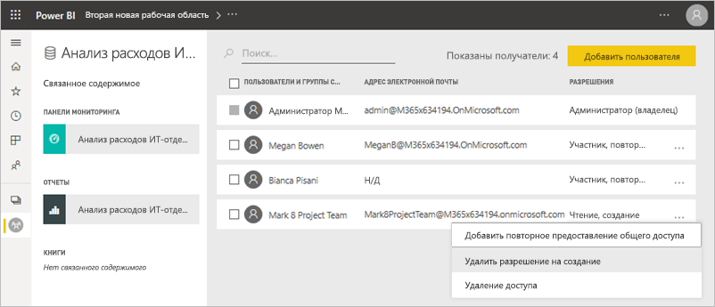
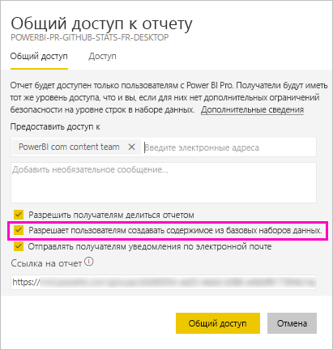

# Разрешение на сборку для общих наборов данных (предварительная версия)

Как автор *моделей данных* в Power BI Desktop, вы можете делиться ими в виде *наборов данных* в службе Power BI. После этого авторы отчетов могут легко находить и повторно использовать наборы данных, которые вы предоставили для общего доступа. Узнайте, как управлять доступом к данным с помощью разрешения на сборку.

Разрешения на сборку актуальны только для наборов данных. Когда вы предоставляете пользователям разрешение на сборку, они могут создавать с его помощью содержимое на базе набора данных, например отчеты, панели мониторинга, закрепленные плитки из функции "Вопросы и ответы" и обнаружение ценных сведений. Кроме того, они могут создать содержимое на основе набора данных за пределами Power BI, например на листах Excel, с помощью функции "Анализ в Excel", XMLA и экспорта базовых данных.

## Способы предоставления разрешения на сборку

Предоставить разрешение на сборку для набора данных можно несколькими разными способами.

- Члены рабочей области, имеющие по крайней мере роль участника, автоматически получают разрешение на сборку для набора данных и разрешение на копирование отчета.
 
- Члены рабочей области, в которой находится набор данных, могут назначить разрешение для определенных пользователей или групп безопасности в центре разрешений. Если вы член рабочей области, нажмите кнопку с многоточием (…) рядом с набором данных и выберите **Управление разрешениями**.

    

    Открывается центр разрешений для этого набора данных, где можно задать и изменить разрешения.

    

- Администратор или член рабочей области, где находится набор данных, может указать во время публикации, чтобы пользователи с разрешением для приложения также получили разрешение на сборку для базовых наборов данных. Дополнительные сведения см. в разделе [Общий доступ к набору данных](service-datasets-share.md).

- Предположим, у вас есть разрешения на повторное предоставление общего доступа и сборку для набора данных. Делясь отчетом или панелью мониторинга, основанными на этом наборе данных, вы можете указать, что получателям также предоставляется разрешение на сборку для базового набора данных.

    

Вы можете отменить разрешение пользователя на сборку для набора данных. В этом случае они по-прежнему могут просматривать отчет, созданный на базе общего набора данных, но больше не могут изменять его. Дополнительные сведения см. в следующем разделе.

## Удаление разрешения на сборку для наборов данных

В какой-то момент может потребоваться удалить разрешение на сборку у некоторых пользователей общего набора данных. 

1. В рабочей области перейдите на страницу списка **Наборы данных**. 
1. Щелкните многоточие (…) рядом с набором данных. Затем выберите пункт **Управление разрешениями**.

    

1. Нажмите кнопку с многоточием (...) рядом с именем > **Удалить сборку**.

    

    Они по-прежнему могут просматривать отчет, созданный на базе общего набора данных, но больше не могут изменять его.

### Удаление разрешения на сборку для наборов данных в приложении

Предположим, вы распространяли приложение из рабочей области среди группы людей. Позже вы решили удалить доступ к приложению для некоторых пользователей. Удаление доступа к приложению не приводит к автоматическому удалению их разрешений на сборку и повторное предоставление общего доступа. Это дополнительный шаг. 

1. На странице списка рабочих областей выберите **Обновить приложение**. 

    

1. На вкладке **Разрешения** выберите **X**, чтобы удалить пользователя или группу. 

    
1. Щелкните **Обновить приложение**.

    Появится сообщение о том, что необходимо перейти к разделу **Управление разрешениями**, чтобы удалить разрешение на сборку для пользователей с существующим доступом. 

    

1. Щелкните **Обновить**.

1. В рабочей области перейдите на страницу списка **Наборы данных**. 
1. Щелкните многоточие (…) рядом с набором данных. Затем выберите пункт **Управление разрешениями**.

    

1. Нажмите кнопку с многоточием (...) рядом с именем > **Удалить сборку**.

    

    Они по-прежнему могут просматривать отчет, созданный на базе общего набора данных, но больше не могут изменять его.

## Более детализированные разрешения

Разрешение на сборку появилось в Power BI в июне 2019 года и дополняло существующие разрешения на чтение и повторное предоставление общего доступа. Все пользователи, которые на тот момент уже обладали разрешением на чтение для наборов данных посредством разрешений приложения, общего доступа и доступа к рабочей области, также получили разрешение на сборку для тех же наборов данных. Они получили разрешение на сборку автоматически, так как разрешение на чтение уже позволяло им создавать содержимое на основе набора данных с помощью функции "Анализ в Excel" или экспорта.

Благодаря такому более детализированному разрешению на сборку вы можете выбрать, кто может только просматривать содержимое в существующем отчете или существующей панели мониторинга, а кто может создавать содержимое, связанное с базовыми наборами данных.

Если ваш набор данных используется в отчете за пределами его рабочей области, удалить этот набор данных невозможно. Вместо этого отображается сообщение об ошибке.

Вы можете удалить разрешения на сборку. В этом случае пользователи, разрешения которых вы отменили, по-прежнему могут просмотреть отчет, но больше не могут изменить его или экспортировать базовые данные. Пользователи с разрешением только на чтение все еще могут экспортировать сводные данные. 

## Дальнейшие действия

- [Использование наборов данных в рабочих областях (предварительная версия)](service-datasets-across-workspaces.md)
- У вас появились вопросы? [Попробуйте задать вопрос в сообществе Power BI.](http://community.powerbi.com/)
