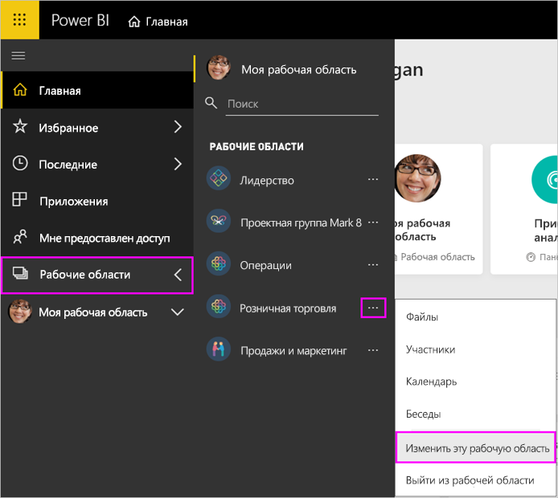
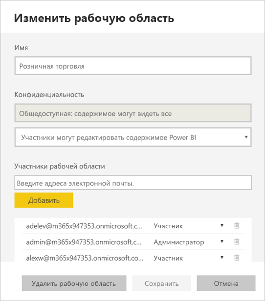
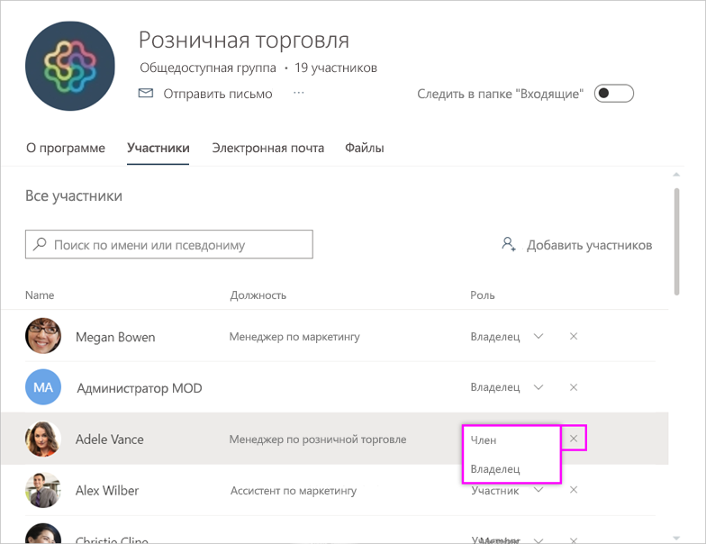
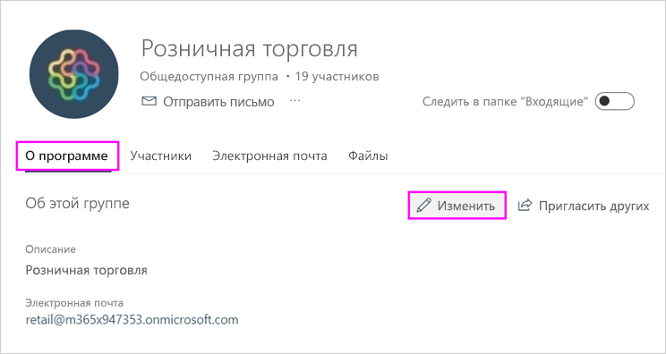
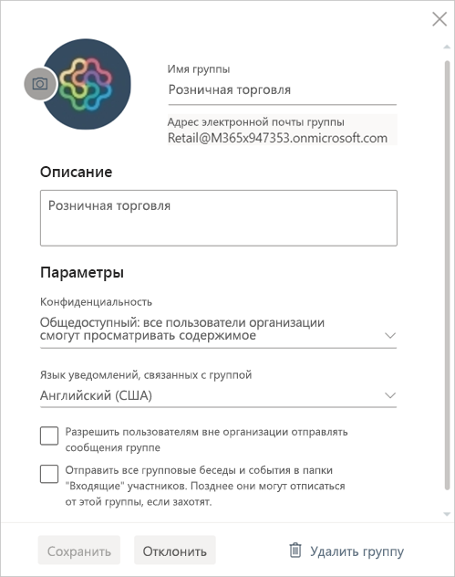

# Управление рабочей областью приложения в Power BI и Office 365

Автор или администратор [рабочей области приложения в Power BI](service-create-distribute-apps.md) или в Office 365 может управлять некоторыми аспектами рабочей области в Power BI. Управление другими аспектами осуществляется в Office 365.

> [!NOTE]
> В новом интерфейсе рабочей области изменятся отношения между рабочими областями Power BI и группами Office 365. Вы не будете автоматически создавать группу Office 365 каждый раз при создании одной из новых рабочих областей. Узнайте о [создании новых рабочих областей](service-create-the-new-workspaces.md).

В **Power BI** можно выполнять следующие задачи:

* Добавлять или удалять участников рабочей области приложения, включая присвоение участнику рабочей области прав администратора.
* Менять название рабочей области приложения.
* Удалять рабочую область приложения.

В **Office 365** можно выполнять следующие задачи:

* добавлять или удалять участников рабочей области приложения, включая присвоение участнику прав владельца;
* менять название группы, ее изображение, описание и другие параметры;
* просматривать адрес электронной почты группы;
* удалять группу.

Лицензия [Power BI Pro](service-features-license-type.md) необходима для администратора или участника рабочей области приложения. Вашим пользователям приложения также требуется лицензия Power BI Pro, если только рабочая область приложения не хранится емкости Power BI Premium. Дополнительные сведения см. в статье [Что такое Power BI Premium?](service-premium-what-is.md)

## Изменение рабочей области приложения в Power BI

1. В службе Power BI щелкните стрелку рядом с элементом **Рабочие области**, выберите многоточие (…) рядом с именем рабочей области, а затем **Изменение этой рабочей области**.

   

   > [!NOTE]
   > Элемент **Изменение этой рабочей области** отображается только для администраторов рабочих областей.

1. Здесь можно переименовать или удалить рабочую область, а также добавить или удалить членов.

   

1. Выберите **Сохранить** или **Отменить**.

## Изменение свойств рабочей области приложения Power BI в Office 365

Вы также можете изменять различные аспекты рабочей области приложения непосредственно в Outlook для Office 365.

### Изменение членов группы рабочей области приложения

1. В службе Power BI выберите стрелку рядом с элементом **Рабочие области**, многоточие (…) рядом с именем рабочей области и элемент **Участники**.

   

   Откроется представление Outlook для группы Office 365 для рабочей области приложения. Возможно, вам потребуется войти в свою корпоративную учетную запись.

1. Чтобы сделать пользователя **членом** или **владельцем**, выберите роль рядом с его именем. Выберите **X**, чтобы удалить пользователя из группы.

   

### Добавление изображения и задание других свойств рабочей области

При распространении приложения из рабочей области приложения изображение, которое вы добавляете, является изображением вашего приложения. Ознакомьтесь с разделом [Добавление изображения в рабочую область приложения Office 365](service-create-workspaces.md#add-an-image-to-your-office-365-workspace-optional) статьи **Создание рабочих областей**.

1. В представлении Outlook для Office 365 своей рабочей области приложения откройте вкладку **О программе** и выберите **Изменить**.

    
1. Вы можете изменить имя, описание и язык для уведомлений, связанных с группой. Кроме того, здесь можно добавить изображение и задать другие свойства.

   

1. Выберите **Сохранить** или **Отменить**.

## Дальнейшие действия

* [Публикация приложения в Power BI](service-create-distribute-apps.md)

* Появились дополнительные вопросы? [Ответы на них см. в сообществе Power BI.](http://community.powerbi.com/)
