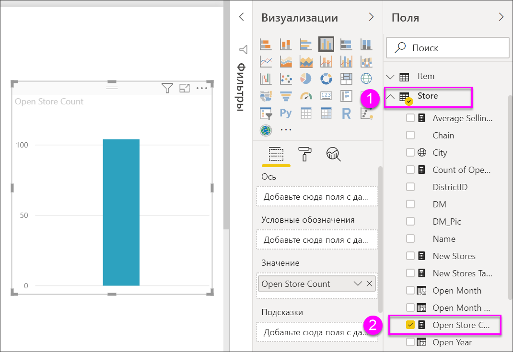
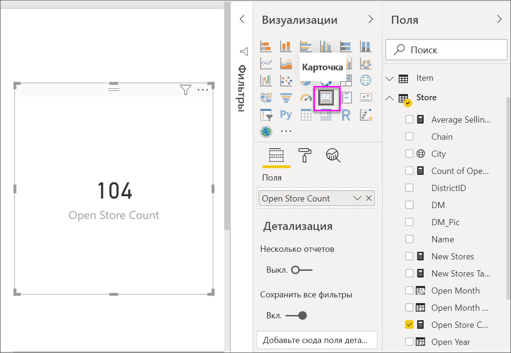
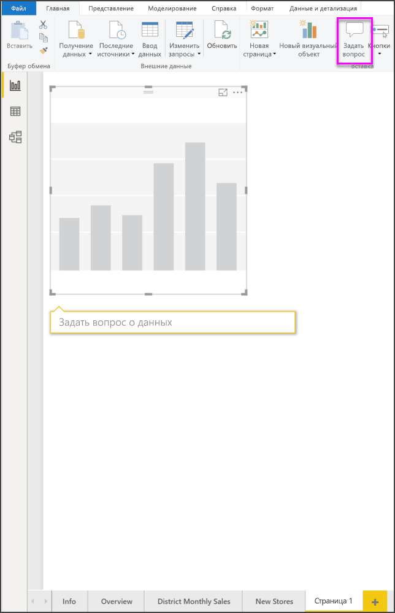
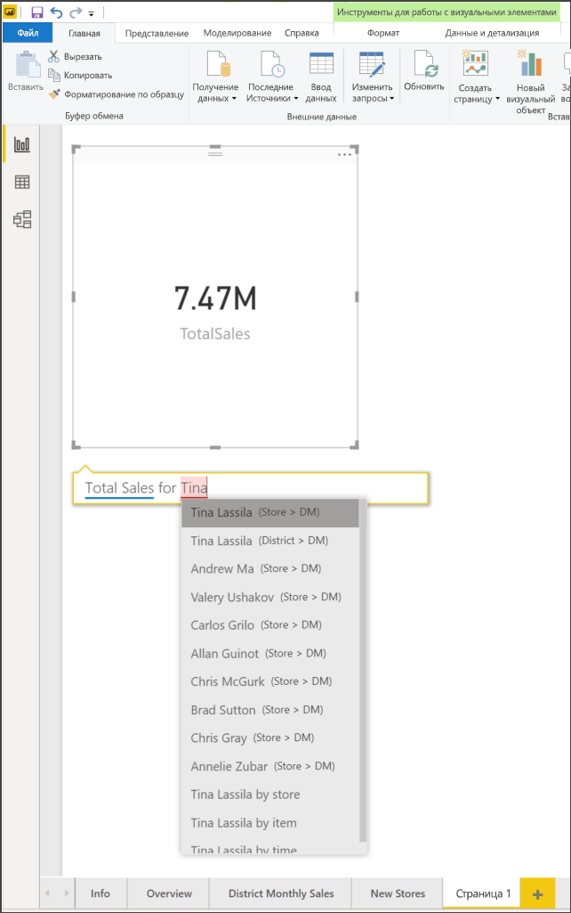
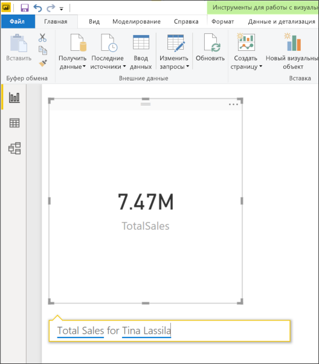
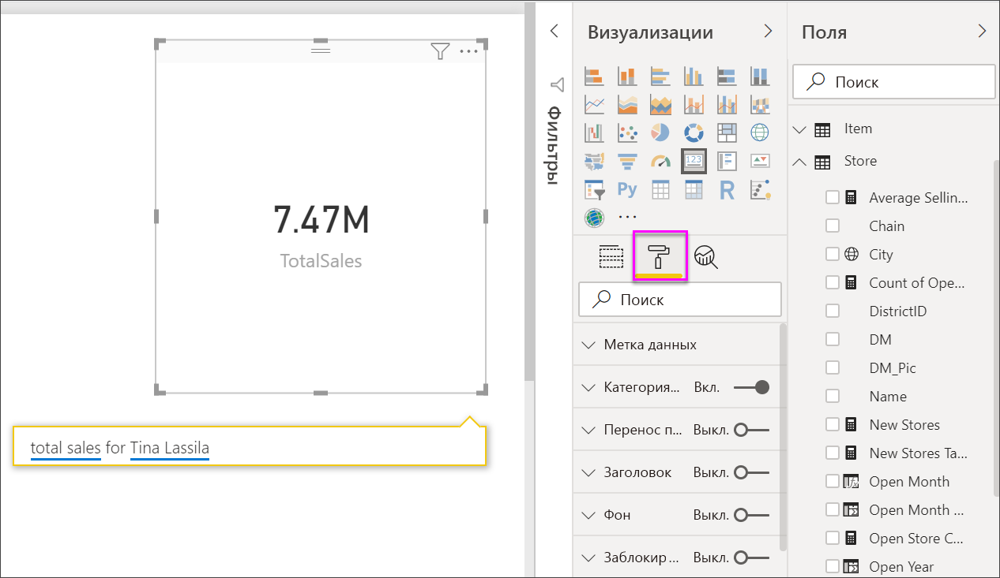
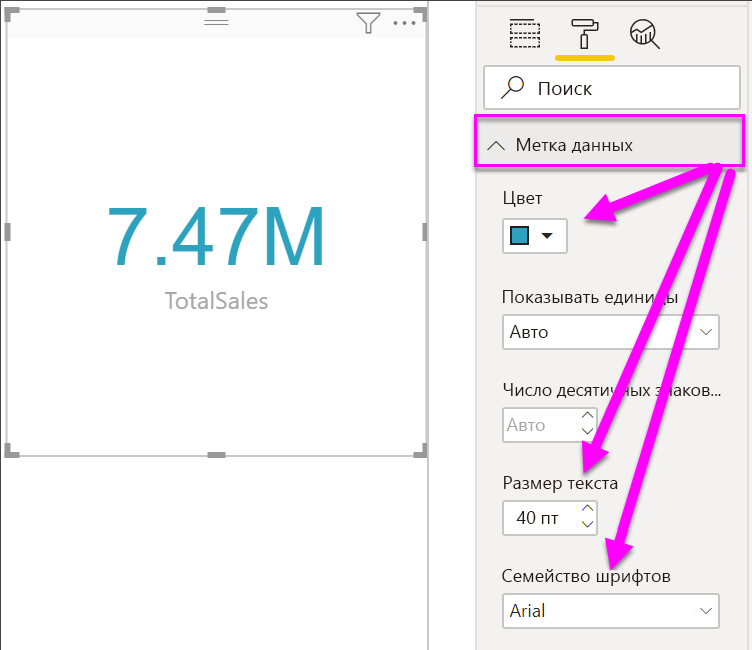
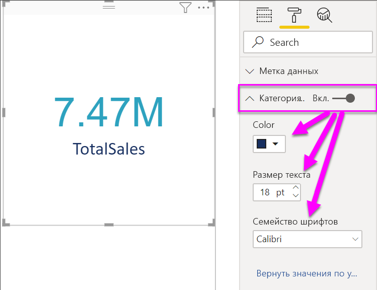
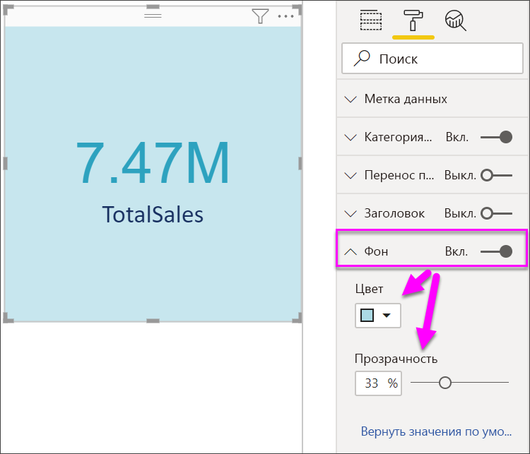

# Визуализации в виде карточек

[!INCLUDE [power-bi-visuals-desktop-banner](../includes/power-bi-visuals-desktop-banner.md)]

Иногда на панели мониторинга или в отчете Power BI очень важно отслеживать одно число, например показатель общего объема продаж, долю на рынке в годовом исчислении или общее число возможных сделок. Такой тип визуализации называется *карточкой*. Как и практически все собственные визуализации Power BI, карточки можно создавать при помощи редактора отчетов или функции вопросов и ответов.

## Необходимое условие

В этом руководстве используется пример PBIX-файла с примером [Анализ розничной торговли](http://download.microsoft.com/download/9/6/D/96DDC2FF-2568-491D-AAFA-AFDD6F763AE3/Retail%20Analysis%20Sample%20PBIX.pbix).

1. В верхнем левом разделе меню выберите **Файл** \> **Открыть**.
   
2. Найдите свою копию PBIX-файла с примером **Анализ розничной торговли**.

1. Откройте PBIX-файл с примером **Анализ розничной торговли** в представлении отчета .

1. Выбрать  чтобы создать новую страницу.

## Вариант 1. Создание карточки с помощью редактора отчетов

Первый способ создать карточку — использовать редактор отчетов в Power BI Desktop.

1. Откройте пустую страницу отчета и выберите поле **Магазин**\>**Количество открытых магазинов**.

    Power BI создаст гистограмму с одним числом.

   

2. На панели "Визуализации" выберите значок карты.

   

Так вы успешно создали карточку в редакторе отчетов. Ниже приведен второй вариант создания карточки с помощью поля вопроса.

## Вариант 2. Создание карточки в поле вопроса функции "Вопросы и ответы"
Поле вопроса — это еще один вариант, который можно использовать при создании карточки. Поле вопроса доступно в представлении отчетов Power BI Desktop.

1. Начните с пустой страницы отчета.

1. В верхней части окна выберите значок **Задать вопрос**. 

    Power BI создаст карточку и поле для вашего вопроса. 

   

2. Например, введите "Общий объем продаж для Анны" в поле "Вопрос".

    В поле вопроса предоставляются рекомендации и переформулировки, а также отображается общее число.  

   

   

Так вы успешно создали карточку в поле вопросов. Ниже приведены инструкции по форматированию карточки под определенные потребности.

## Форматирование карты
Для изменения меток, текста, цвета и многого другого есть много параметров. Лучший способ обучения — создать карту и ознакомиться с панелью форматирования. Здесь описаны только некоторые из доступных параметров. 

Панель форматирования доступна при взаимодействии с карточкой в отчете. 

1. Сначала откройте панель форматирования, щелкнув значок валика. 

    

2. Выбрав карточку, разверните элемент **Метка данных** и измените семейство шрифтов, размер и цвет. Если у вас тысячи магазинов, можно использовать элемент **Показывать единицы** для отображения числа магазинов в тысячах и управления десятичными разрядами. Например, можно отобразить 125,8 тыс. вместо 125 832,00.

    

3.  Разверните элемент **Метка категории** и измените цвет и размер.

    

4. Разверните элемент **Фон** и переместите ползунок в положение "Вкл.".  Теперь можно изменить цвет фона и уровень прозрачности.

    

5. Продолжайте изучать параметры форматирования, пока вы не измените свою карту так, как вам нужно. 

## Рекомендации и устранение неполадок
Если поле для вопроса не отображается, обратитесь к системному администратору или администратору клиента.    

## Дальнейшие действия
[Комбинированная диаграмма в Power BI](power-bi-visualization-combo-chart.md)

[Типы визуализаций в Power BI](power-bi-visualization-types-for-reports-and-q-and-a.md)
