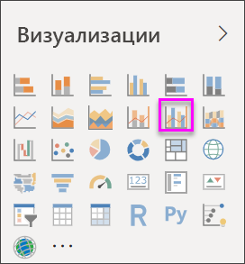
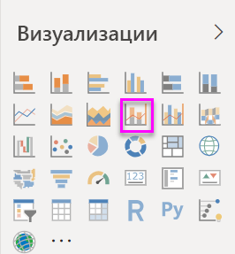
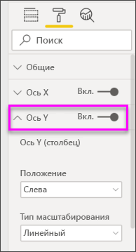
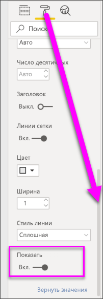

# Комбинированная диаграмма в Power BI

[!INCLUDE [power-bi-visuals-desktop-banner](../includes/power-bi-visuals-desktop-banner.md)]

В Power BI комбинированная диаграмма представляет собой визуализацию, сочетающую график и гистограмму. Объединение двух диаграмм в одну позволяет быстрее сравнивать данные.

Комбинированная диаграмма может содержать одну или две оси Y.

## Сферы применения комбинированной диаграммы
Комбинированная диаграмма отлично подходит:

* при наличии графика и гистограммы с одной и той же осью X;
* для сравнения нескольких показателей с другими диапазонами значений;
* для демонстрации корреляции между двумя показателями в одной визуализации;
* для проверки соответствия одного показателя целевому, который определяется другим показателем;
* чтобы освободить место на холсте.

### Предварительные требования
В этом руководстве используется пример PBIX-файла с примером [Анализ розничной торговли](https://download.microsoft.com/download/9/6/D/96DDC2FF-2568-491D-AAFA-AFDD6F763AE3/Retail%20Analysis%20Sample%20PBIX.pbix).

1. В верхнем левом разделе меню выберите **Файл** > **Открыть**.
   
2. Найдите свою копию PBIX-файла с примером **Анализ розничной торговли**.

1. Откройте PBIX-файл с примером **Анализ розничной торговли** в представлении отчета .

1. Выбрать  чтобы создать новую страницу.

## Создание простой комбинированной диаграммы с одной осью
Посмотрите, как Уилл создает комбинированную диаграмму на основе примера "Продажи и маркетинг".
   > [!NOTE]
   > В этом видео используется более старая версия Power BI Desktop.
   > 
   > 
<iframe width="560" height="315" src="https://www.youtube.com/embed/lnv66cTZ5ho?list=PL1N57mwBHtN0JFoKSR0n-tBkUJHeMP2cP" frameborder="0" allowfullscreen></iframe>  

1. Начните с пустой страницы отчета и создайте гистограмму, отображающую продажи за этот год и валовую прибыль по месяцам.

    а.  В области "Поля" выберите **Sales** \> **This Year Sales** > **Value** (Продажи > Продажи за этот год > Значение).

    б.  Перетащите **Sales** \> **Gross Margin This Year** (Продажи > Валовая прибыль за этот год) в область **Value** (Значение).

    в. Выберите **Time** \> **FiscalMonth** (Время > Отчетный месяц), чтобы добавить время в качестве **оси**.

    
5. Щелкните **Дополнительные параметры** в правом верхнем углу визуализации и последовательно выберите **Сортировать по > ФинМесяц**. Чтобы изменить порядок сортировки, снова нажмите кнопку с многоточием и выберите **Сортировка по возрастанию** или **Сортировка по убыванию**. В этом примере будет использоваться **Сортировка по возрастанию**.

6. Преобразуйте гистограмму в комбинированную диаграмму. Доступно два типа комбинированных диаграмм: **график и гистограмма с накоплением** или **график и гистограмма с группировкой**. Выделив гистограмму, откройте область **Визуализации** и выберите **Линейная гистограмма и гистограмма с группировкой**.

    
7. В области **Поля** перетащите **Sales** \> **Last Year Sales** (Продажи > Продажи за прошлый год) в контейнер **Значения строк**.

   

   Ваша комбинированная диаграмма должна выглядеть следующим образом:

   

## Создание комбинированной диаграммы с двумя осями
В этом задании мы сравним валовую прибыль и продажи.

1. Создайте новый график для отслеживания **процента валовой прибыли за прошлый год** по **фискальным месяцам**. Нажмите кнопку с многоточием, чтобы выполнить сортировку по **месяцам** и по **возрастанию**.  
В январе процент валовой прибыли составил 35 %, в апреле вырос до 45 %, в июле упал, а в августе снова подскочил. Похожа ли эта картина на данные за предыдущий год?

   
2. Добавьте к графику показатели **This Year Sales (Выручка за этот год) > Значение** и **Last Year Sales** (Выручка за прошлый год). Масштаб показателя **Gross Margin Last Year %** (Процент валовой прибыли за прошлый год) намного меньше, чем масштаб показателя **Sales** (Продажи), что усложняет сравнение.      

   
3. Чтобы упростить чтение и понимание визуального элемента, преобразуйте график в линейную гистограмму и гистограмму с накоплением.

   

4. Перетащите параметр **Gross Margin Last Year %** (% валовой прибыли за прошлый год) из области **Значения столбцов** в область **Значения строк**. Power BI создаст две оси, позволяя масштабировать наборы данных независимо друг от друга. Левая ось служит обозначает объемы продаж в долларах, а правая — проценты. И вот ответ на наш вопрос — да, результат похож на данные за предыдущий год.

       

## Добавление заголовков осей
1. Выберите значок с изображением валика 
1.  чтобы открыть панель форматирования.
1. Щелкните стрелку вниз, чтобы развернуть параметры **оси Y** .
1. В разделе **Ось Y (столбец)** задайте для параметра **Расположение** значение **Слева**, для переключателя **Заголовок** — положение **Вкл.** , для параметра **Стиль** — значение **Показать только заголовок**, а для параметра **Единица измерения** — значение **Миллионы**.

   
4. В разделе **Ось Y (столбец)** прокрутите вниз до тех пор, пока не появится **Показать вторичные**. Так как для осей Y существует много вариантов, может потребоваться использовать обе полосы прокрутки. Здесь показаны параметры форматирования графика на комбинированной диаграмме.

   
5. Для раздела **Ось Y (строка)** оставьте для параметра **Расположение** значение **Справа**, установите переключатель **Заголовок** в расположение **Вкл.** и задайте для параметра **Стиль** значение **Показать только заголовок**.

   На комбинированной диаграмме теперь отображаются две оси с заголовками.

   

6. При желании вы можете изменить шрифт, размер и цвет, а также настроить другие параметры форматирования, чтобы сделать диаграмму более красивой и удобной.

Здесь можно выполнять следующие действия:

* [Добавьте комбинированную диаграмму как плитку панели мониторинга](../service-dashboard-tiles.md).
* [Сохраните отчет](../service-report-save.md).
* [Сделать отчет более доступным для людей с ограниченными возможностями](../desktop-accessibility.md).

## Перекрестное выделение и перекрестная фильтрация

Когда вы выделяете столбец или строку в комбинированной диаграмме, срабатывает перекрестное выделение и перекрестная фильтрация этих данных в других визуализациях на странице отчета (и наоборот). Чтобы изменить это стандартное поведение, используйте элемент управления [Взаимодействие визуальных элементов](../service-reports-visual-interactions.md).

## Дальнейшие действия

[Кольцевые диаграммы в Power BI](power-bi-visualization-doughnut-charts.md)

[Типы визуализаций в Power BI](power-bi-visualization-types-for-reports-and-q-and-a.md)
