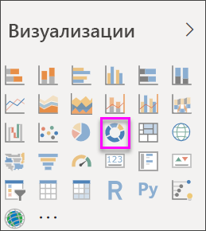
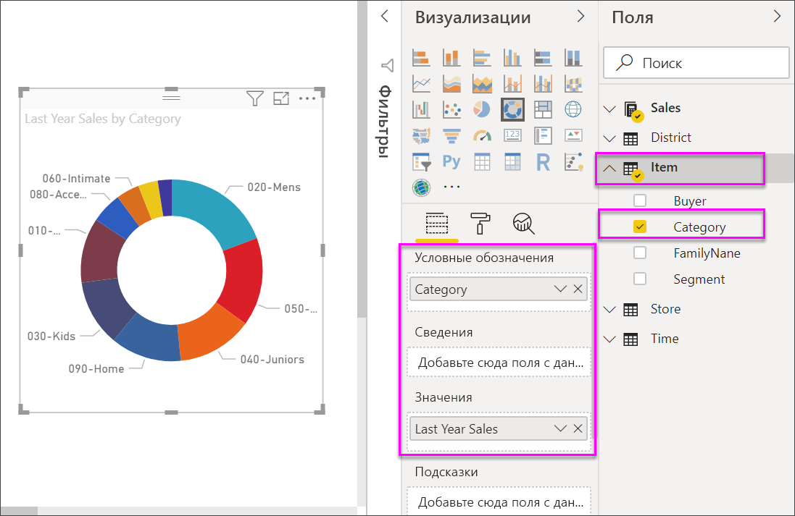

# Создание и использование кольцевых диаграмм в Power BI

[!INCLUDE [power-bi-visuals-desktop-banner](../includes/power-bi-visuals-desktop-banner.md)]

Кольцевая диаграмма похожа на круговую диаграмму в том, что она показывает отношение между целым и частями. Единственное отличие в том, что центр диаграммы пуст и в него можно добавить подпись или значок.

## Необходимое условие

В этом руководстве используется пример PBIX-файла с примером [Анализ розничной торговли](https://download.microsoft.com/download/9/6/D/96DDC2FF-2568-491D-AAFA-AFDD6F763AE3/Retail%20Analysis%20Sample%20PBIX.pbix).

1. В верхнем левом разделе меню выберите **Файл** > **Открыть**.
   
2. Найдите свою копию PBIX-файла с примером **Анализ розничной торговли**.

1. Откройте PBIX-файл с примером **Анализ розничной торговли** в представлении отчета .

1. Выбрать  чтобы создать новую страницу.

## Создание кольцевой диаграммы

1. Откройте пустую страницу отчета и в области "Поля" выберите **Продажи** \> **Продажи за последний год**.  
   
3. В области "Визуализации" щелкните значок кольцевой диаграммы , чтобы преобразовать линейчатую диаграмму в кольцевую. Если поля **Продажи за прошлый год** нет в области **Значения**, перетащите его туда.
     
   

4. Выберите **Элемент** \> **Категория**, чтобы добавить его в область **условных обозначений**. 
     
    

5. При необходимости [настройте размер и цвет текста диаграммы](power-bi-visualization-customize-title-background-and-legend.md). 

## Рекомендации и устранение неполадок
* Сумма значений кольцевой диаграммы должна составлять 100 %.
* Слишком большое число категорий затрудняет чтение и понимание.
* Кольцевые диаграммы лучше подходят для сравнения определенной части с целым, а не отдельных частей друг с другом. 

## Дальнейшие действия
[Воронкообразные диаграммы в Power BI](power-bi-visualization-funnel-charts.md)

[Типы визуализаций в Power BI](power-bi-visualization-types-for-reports-and-q-and-a.md)

