# Общие сведения о визуальных элементах "Вопросы и ответы" в Power BI

[!INCLUDE [power-bi-service-new-look-include](../includes/power-bi-service-new-look-include.md)]

## Что такое визуальный элемент "Вопросы и ответы"?

Визуальный элемент "Вопросы и ответы" принимает вопросы пользователей на естественном языке и выводит ответы в визуальном представлении. 

[!INCLUDE [power-bi-visuals-desktop-banner](../includes/power-bi-visuals-desktop-banner.md)]

С помощью визуального элемента "Вопросы и ответы" *потребители* могут быстро получать связанные с их данными ответы, а *разработчики* — легко создавать визуальные элементы в отчете, дважды щелкнув в нужном месте и задав их начальные свойства, используя естественный язык. Как и любой другой визуальный элемент, элемент "Вопросы и ответы" поддерживает перекрестные фильтрацию и выделение, а также закладки. Кроме того, он поддерживает темы и другие параметры форматирования по умолчанию, доступные в среде Power BI.

Визуальный элемент "Вопросы и ответы" состоит из четырех основных компонентов:

- Поле вопроса. Здесь пользователи вводят вопрос и могут выбирать предлагаемые варианты его завершения.
- Предварительно заполненный список предлагаемых вопросов.
- Значок для преобразования элемента "Вопросы и ответы" в стандартный визуальный элемент. 
- Значок, позволяющий открыть средство "Вопросы и ответы", с помощью которого разработчики могут настраивать базовый обработчик естественного языка.

## Предварительные требования

1. В этом руководстве используется [PBIX-файл с образцом "Продажи и маркетинг"](https://download.microsoft.com/download/9/7/6/9767913A-29DB-40CF-8944-9AC2BC940C53/Sales%20and%20Marketing%20Sample%20PBIX.pbix). 

1. В верхнем левом разделе меню Power BI Desktop выберите пункты **Файл** > **Открыть**.
   
2. Найдите копию **PBIX-файла с образцом "Продажи и маркетинг"**.

1. Открытие файла в представлении отчета .

1. Выбрать  чтобы создать новую страницу.

Если при создании визуального элемента "Вопросы и ответы" произойдет ошибка, ознакомьтесь с разделом [Ограничения](../natural-language/q-and-a-limitations.md) и убедитесь, что используемая конфигурация источника данных поддерживается.

## Создание визуального элемента "Вопросы и ответы" с использованием предлагаемого вопроса
В этом упражнении мы выберем один из предлагаемых вопросов, чтобы создать визуальный элемент "Вопросы и ответы". 

1. На пустой странице отчета щелкните значок визуального элемента "Вопросы и ответы" в области "Визуализации".

    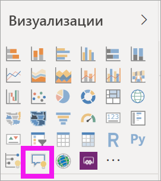

2. Перетащите границу, чтобы задать нужный размер визуального элемента.

    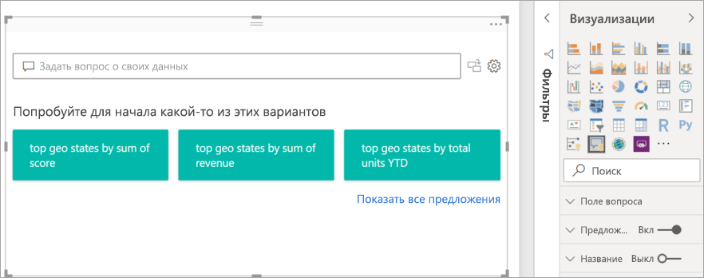

3. Чтобы создать визуальный элемент, выберите один из предлагаемых вопросов или начните вводить текст в поле вопроса. В этом примере мы выбрали **лучшие по выручке географические регионы**. Power BI автоматически определяет оптимально подходящий тип визуального элемента. В этом случае будет использоваться карта.

    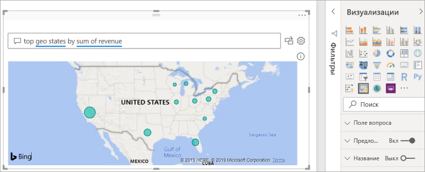

    При необходимости вы можете указать, какой тип визуального элемента следует использовать в Power BI, добавив его название в сформированный на естественном языке запрос. Обратите внимание, что тип визуального элемента должен соответствовать вашим данным. Так, на основе используемых в нашем примере данных невозможно создать значащую точечную диаграмму. Тем не менее, заполненная карта в этом случае подойдет идеально.

    

## Создание визуального элемента "Вопросы и ответы" с использованием запроса на естественном языке
В приведенном выше примере мы выбрали один из предлагаемых вопросов, чтобы создать визуальный элемент "Вопросы и ответы".  В этом упражнении мы попробуем ввести вопрос самостоятельно. По мере ввода текста Power BI будет предлагать варианты автозаполнения и обеспечивать обратную связь.

Если вы не уверены, как сформулировать вопрос или какую терминологию следует использовать, разверните список **Показать все предложения** или изучите область "Поля", которая располагается в правой части холста. Это позволит вам получить представление о терминах и содержимом набора данных "Продажи и маркетинг".

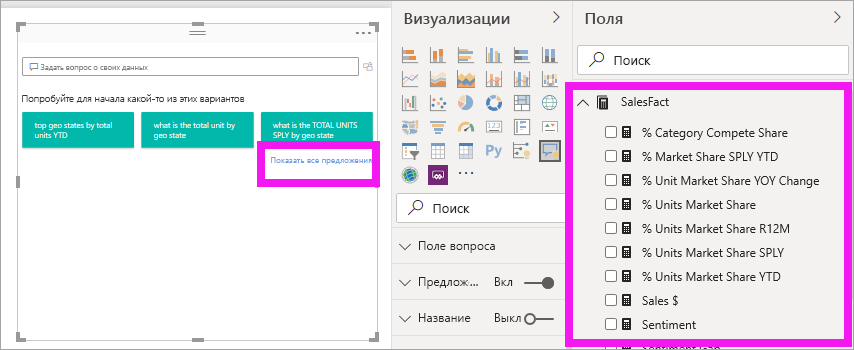

1. Введите вопрос в поле элемента "Вопросы и ответы". Слова, которые Power BI не распознает, будут подчеркнуты красной линией. По возможности Power BI помогает определить нераспознанные слова.  В первом из приведенных ниже примеров нам подойдет любой из предложенных вариантов.  

    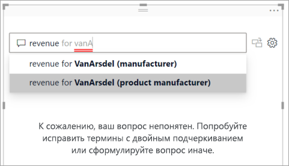

2. По мере ввода текста в поле Power BI может сообщать о том, что вопрос не понятен и предлагать помощь. В приведенном примере Power BI отображает запрос "Возможно, вы имели в виду..." и предлагает другую формулировку вопроса, основанную на терминологии нашего набора данных. 

    

5. Благодаря подсказке Power BI мы смогли сформулировать вопрос, используя только распознаваемые термины. Power BI выводит результаты в виде графика. 

    

6. Изменим форму визуального элемента на гистограмму. 

    

7.  Добавьте дополнительные визуальные элементы на страницу отчета и посмотрите, как визуальный элемент "Вопросы и ответы" взаимодействует с другими визуальными элементами на странице. В этом примере визуальный элемент "Вопросы и ответы" выполнил перекрестную фильтрацию графика и сопоставление и перекрестное выделение на линейчатой диаграмме.

    

## Форматирование и настройка визуального элемента "Вопросы и ответы"
Для настройки визуального элемента "Вопросы и ответы" можно использовать панель форматирования или применить тему. 

### Применение темы
Выбранная тема применяется ко всей странице отчета. Набор доступных тем достаточно широк, поэтому вы сможете выбрать среди них наиболее подходящую вашим требованиям. 

1. В строке меню перейдите на вкладку **Главная** и щелкните **Переключить тему**. 

    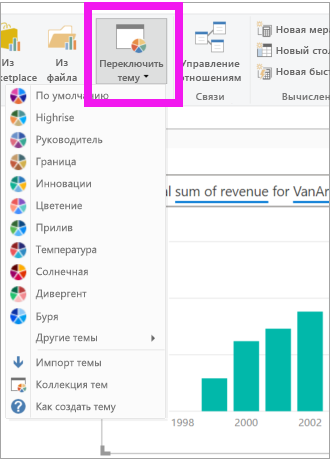

    
    
2. В этом примере мы выбрали **Другие темы** > **Различимая для людей с цветовой слепотой**.

    

### Форматирование визуального элемента "Вопросы и ответы"
Вы можете изменить форматирование визуального элемента "Вопросы и ответы", поля вопроса, а также предлагаемых вариантов. Возможна настройка любых компонентов, начиная с фона заголовка и заканчивая цветом, который применяется к нераспознанным словам при наведении указателя мыши. В этом случае мы задали серый цвет фона в поле вопроса и зеленый цвет подчеркивания вместо желтого. Заголовок выравнивается по центру и имеет желтый фон. 

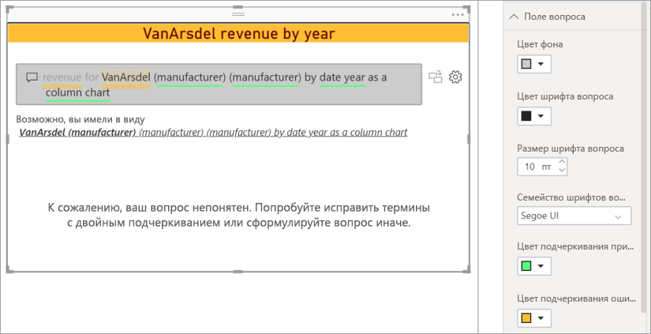

## Преобразование элемента "Вопросы и ответы" в стандартный визуальный элемент
Мы слегка изменили столбец визуального элемента гистограммы с примененной темой "Различимая для людей с цветовой слепотой", добавив заголовок и границы. Теперь все готово к тому, чтобы преобразовать его в стандартный визуальный элемент отчета и закрепить результат на панели мониторинга.

Щелкните  и выберите **Превратить этот результат модуля QA в стандартный визуальный элемент**.

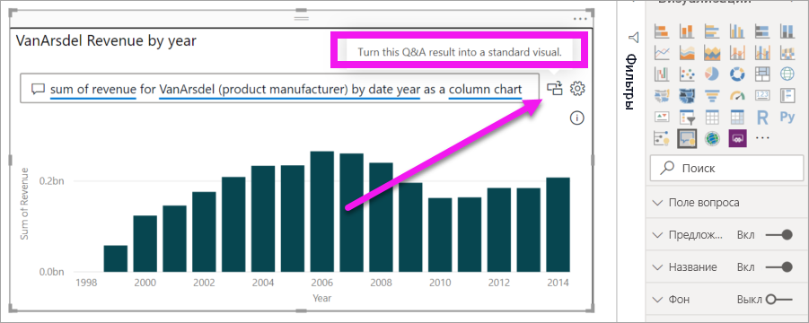

Элемент "Вопросы и ответы" преобразуется в стандартную гистограмму. Закрепить его на панели мониторинга нельзя. В отчете этот элемент будет вести себя так же, как и любой другой стандартный визуальный элемент. Обратите внимание, что в области "Визуализации" будет выделен значок гистограммы вместо значка визуального элемента "Вопросы и ответы".

Если вы используете ***службу Power BI***, на этом этапе можно закрепить визуальный элемент на панели мониторинга с помощью значка булавки. 

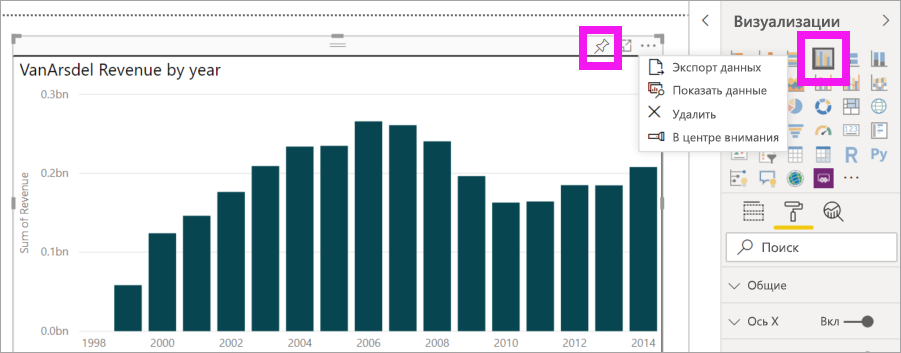

## Дополнительные возможности визуального элемента "Вопросы и ответы"
Если щелкнуть значок шестеренки, откроется панель средств для визуального элемента "Вопросы и ответы". 

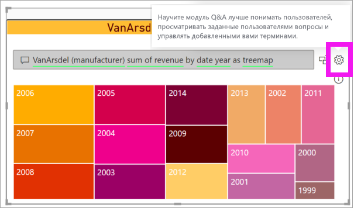

С помощью этой панели вы можете обучить функцию "Вопросы и ответы" нераспознанным терминам, а также управлять предлагаемыми вариантами для выбранного набора данных и отчета. В панели средств вы также можете просмотреть вопросы, которые задавались с помощью этого визуального элемента "Вопросы и ответы", а также отмеченные пользователями ответы. Дополнительные сведения см. в [этом разделе](../natural-language/q-and-a-tooling-intro.md).

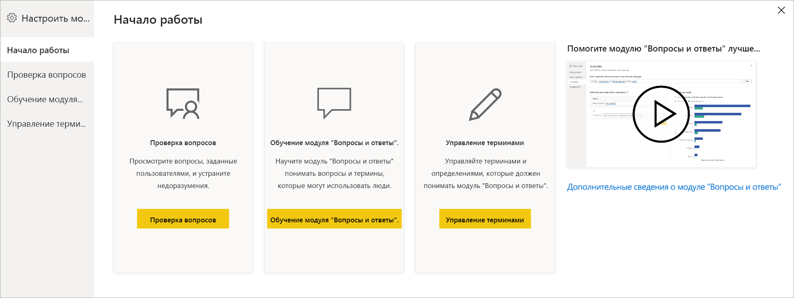

## Рекомендации и устранение неполадок
Визуальный элемент "Вопросы и ответы" интегрируется с Office и Bing для сопоставления часто встречающихся нераспознанных слов с полями в вашем наборе данных.  

## Дальнейшие действия

Поддержку естественного языка можно интегрировать в отчеты самыми разными способами. Дополнительные сведения см. в следующих статьях:

* [Средства функции "Вопросы и ответы"](../natural-language/q-and-a-tooling-intro.md)
* ["Вопросы и ответы": рекомендации](../natural-language/q-and-a-best-practices.md)
