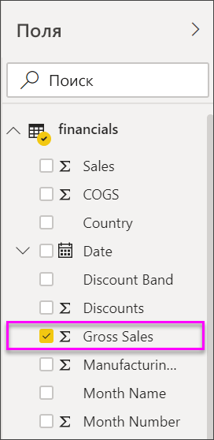
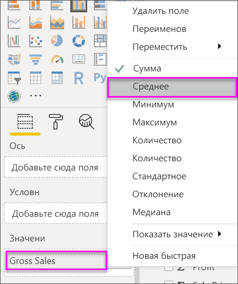
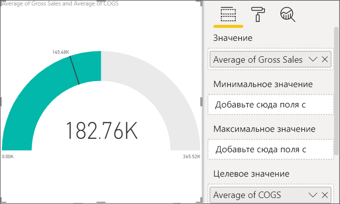
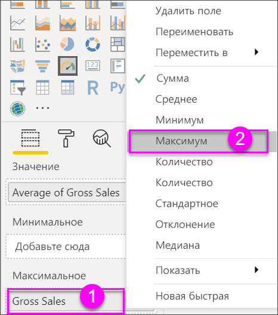
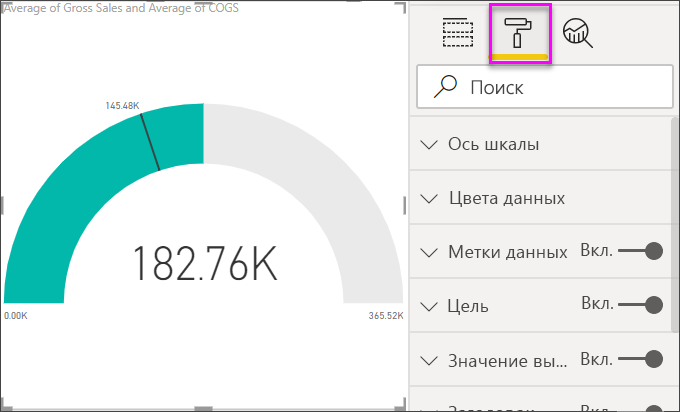
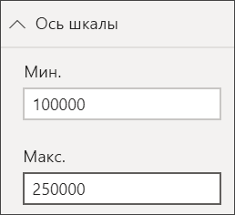
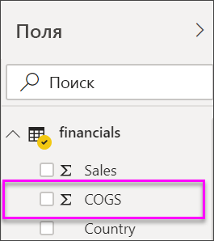
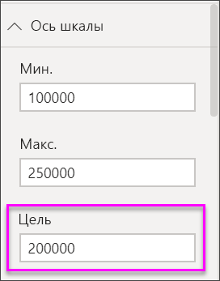
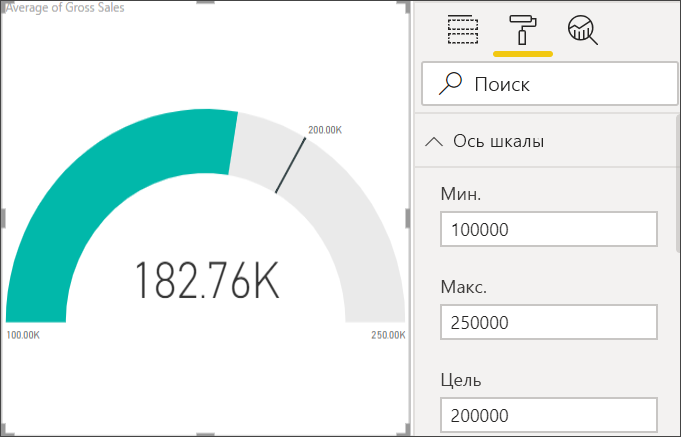

# Диаграммы "Радиальный датчик" в Power BI

[!INCLUDE [power-bi-visuals-desktop-banner](../includes/power-bi-visuals-desktop-banner.md)]

Радиальная индикаторная диаграмма имеет дугу и показывает одно значение, которое отражает ход достижения цели или значение ключевого показателя эффективности. Строка (или *линия*) представляет цель целевого значения. Заливка представляет прогресс в достижении цели. Значение внутри дуги представляет значение хода выполнения. Power BI равномерно распределяет все возможные значения по дуге, от минимального (крайнее левое значение) до максимального (крайнее правое значение).

В этом примере вы являетесь продавцом автомобилей, отслеживающим среднемесячный объем продаж отдела продаж. Линия представляет достижение цели продаж, которая составляет 140 автомобилей. Минимальное значение среднемесячных продаж — 0, а максимальное — 200.  Область с синей заливкой показывает, что средний объем продаж отдела за этот месяц составляет примерно 120 единиц. К счастью, есть еще одна неделя, чтобы достичь цели.

В следующем видео Уилл создает метрические визуализации: шкалы, карты и КПЭ.
   > [!NOTE]
   > В этом видео используется более старая версия Power BI Desktop.
   > 
   > 
<iframe width="560" height="315" src="https://www.youtube.com/embed/xmja6EpqaO0?list=PL1N57mwBHtN0JFoKSR0n-tBkUJHeMP2cP" frameborder="0" allowfullscreen></iframe>

## Когда следует использовать радиальный датчик

Радиальный датчик отлично подходит для:

* отображения прогресса в достижении цели;

* представления процентильного показателя, например ключевого показателя эффективности;

* отображения степени приемлемости показателя;

* отображения информации, которую можно быстро проверить и понять.

## Предварительные требования

Этот учебник использует файл Excel с примером [финансовых данных](https://download.microsoft.com/download/9/6/D/96DDC2FF-2568-491D-AAFA-AFDD6F763AE3/Retail%20Analysis%20Sample%20PBIX.pbix).

1. В верхнем левом разделе меню выберите **Получить данные** > **Excel**.
   
2. Найдите свою копию файла Excel с примером **финансовых данных**.

1. Откройте **пример финансовых данных** в представлении отчета .

1. Выберите **Финансы** и **Лист1**.

1. Щелкните **Загрузить**.

1. Выбрать  чтобы создать новую страницу.

## Создание базового радиального датчика

### Шаг 1. Создание датчика для отслеживания валовой выручки

1. Начните с пустой страницы отчета.

1. Из области **Поля** выберите **Gross Sales**(Валовая выручка).

   

1. Измените метод агрегирования данных на **Среднее**.

   

1. Выберите значок шкалы  чтобы преобразовать гистограмму в индикаторною диаграмму.

    

    В зависимости от того, когда выполняется загрузка файла **Пример финансовых данных**, вы можете увидеть числа, которые соответствуют этим числам.

    > [!TIP]
    > По умолчанию Power BI создает индикаторною диаграмму, где текущее значение (в этом случае **среднее от валовой выручки**) — точка середины шкалы. Поскольку значение **средней валовой выручки** составляет 182,76 тыс. долларов США, начальное значение (минимум) равно нулю, а конечное (максимум) — текущему значению, умноженному на два.

### Шаг 3. Настройка целевого значения

1. Перетащите **COGS (Себестоимость реализованной продукции)** из области**Поля**в поле **Целевое значение**.

1. Измените метод агрегирования данных на **Среднее**.

   Power BI добавит линию для представления нашего целевого значения — **145,48 тыс. долларов США**.

   

    Обратите внимание, что мы превзошли нашу цель.

   > [!NOTE]
   > Целевое значение можно ввести и вручную. См. раздел [Использование ручной настройки форматирования, чтобы задать минимальное, максимальное и целевое значения](#use-manual-format-options-to-set-minimum-maximum-and-target-values).

### Шаг 4. Настройка максимального значения

В шаге 2 Power BI использовал поле **Значение** для автоматической установки значений минимума и максимума. Что делать, если вам требуется задать ваше собственное максимальное значение? Предположим, что максимально возможное значение требуется задать не как удвоенное текущее значение, а установить его равным наибольшему значению валовой выручки в наборе данных.

1. Перетащите показатель **Gross Sales** (Валовая выручка) из области **Поля** в поле **Максимальное значение**.

1. Измените метод агрегирования данных на **Максимум**.

   

   Датчик будет перерисован с новым конечным значением валовой выручки, 1,21 миллиона долларов США.

   

### Шаг 5. Сохранить отчет

1. [Сохраните отчет](../service-report-save.md).

## Используйте ручную настройку форматирования, чтобы задать минимальное, максимальное и целевое значения

1. Удалите поле **Max of Gross Sales** (Максимальная валовая выручка) из списка **Максимальное значение** .

1. Откройте панель **Форматирование**, щелкнув значок валика.

   

1. Разверните **ось шкалы** и введите **минимальное** и **максимальное**значения.

    

1. Удалите параметр **COGS (Себестоимость реализованной продукции)** в панели **Поля**, чтобы удалить целевое значение.

    

1. Когда поле **целевого значения** появится под **осью датчика**, введите значение.

     

1. При желании продолжите форматирование диаграммы датчика.

После завершения этих действий, у вас будет индикаторная диаграмма, которая выглядит примерно следующим образом:

## Дальнейшие действия

* [Визуальные элементы ключевого показателя эффективности (КПЭ) ](power-bi-visualization-kpi.md)

* [Типы визуализаций в Power BI](power-bi-visualization-types-for-reports-and-q-and-a.md)

Появились дополнительные вопросы? [Ответы на них см. в сообществе Power BI.](https://community.powerbi.com/)
